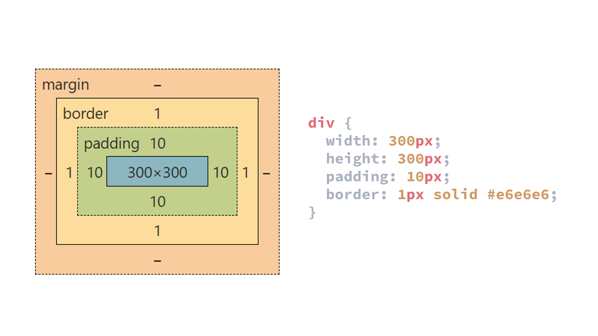
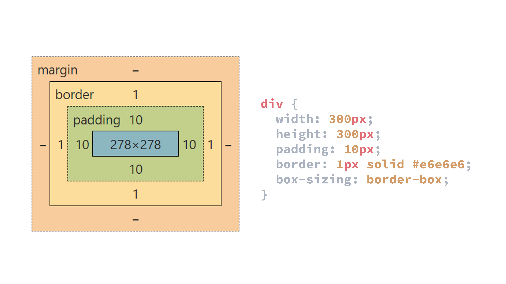
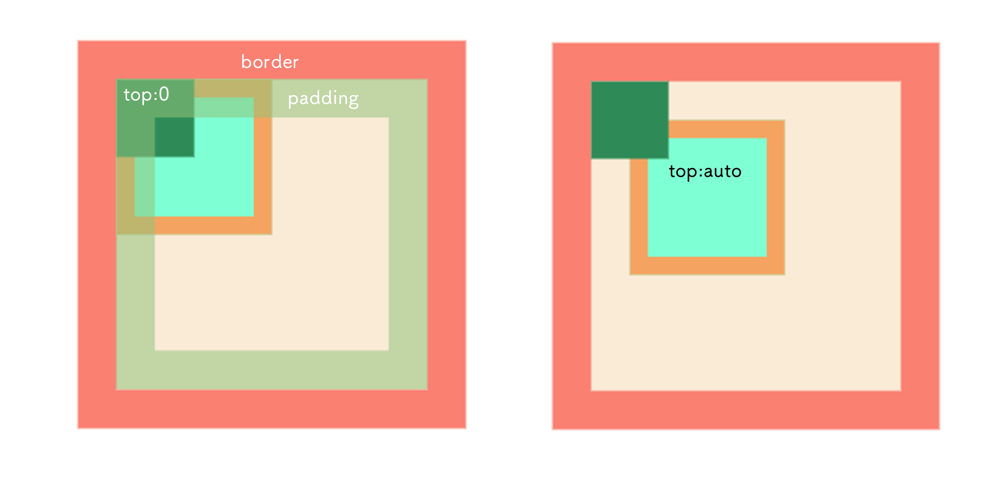

## 继承

:::info
`a` 标签字体颜色不能被继承

`h1~h6` 字体大小不会被继承
:::

- 字体

  ```
  font
  font-family
  font-weight: 粗细
  font-size: 大小
  font-style: 风格
  font-variant
  ```

- 文本

  ```
  text-indent: 文本缩进
  text-align: 水平对齐
  line-height: 行高
  word-spacing: 单词间距
  letter-spacing: 字符间距
  text-transform: 文本大小写
  direction: 书写方向
  color: 字体颜色
  ```

- 可见性

  ```
  visibility
  ```

- 列表

  ```
  list-style-type: 文字前小点
  list-style-position: 小点位置
  list-style
  ```

- 光标

  ```
  cursor
  ```

## 单位

- 相对单位 : `em` `ex` `ch` `rem` `vw` `vh` `vmin` `vmax`

- 绝对单位: `cm` `mm` `in` `px` `pt` `pc`

- `em` : 相对于当前原生字体的大小, 默认情况下 `1em = 16px`

  :::info
  一般给 body 添加属性 font-size: 62.5% 这样 1em = 16px × 62.5% = 10px
  :::

  chrome 字体最小为 `12px` , 想要更小需要: 

  ```css
  -webkit-transform: scale(0.6); 
  ```

- `rem` : 相对于根元素 `html` 的字体大小

- `vmin` `vmax` : 浏览器 `viewport` 最小/最大的边

- `ex` : 相对于 `x` 的大小

### 百分比

- `margin` 和 `padding` 使用百分比以其父(祖先)元素的 `宽度` 作为参照

## 优先级

```
!important > style > id > class > :first-child(伪类), div[id="x"] >
div, span, ::after(伪元素) > (> + ~ *) > 继承 > 默认
```

## 盒模型

1. 标准盒模型

  ```
  总宽度 = width(content) + margin + padding + border
  ```



2. 怪异盒模型

  ```
  总宽度 = width(content + padding + border) + margin
  ```



## link/@import

1. `link` 是 `HTML` 标签, `@import` 是 `CSS` 语法

2. `link` 引入的样式被同时加载, `@import` 在页面加载完成后加载

3. `link` 的兼容性更高

## absolute



## background

会填充 `border` `padding` `content` 区域

设置 `border: 10px solid transparent;` 可以验证

## 默认值

- `border-top-width` 默认值 medium

- `outline-width` 默认值 medium