## 万维网(WWW)

- 内核

  - `统一的资源定位符(URL)` 标志分布在互联网上的文档
  
  - `超文本传输协议(HTTP)` 实现各种链接的协议
  
  - `超文本标记语言(HTML)` 不同风格的文档能够在不同主机上显示

- 分布式超媒体系统

- 非分布式, 各种文档都在一台计算机上

## P2P

- 成对间歇连接的主机(对等方)批次直接通信

- `自扩展` 对等方即是比特的消费者也是比特的重新分发者

- BitTorrent
  
  - 参与文件分发的 `所有对等方` 集合称为 `torrent`

- 运行过程

  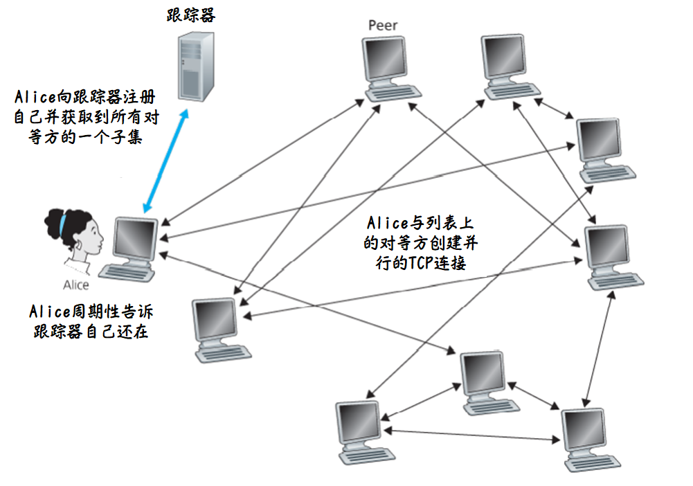
        

## FTP

- FTP 采用 `客户/服务器` 工作方式, 允许客户指明文件的类型与格式

- FTP 是使用 `TCP` 可靠传输

- 存在两个端口

  - 控制连接, 被动连接, 端口 `21`
  
  - 数据连接, 主动连接, 端口 `20`

- 匿名 FTP
  
  - 用户名 `anonymous`
  
  - 密码 `空`

- 连接模式

  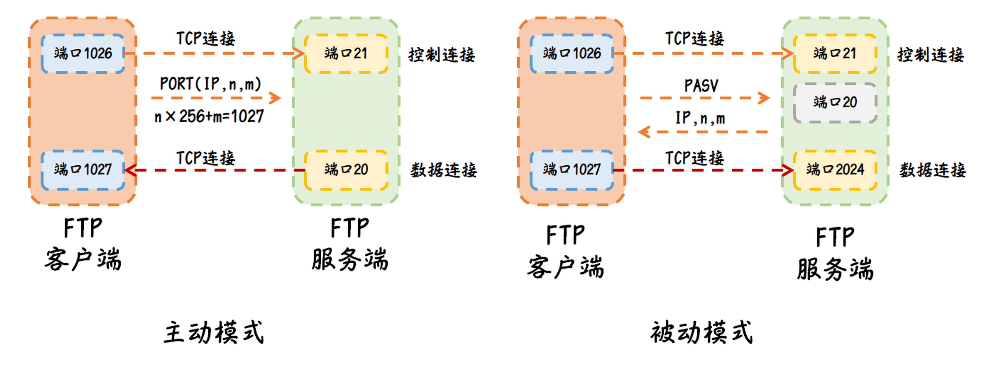

  :::info 主动模式和被动模式主要区别

  在于第二次连接是谁发起的
  
  :::

## DNS(域名系统)

- 域名格式 `xx.三级域名.二级域名.顶级域名`

- DNS 服务器端口 `53`

- DNS 协议运行在 `UDP` 协议上

- 定义
  
  - 由分层的 DNS 服务器实现的 `分布式数据库`
  
  - 一个使主机能够查询分布式数据库的 `应用层协议`

- 服务
  
  - `主机名` IP 地址转换
  
  - `别名` 同一台服务器可以有不同的网址
  
  - `负载分配` 多台服务器多个 IP 组成集合, 客户端发出请求后 IP 地址集合 `整个响应` , DNS 循环 IP 地址次序

- DNS 服务器是分布式的
    
  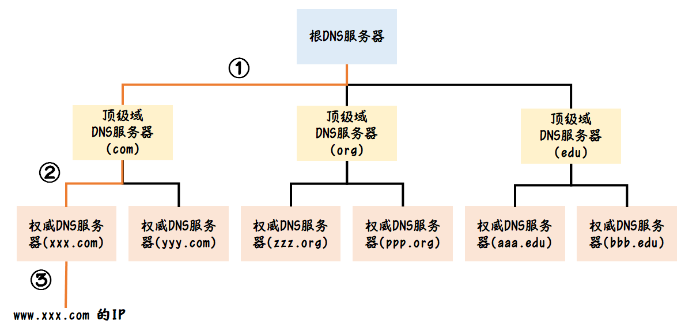

  - `根域名服务器` 共 `13` 套, 每套都可以有多个镜像

  - 任意根服务器都知道顶级域名的 IP

  - 更改根服务器数据只需要改 `a.rootservers.net` 就可以同步至其他 12 套上
    
- 获取一个网址的 IP 地址
  
  - 与根 DNS 联系并获得顶级域 com 的 `TLD(Top-level Domain)` 服务器 IP 地址
  
  - 与 com 的 TLD 服务器联系并获得 `xxx.com` 的权威 DNS 服务器 IP 地址
  
  - 与 `xxx.com` 联系获得 `www.xxx.com` 的 IP 地址

- 查询方式

  - 每个域名服务器只负责解析本辖域的域名
  
  - `递归查询` 查一次就得出结果

    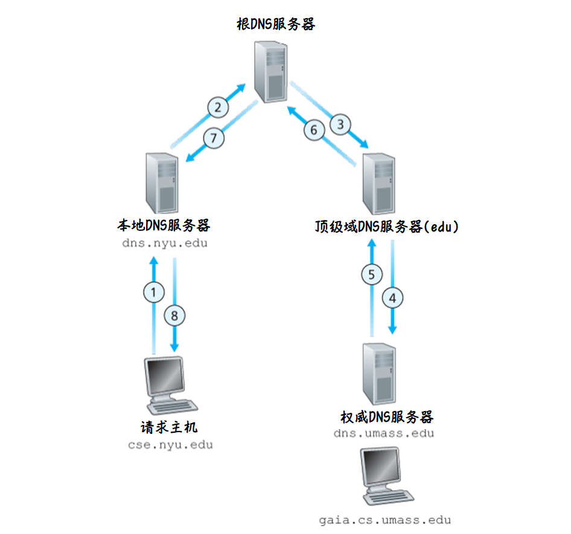
  
  - `迭代查询` 查一次得不出结果但是能返回能解答的服务器 IP
        
    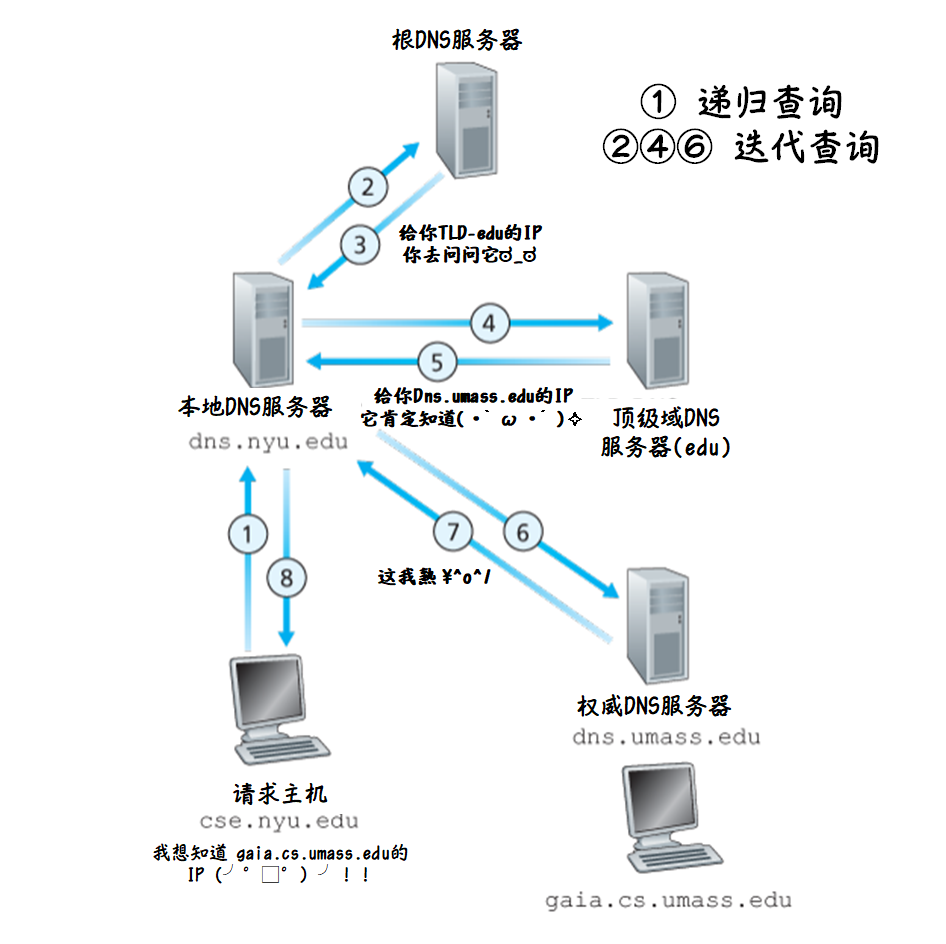

- DNS 缓存
  
  - 本地 DNS 服务器在接收到一个回答后能缓存包含在该回答中的任意信息
  
  - DNS 服务器在 `一段时间` 后将 `丢弃` 缓存信息

- DNS 记录

  - 记录格式 `(Name, Value, Type, TTL)`

  - type 类型
        
    - `A` 表示 name 是主机(域)名, value 是 ip
    
    - `NS` 表示 name 是主机名, value 是能获取该主机 ip 的 dns 服务器域名
    
    - `CNAME` 表示 value 是别名为 name 的主机对应的规范主机名
    
    - `MX` 表示 value 是别名为 name 的邮件服务器的规范主机名

:::info DNS 与 Host 的异同

1. 作用都是域名解析

2. DNS 将域名解析从本地(Host)转移至服务器

:::

## HTTP 协议

- HTTP 使用 `TCP` 作为运输协议

- HTTP 是一个 `无状态协议` , 不保存客户的任何信息, 因此可以反复请求相同的东西

- 非持续连接(HTTP1.0)
  
  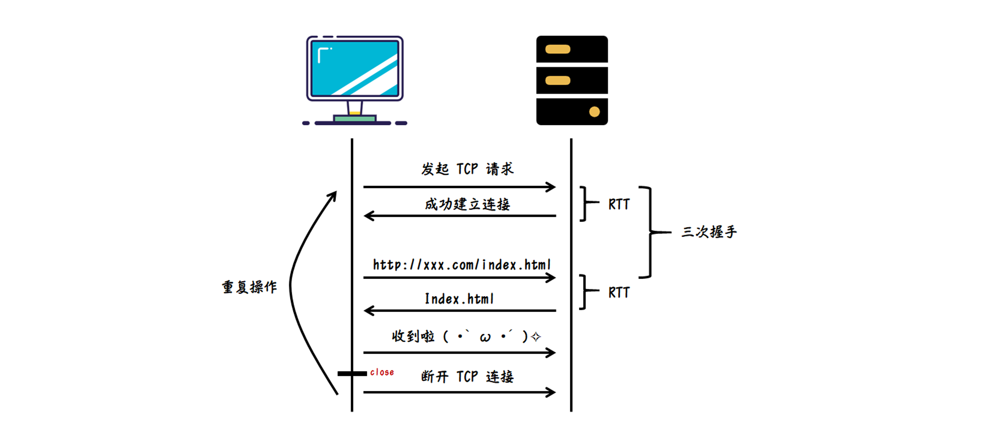

  `http1.0` 不支持断点续传, 要求传输整个数据, 不能只传输一部分

  :::info http1.0 实现长连接

  connection: keep-alive

  :::
    
- 持续连接(HTTP1.1)
    
  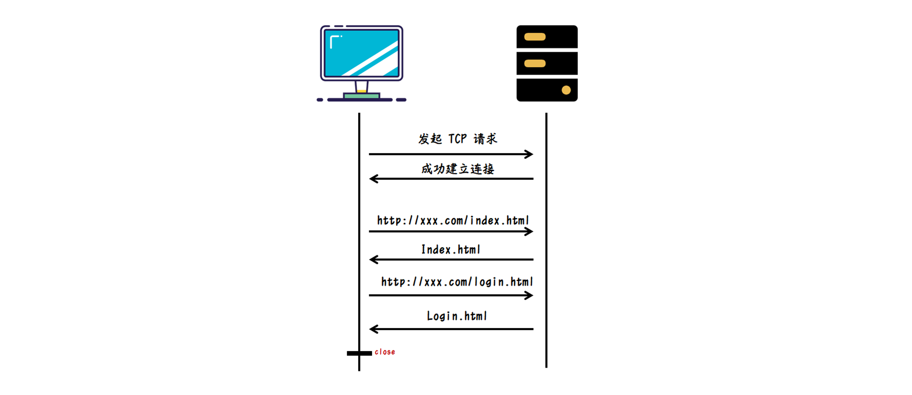
    
  :::info 与 websokect 差异
  
  长连接只有客户端向服务器发送请求, 服务器不能向客户端主动发送请求, 且长连接持续一段时间不用就自动关闭
  
  :::

- HTTP2.0
  
  - `帧(frame)` 通信的最小单位
  
  - `消息(message)` 与逻辑请求或响应消息对应的完整的一系列帧
  
  - `数据流(stream)` 已建立连接内的双向字节流
  
    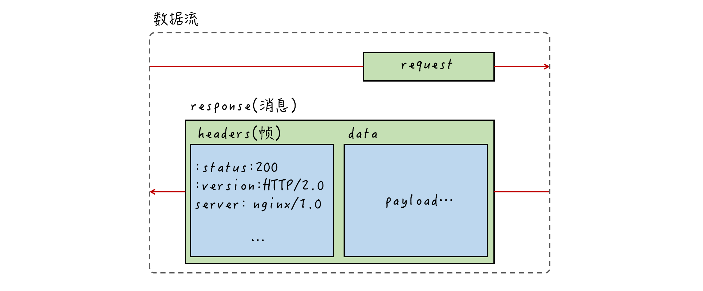
    
  - `HTTP2.0` 的连接是永久的, 还具有流控制

  - `http1.1` 基于文本格式传输, `http2.0` 基于 `二进制` 格式传输
  
  - 支持 `多路复用` , 可 `并发` 请求或响应, 与长连接不同的是, 一个请求超时, 其他请求可以继续, 不会被一个请求阻塞住(对头阻塞)
  
  - 采用了 `头部压缩` , 减少相同数据的重复发送

  - [`服务端推送`](https://www.ruanyifeng.com/blog/2018/03/http2_server_push.html) 无需客户端发送请求

- HTTP3.0

  - 使用 `QUIC` 作为传输协议, 基于 `UDP`, 

  - `向前纠错` 机制, 每个数据包除了包含本身数据外, 还包含了其他数据包的部分数据, 少量丢包时可以利用这些冗余数据直接修复

  - 首次连接采用 `密钥协商` , 之后连接均使用密钥

### Url

`http://host:port/path?query`

- `host` 主机地址

- `path` 资源在服务器主机中的路径

- `query` url 携带参数
    
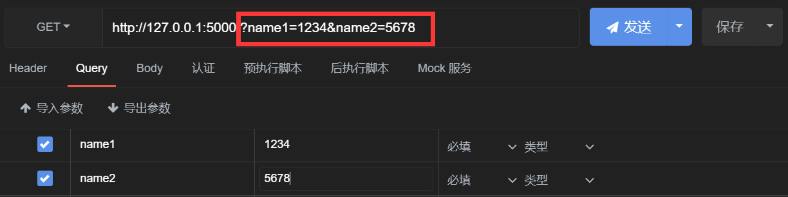
    

### [请求方法](https://developer.mozilla.org/zh-CN/docs/Web/HTTP/Methods)

- `GET` 获取服务器资源, `url` 带有 `query` (幂等请求)

- `HEAD` 类似 GET 不返回请求对象而返回响应报文

- `POST` 向服务器提交资源, `url` 不带 `query` (非幂等请求)

- `PUT` 与 `POST` 请求类似(幂等请求)

- `DELETE` 对服务器的特定资源进行删除(幂等请求)

:::info 幂等请求

指请求多次和一次效果相同

:::

#### Get/Post

1. get 请求参数放在 url 里, post 放在 body 里

2. get 提交数据存在 1kb 限制(浏览器限制)

3. get 可以缓存, 而 post 有副作用, 非幂等, 不可缓存

### 请求格式(报文格式)

- `METHOD URL HTTP/VERSION CRLF` 请求行
  ```
  GET /hello.txt HTTP/1.1
  ```
  
  

- `Request Headers` 请求头/首部行

- [`Cookie`](https://developer.mozilla.org/zh-CN/docs/Web/HTTP/Cookies)
  
  - 服务器通过 set-Cookie 返回给客户端
  
  - 客户端请求携带 Cookie
  
  - 服务器以此对用户进行识别

- `User-Agent` 用户代理

- `Host` http 服务器的地址和端口

- [`Content-Type`](https://www.runoob.com/http/http-content-type.html) 内容媒体类型
  
  - text/html(html)
  
  - text/plain(纯文本)
  
  - application/json(json)

- Accept 客户端可接受的 MIME 类型

- 请求体/实体体
    
  
    

### 响应格式

- [`Status Code`](https://developer.mozilla.org/zh-CN/docs/Web/HTTP/Status) 状态行
    
  ```
  HTTP/1.1 200 OK
  ```

- `Response Headers` 响应头

  - `Set-Cookie` 返回一个 cookie 值
        
    ```
    userToken=xxxxx;
    expires=Fri, 06-May-2022 07:57:17   GMT;
    Max-Age=31104000; 
    path=/; 
    domain=www.maimemo.com
    ```
        
    - `expires` cookie 的有效期, 没有设置这个属性则表示 `会话期 cookies` , 浏览器关闭则失效
            
    - `Max-Age` cookie 失效之前需要经过的秒数(优先级高于expires)
    
    - `domain` 服务器所在的域名
    
    - `path` 路径必须出现在客户端请求资源的路径中
    
    - `secure` 指定只有在请求使用 SSL 和 HTTPS协议的时候才会发送 cookie 至服务器
    
    - `HttpOnly` Js 无法获取 Cookie
        
### Session
        

        
- `Server` 服务器名称

- `Content-Type` 响应内容的MIME类型

- `Content-Length` 响应内容的长度

- `Content-Language` 响应内容使用的语言

- `Date` 服务器响应并发送响应报文时间

- `Allow` 服务器允许的 http 方法

- `Location` 资源重定向

- `Cacge-Control` 缓存机制

  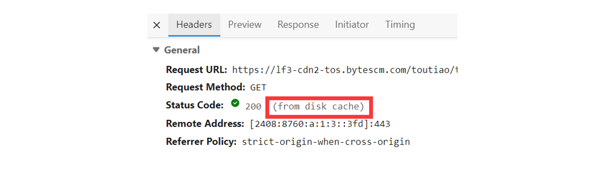

- 缓存
    
  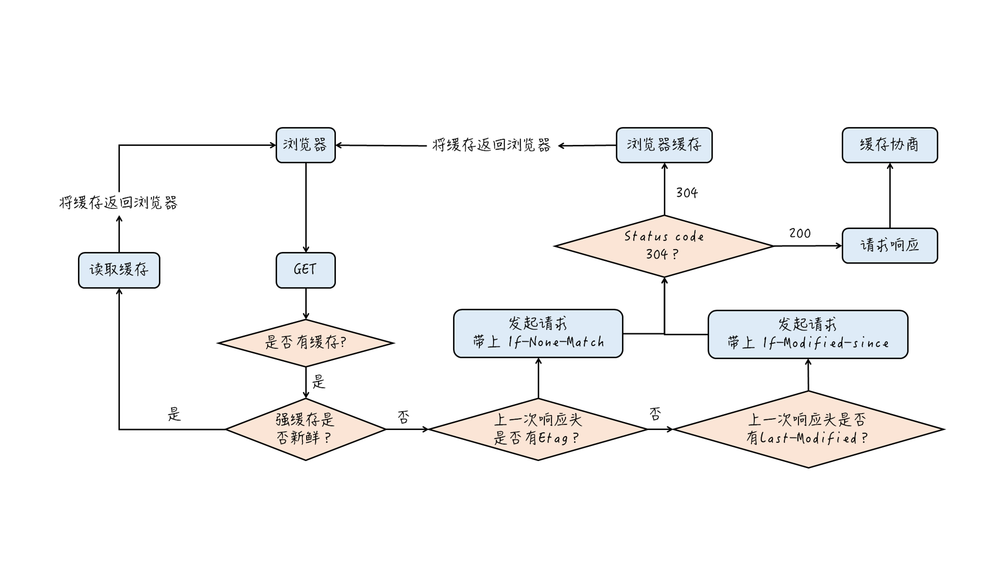
    
  - 强缓存的两种方案
    
    - 设置 `Cacge-Control` (优先)
    
    - 设置 `expires` (Http/1.0产物)
    
    ```
    200 OK (from disk cache)
    ```
  
  - 协商缓存
    
    - `If-Modified-since`
      
      - `Last-Modified` 比较服务器资源的更新时间判断是否需要返回新资源
    
    - `If-None-Match`
      
      - Etag 资源标识符(资源的md5值): 比较服务器的资源标识判断是否需要返回新资源
      
      - 如果资源没有改变, 服务器返回状态码 304
    
    - 强制缓存优于协商缓存, 因此服务器资源改了, 要么禁用强制缓存, 要么把资源名改了

    ```
    304 Not Modified
    ```
        
    

### HTTP 代理

- `正向代理`

  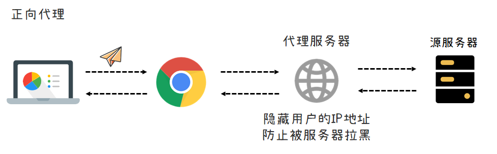

  - `透明代理` 会传送用户的真实IP
  
  - `匿名代理` 携带与代理相关的信息
  
  - `高匿代理` 啥都不会传给服务器
    
  ```python
  # 正向代理
  import requests
    
  headers = {
    'User-Agent': '...',
    'cookie':'...'
  }
    
  proxies = {
    # 代理 ip
    'http': '...',
    'https': '...'
  }
    
  url = '...'
  response = requests.get(url, headers = headers,proxies=proxies)
  ```
    
- `CDN`

  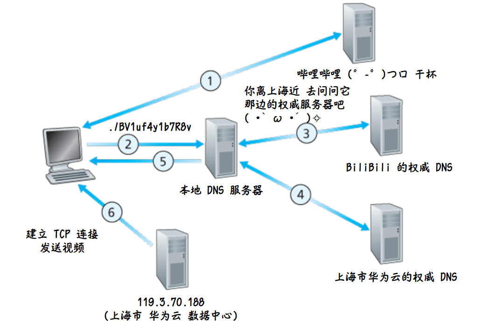
  
  - 数据内容缓存到运营商的机房, 用户能够就近访问
  
  - 避开影响数据传输速度和稳定性的瓶颈和环节
    
  - 用户访问 CDN, CDN 访问反向代理服务器进行缓存

- `反向代理`

  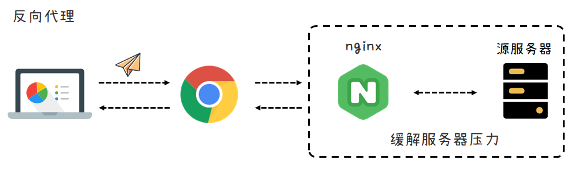

  - 部署到公司机房
  
  - 代替真实的目标服务器去接受并返回客户端的请求
  
  - 防止服务器被恶意攻击
  
  - 负载均衡(Nginx)
  
  - 缓存作用

- `Web缓存器`(代理服务器)
    
   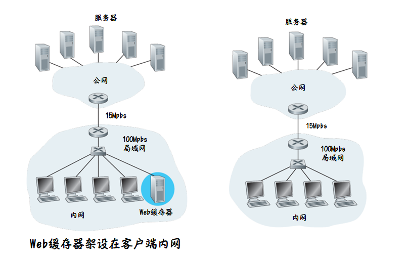
    

### HTTPs 传输

- HTTP 只能进行明文传输, 而在 HTTP 基础上添加 `SSL` 后就是 HTTPs

- `SSL(Secure Sockets Layer)` 安全套接字层, 对 TCP 的加强, 这种强化在 `应用层` 上实现

  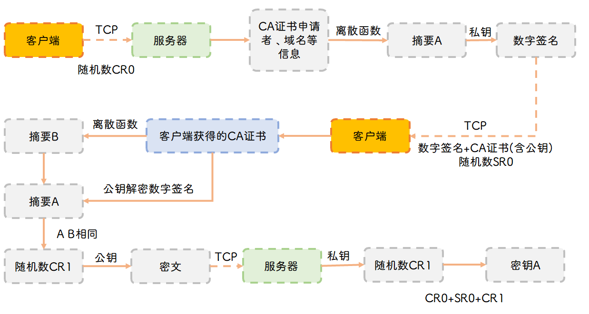

## SMTP


- 使用 `TCP` 协议

- 端口 `25`

- 一般不使用中间邮件服务器, 即使接收方没有开机, 也会一直停留在发送方并等待重试

- 典型的报文头部

  ```
  From: alice@crepes.fr
  To: bob@hamburger.edu
  Subject: Searching for the meaning of life
  ```

### 邮件访问协议

解决如何从邮件服务器上获取邮件

#### POP3

`第三版的邮局协议`

- `特许阶段` 用户代理发送 `用户名` 和 `口令` 鉴别用户

- `事务处理阶段` 用户代理取回报文, 对报文进行一系列操作

  - 下载并保留

  - 下载并删除

- `更新阶段` 客户发出 `quit` 命令结束会话

:::info 

用户把邮件下载到本地, 对本地邮件进行的一系列操作, 如移入其他文件夹中、标记已读等, 不会反馈到邮件服务器中

:::

#### IMAP

`因特网邮件访问协议`

- 可以使用多台计算机和设备同时登录

- 邮件存档将同步并存储在服务器上, 供所有已连接设备访问

- 已发送和已接收的邮件将存储在服务器上, 直至用户将其永久删除