- 无连接服务发送 `数据包` , 可以沿不同路径到达, 可能失序

- 数据包转发基于分组的 `目的地址`

- 通信之间建立 `逻辑连接` , 不是真正建立一条物理连接

:::info

- 网络层：路由器、防火墙

- 数据链路层：网卡、网桥、交换机

- 物理层：中继器、集线器、网线、网卡

:::

## 相关问题

- 数据包大于最大传输单元(MTU), 使用分片机制解决

- 报头错误, 使用首部校验和解决

- 防止 `循环转发` , 通过跳数限制解决

## 路由器

路由器具有截断的协议栈, 仅包括网络层、链路层、物理层

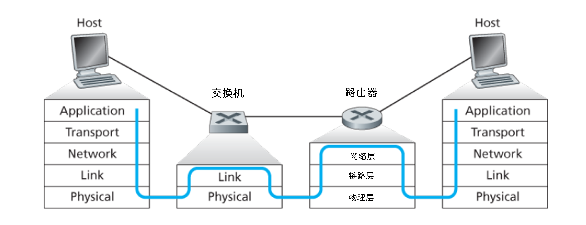

### 路由器交付

- `直接交付` 发送站与目的站在同一网段, 不涉及路由器

- `间接交付`

### 功能

- `转发(数据面)` 将分组从一个输入链路接口转移到适当的输出链路接口

- `路由(控制面)` 决定分组从源到目的地所采用的路径或路由

  - `传统方法` 转发表人为配置

    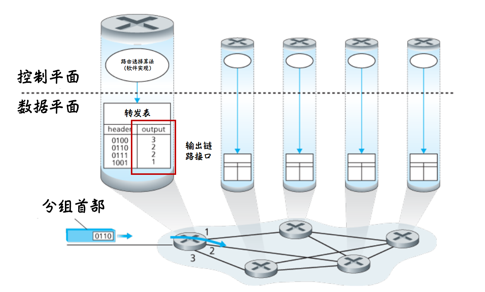

  - `SDN方法` 路由选择设备仅负责 `转发` , 而远程控制设备计算并分发 `转发表`

    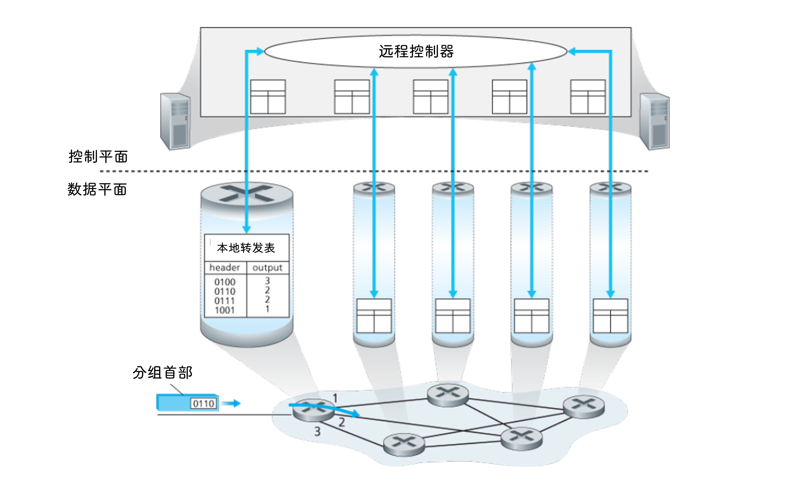

  - 去目的 IP 存在多种方式时, 根据优先级选择路由, 数值越小, 优先级越高

    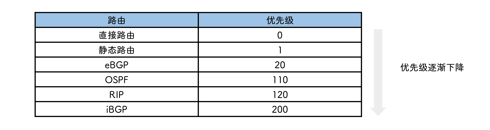

### 工作原理

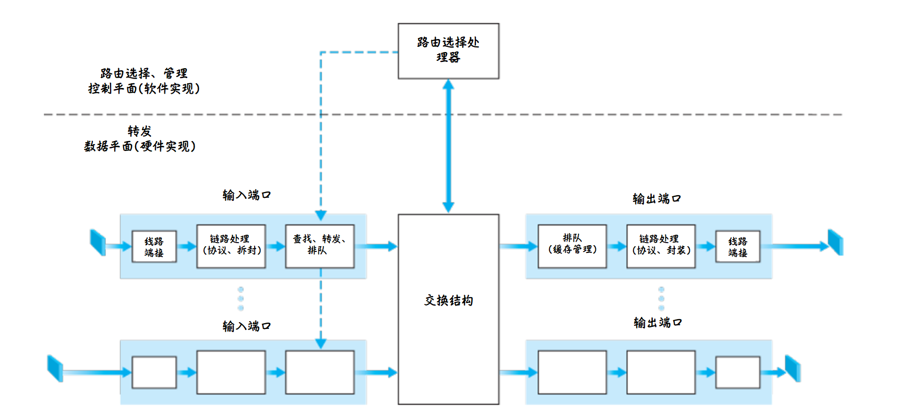

### 交换

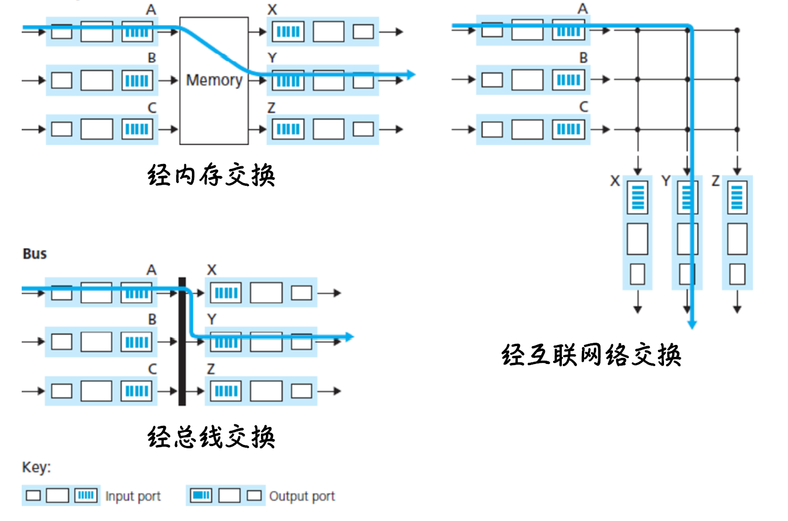

- `内存交换`

  - 在输入端口中复制分组到内存中, 再复制到对应的输出端口缓存中

  - 需要共享系统总线, 因此一次只能读/写一个端口

- `总线交换`

  - 输入端给分组加上一个交换机 `内部标签` , 所有端口均可收到分组, 但仅标签匹配的端口保存分组

  - 标签到了输出端口会被剔除

  - 一次只能有一个分组在系统总线上传输, 因此路由交换速率受到总线速率的限制

- `互联网络`

  - 总线互联成的网络, `并行` 转发分组

  - 相同输出端口会阻塞, 不同输出端口非阻塞

### 排队

- `输入排队`

  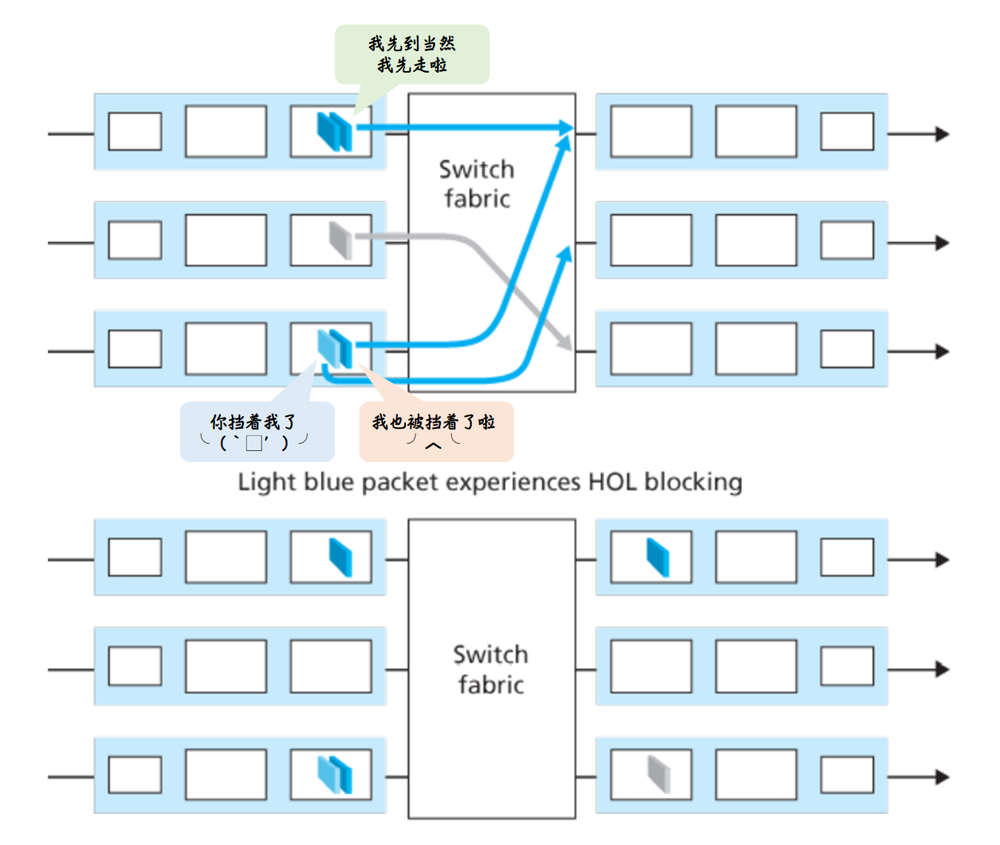

- `输出排队`
  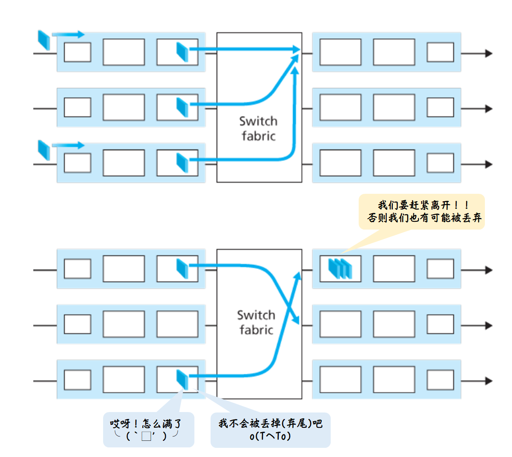

### 分组调度

`排队规则`

- `先进先出`

  

  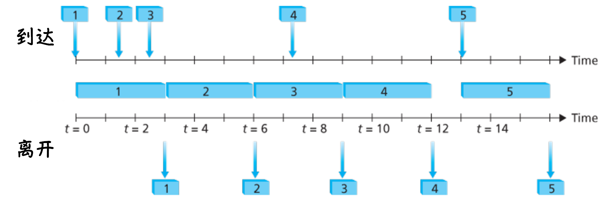

- `优先权`

  

  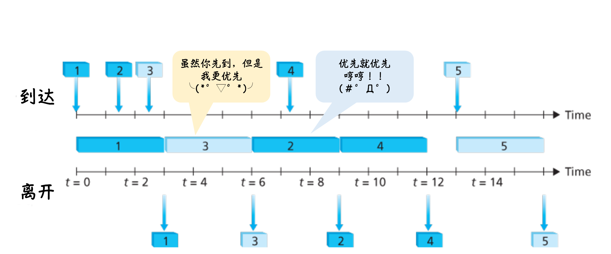

- `循环和加权公平排队`

  - 不存在优先级别, 循环调度, 类 A 完成一个后到类 B 然后再到类 A

  - 不允许链路保持空闲, 类 A 完成后到类 B, 但是类 B 没有分组需要传输, 继续下一个类

  

## IPv4

`国际协议版本4` `无连接` `寻址` `分片`

### 数据报

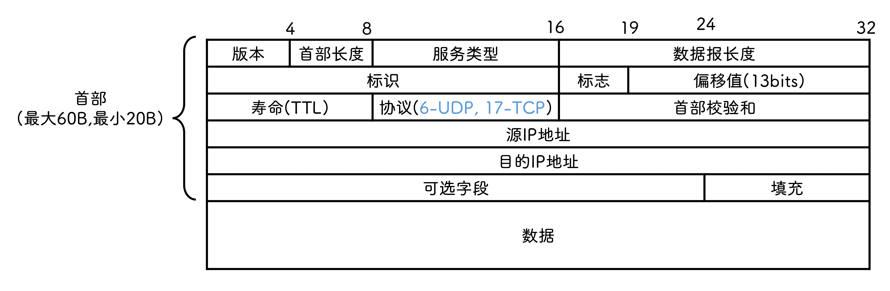

- 首部长度 `4` 位, 可表示的十进制为 `15` , 因此 `IP` 首部最长为 `15 × 4B = 60B`

- `可选字段` 一般不用, 因此首部长度一般为 `5 × 4B = 20B` , 定义安全性/严格源路由/松散源路由/记录源路由/时间戳等等

- `数据报长度` 为 `16` 位, 因此数据报的长度为 `2^16-1=65535B(首部+数据)`

- `寿命` 每当一个路由器处理该数据报时 TTL 减一

- IP 分组中的检测字段仅检查分组首部

### 数据分片

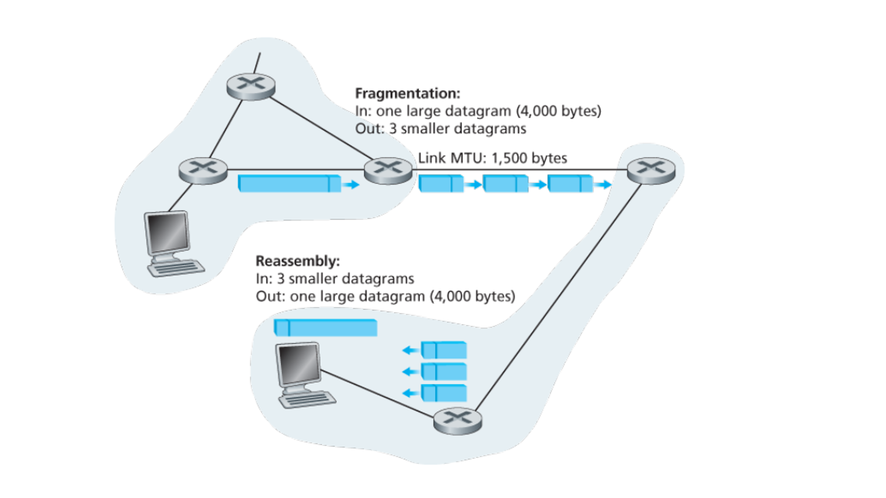

- `最大传送单元(MTU, 1500 字节)` 链路层帧能承载的最大数据量

- 只在 `目的` 端系统进行重组

- 由于 MTU , IPv4 数据部分最大 `1480` 字节

### 分片策略

- `允许途中分片` 根据下一跳链路的 MTU 分片

- `不允许途中分片` 数据包长度小于路径 MTU

### 分片报文

- `偏移量`

  - `8` 字节为一个单元

  - 偏移 `185` 即偏移 `185×8=1480` 字节

- 每个分片都有相同的标识、源地址、目的地址

- 根据偏移量判断 `是否缺失` 分片

- 根据标志 `MF=0` 判断是否结束

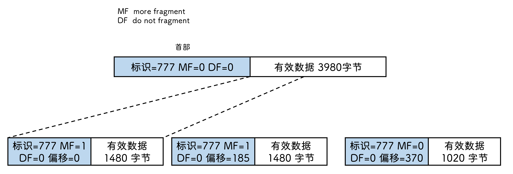

仅最后一个分片会添加 ICMP 头部


### IPv4 地址

一台主机有多个 IP , 那么要求这些 IP 属于不同的逻辑网络


路由器在转发 IP 数据报时, 重新封装源硬件地址和目的硬件地址

#### 特殊地址

- `主机号全为 0` 网络本身, 如 `202.98.174.0`

- `主机号全为 1` 广播地址, 如 `202.98.174.255`

- `127.x.x.x` 环回自检地址, 代表主机本身 ( 通常为 `127.0.0.1` )

- `0.0.0.0` 本网络上本主机

- `255.255.255.255` TCP/IP 网络广播地址(受限广播地址)

#### 分类

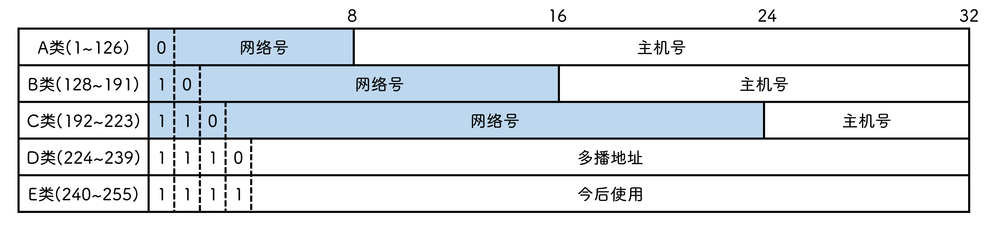

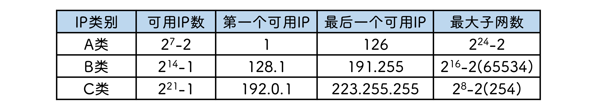

:::info

1. 127 和 0 不属于 A 类

2. 128.0 与 192.0.0 不可指派

3. 子网数减 2 是因为主机号全 0 和全 1 是特殊 IP

:::

#### 私有 IP 地址

选择哪一类由连接的子网数量决定, 又称 `专用网`

- `A类地址` 10.0.0.0 ~ 10.255.255.255

- `B类地址` 172.16.0.0 ~ 172.31.255.255

- `C类地址` 192.168.0.0 ~ 192.168.255.255

#### 子网掩码

- 网络号数量不足, 向右的主机数借位, 使得主机数变少

- B 类地址有 6w 多个子网, 但是一个企业仅需要 `2000` 个公网 IP, 那么我们需要从 6w 多个中划出 `2048` 个子网给企业, 也就是 B 类地址的主机号前 `5` 位都是相同的, 那么这 `5` 位称为 `子网号` , 后 `11` 位称为子网的 `主机号`

  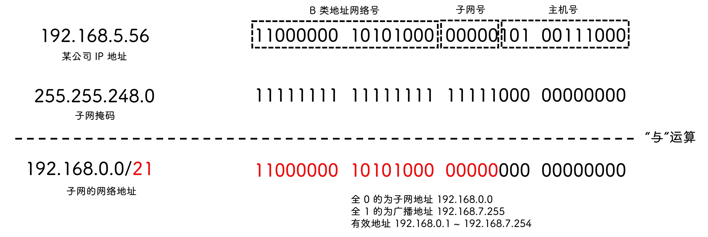

- 子网掩码的作用就是从主机号中再划分出更小的子网区域

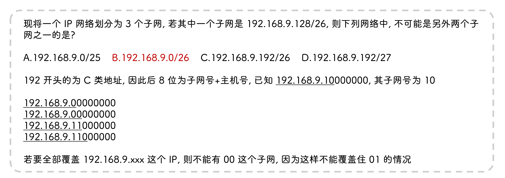

#### 无分类编址(CIDR)

- 消除了传统 A, B, C 类地址的概念

- 使用 `<网络前缀, 子网号, 主机号>` 的形式

- 使用 `/` 显式声明网络号位数, 如 `206.1.0.0/16`

- `206.1.0.0/16` 表示前 `16` 位为网络号, 后 `16` 位为子网和主机

  - 若全部当作主机号, 则有一个子网和 `2^16-2` 个有效 IP(去掉全 0 和全 1)

  - 主机号最少 2 位, 因为需要去掉全 0 和全 1 的, 只有 1 位的话就不存在有效 IP 了

#### 最长前缀匹配规则

对于 32 位的 IPv4 来说, 为每个地址建立一个表项, 会存在约 `40` 亿个表项, 大可不必, 只需要为某些 `前缀` 建立表项即可

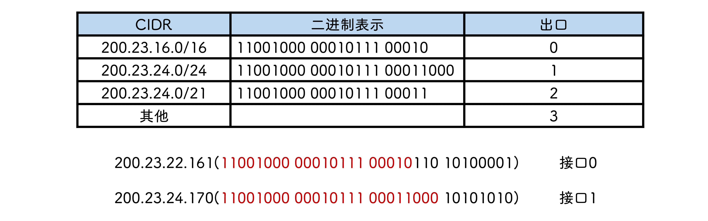

### 网络控制报文协议

`ICMP` `报告差错情况` `提供异常报告`

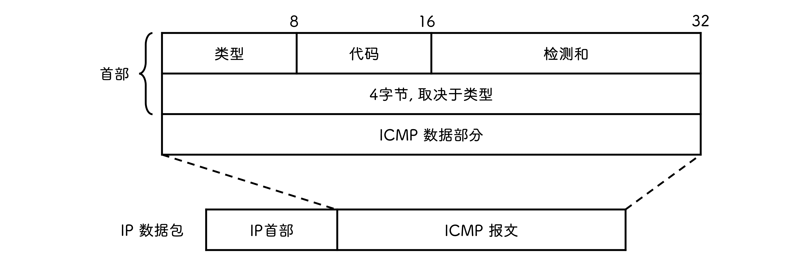

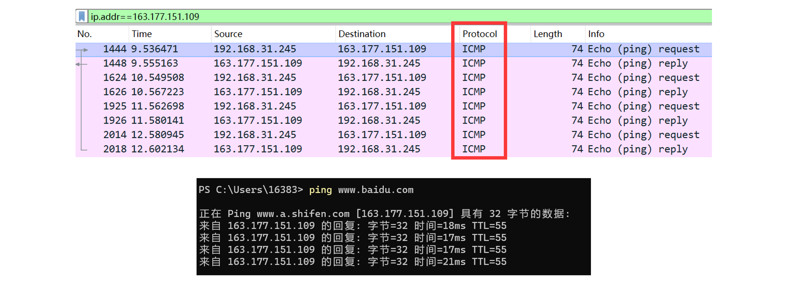

- `差错报文`

  - `终点不可达(3)` 路由器或主机不能交付数据报

  - `源点抑制(4)` 路由器或主机由于拥塞而丢失数据报时

  - `时间超时(11)` 路由收到生存时间为零的数据报时

  - `参数问题(12)` 数据报首部有字段值不正确

  - `改变路由(5)` 主机在下次将数据报发送给另一个路由器

- `询问报文`

  - `回送请求和回答报文(8,0)`

  - `时间戳请求和回答报文(13,14)`

  - `地址掩码请求和回答报文(17,18)`

  - `路由器询问和通告报文(9,10)`

### 地址解析协议

`ARP`

- 在链路层与物理层中, 同一局域网中的一台主机要和另一台主机进行通信, 需要通过 `MAC` 地址进行定位

- 在发送数据前需要通过 ARP 协议根据 `IP` 地址获取相应的 `MAC` 地址

- 查看 ARP 缓存

  ```
  arp -a
  ```

  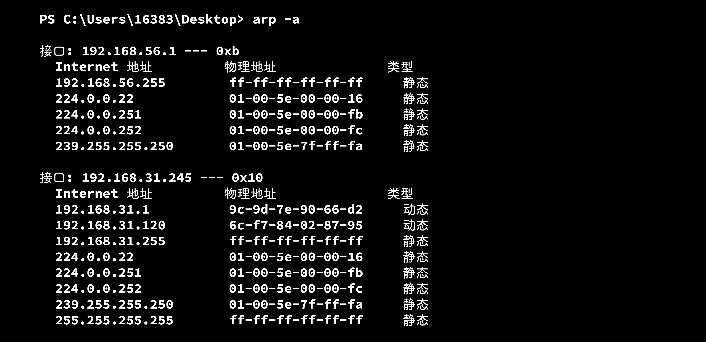

- 工作流程
  

:::info

ping 局域网内设备, 目的 MAC 地址是对应设备的, ping 外网地址, 目的地址是路由器(网关)的

:::

### 网络地址转换

`NAT`

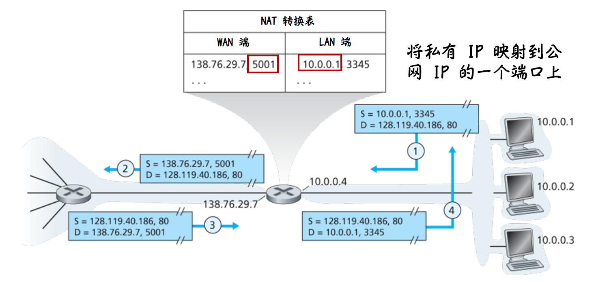

- 私有 IP 不能直接访问互联网, NAT 是将私有地址转化为公有地址的技术

- 从本地网络发出去的报文具有相同的 IP 地址, 但是有不同的端口号

- NAT 使路由器对外隐藏了家庭网络的细节

- NAT 支持 65535 个并行使用路由器广域网一侧单个 IP 地址的连接

### 动态主机配置协议

`DHCP` `应用层协议` `基于UDP`

- 给主机 `动态` 分配 IP 地址

- 提供 DNS、网关信息

- 为特定客户机(打印机, 文件服务)提供 `固定` IP 地址

- 分配到的 IP 是临时的, 只能在有限的时间内使用, 这段时间称为 `租用期`

- 由于开始时客户端没有 IP, 也不知道 DHCP 的服务器 IP, 所以只能 `广播` , 使用 UDP 端口 `68`

:::info 消息类型

- 服务端发送的是 offer, ack
- 客户端发送的是 discover, request
  :::

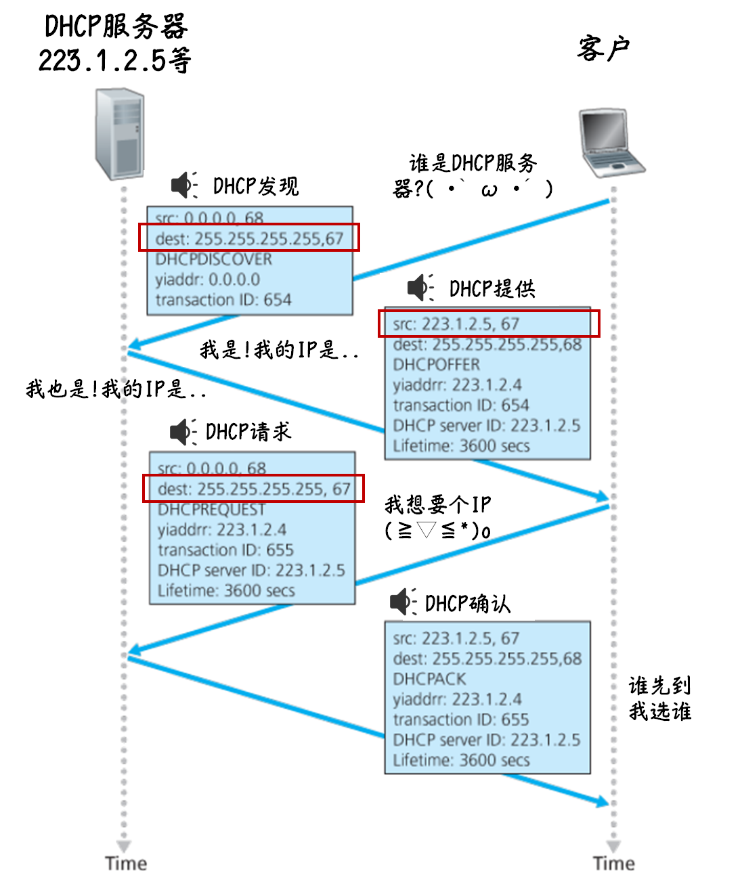

## IPv6

### 特点

- IPv6 只有在端系统中才能被分片, 链路上的路由不能分片

- IPv6 地址长度为 16 字节 `128b`

- `冒号十六进制法` 多个 0 可以用一个代替
  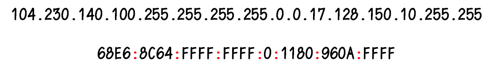
- `零压缩`

  - 连续的零可以用 `双冒号` 代替

  - 仅能使用一次
    

### 数据报格式

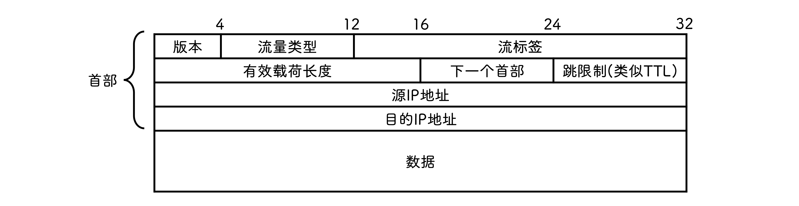

- `版本` 标识 IP 的版本, `IPv6` 设置为 `6`

- `流标签` 对一条流中的某些数据报给出优先级

- `有效载荷长度` 给出跟在 `40B` 首部后面的字节数量

## 移动 IP

### 移动 IP 通信过程

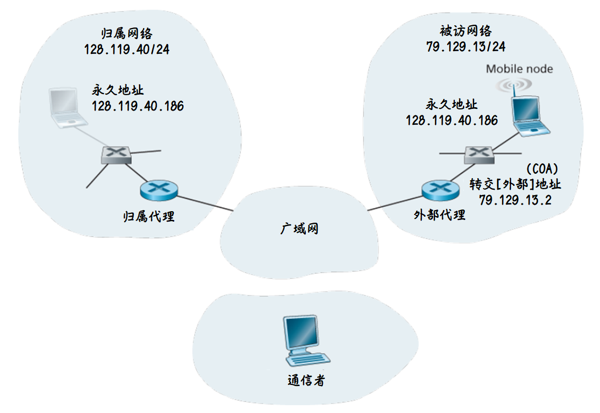

- `归属网络` 移动节点的永久居所

- `外部网络` 移动节点当前所在网络
- `归属代理` 在归属网络中代表移动节点执行移动管理功能的实体

- `外部代理` 在外部网络中帮助移动节点做移动管理功能的实体

- `具体过程`

  1. 移动节点向 `归属代理` 注册当前位置, 即 `转交地址(COA)`

  2. 归属代理构建一条通向转交地址的 `隧道` , 截获发送到移动节点的数据, 并从隧道处送到转交地址

  3. 数据在转交地址处解除隧道封装, 送到移动节点

### 间接路由选择

归属代理对数据报进行封装, 外部代理对数据报进行拆封

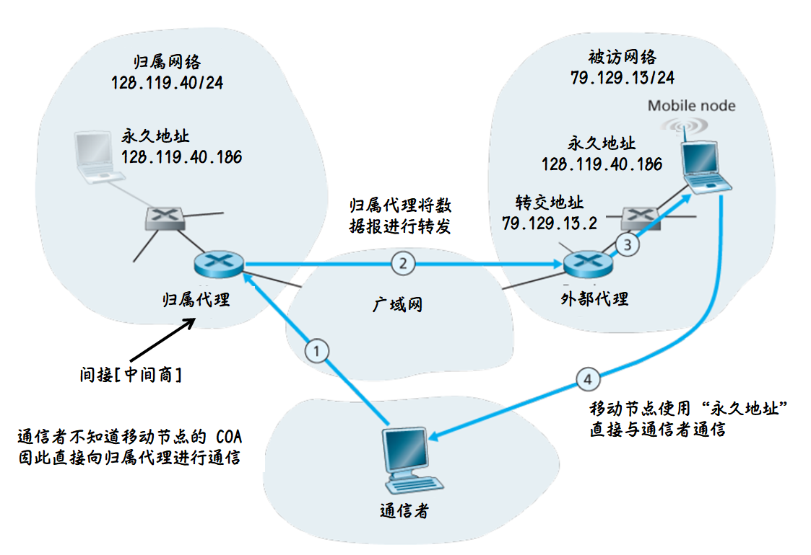

### 直接路由选择

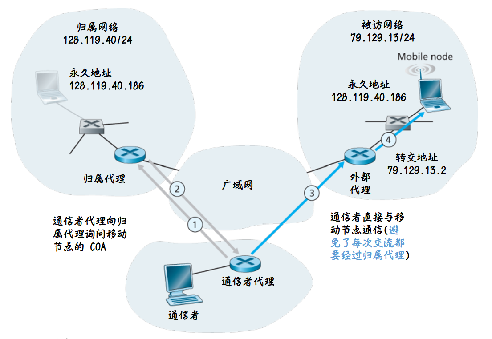

首次发现移动节点的外部网络称为 `锚外部代理` , 每次更改外部网络都要更新锚外部代理中的 `COA`

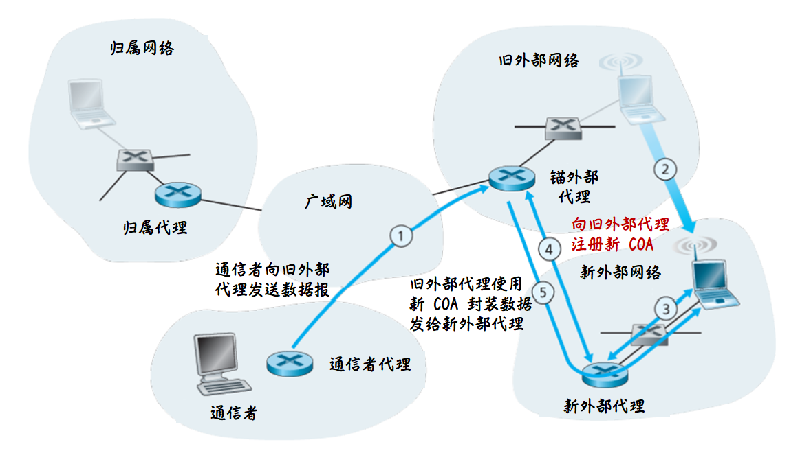

### 移动 IP 标准

- `代理发现` 移动节点发现进入了一个新外部代理的过程

  - `代理通告`

    外部代理/归属代理 `周期性` 的在所有连接的链路上 `广播` 类型 9 的 ICMP 路由器 `发现报文` , 移动节点能够从发现报文中获得需要的信息(如 COA 等)

  - `代理请求(主动)`
    - 移动结点广播类型 10 的 ICMP 报文
    - 代理向移动节点 `单播` 一个代理通告

- `向归属代理注册`

  通过外部代理向归属代理注册新的 `COA`

  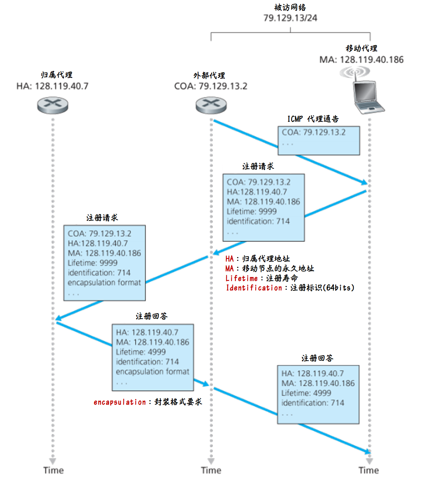

- `数据报间接路由选择` 数据报被归属代理转发给移动节点

## 路由选择算法

- 分类

  - `集中式` 开始计算前需要通过某种方法获得所有链路的开销

  - `分散式` 每个节点仅有与其相连的链路开销

  - `静态路由` 路由随时间变化缓慢，由人工调整

  - `动态路由` 随着网络流量负载或拓扑发生变化而改变路由选择路径

  - `负载敏感`

  - `负载迟钝` 如 RIP、OSPF、BGP

### 链路状态路由选择算法(LS)

`链路中的开销已知` `Dijkstra算法`

1. 从源节点到相邻节点的开销初始化

   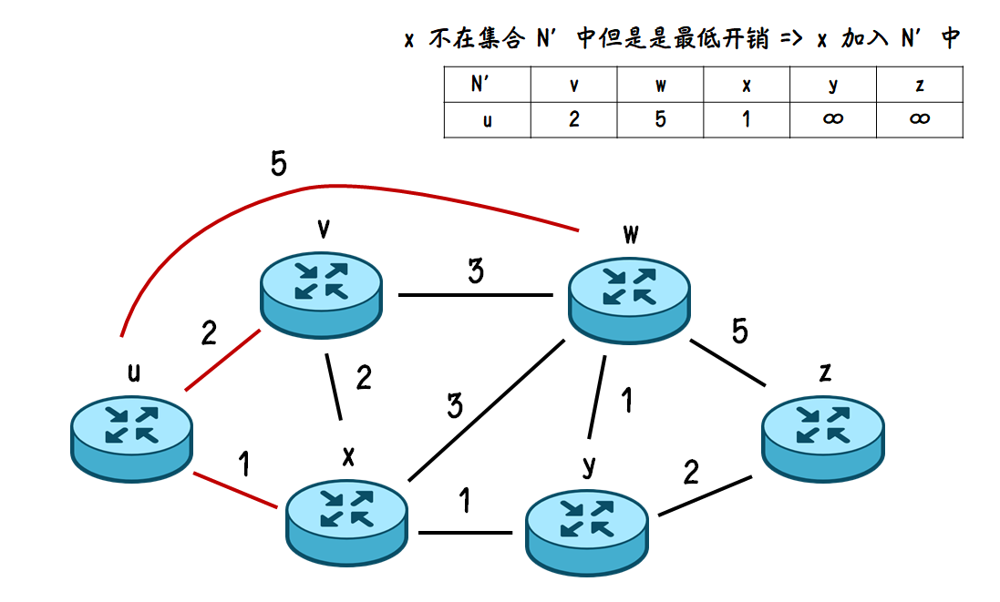

2. 观察未加入集合 `N'` 的节点, 并通过节点 `x` 查找剩余节点

   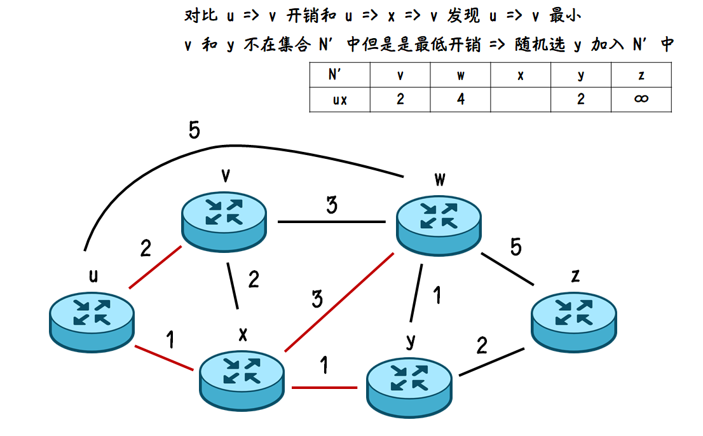

3. 查找 y 到剩余节点的开销
   y → v 为 ∞ 因此最短的还是 u → v
   y → w 为 3 比前一次 u → x → w 低因此最短的开销变成 3

   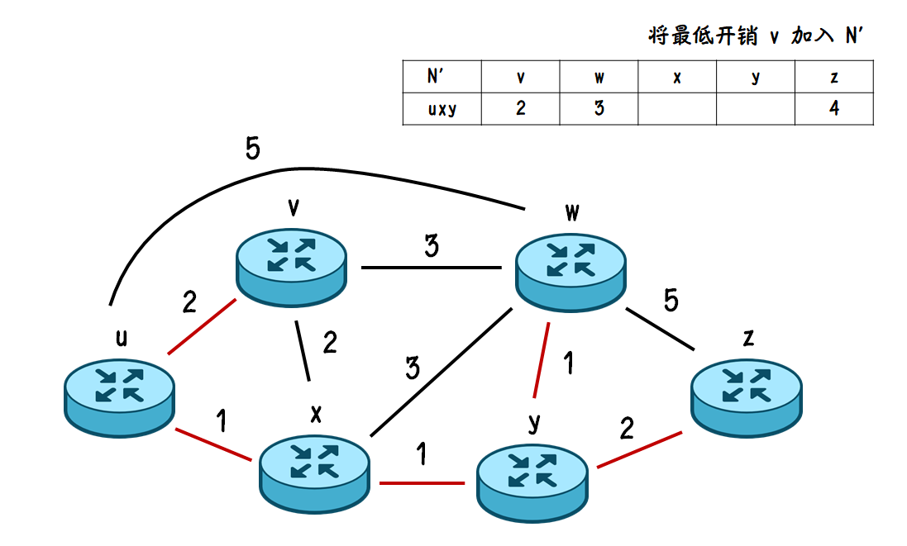

   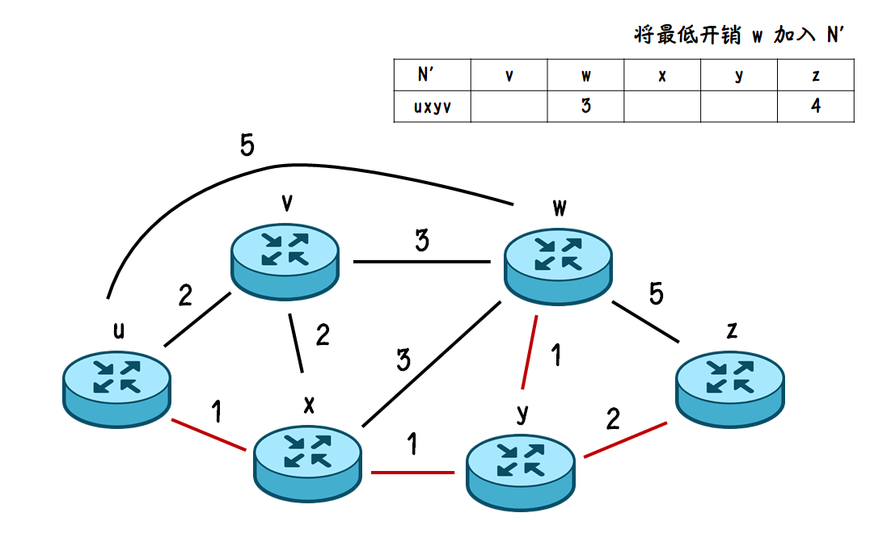

   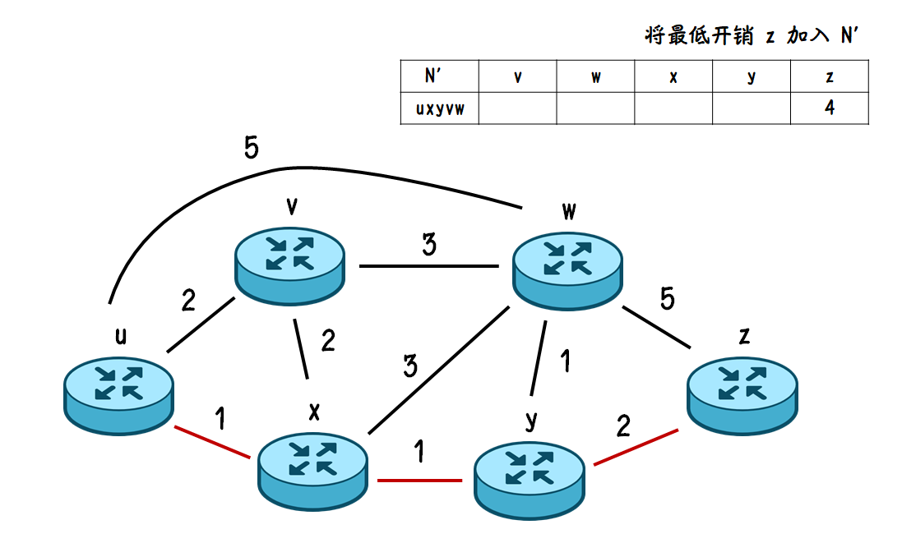

4. 得到最终的最低开销链路图
   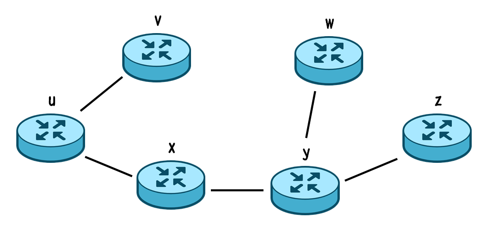

### 其他

- 距离向量路由选择算法(DV), 如 RIP

- 路径向量路径选择算法, 如 BGP

## 路由协议

- `内部网关协议(IGP)` 自治系统内部使用的路由协议, 如 `RIP` `OSPF`

- `外部网关协议(EGP)` 在数据报传到自治系统的边界时, 能将路由选择信息传递到另一个自治系统的路由协议, 如 `BGP-4`

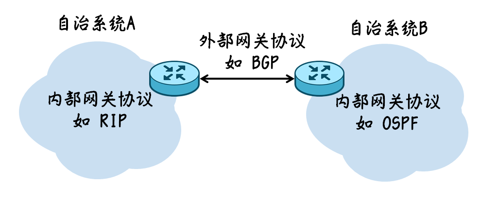

### 路由信息协议(RIP)

`UDP 协议` `端口520` `内部网关协议` `应用层协议` `距离向量协议`

- 跳数少的是好的路由, 即使有一条高速低延迟的线路也不例外

- 路由表的默认目的地址和网关为 `0.0.0.0`

  

- 最多经过 `15跳` , 因为 16 跳被认为是不可达的

- 仅 `相邻` 的两个路由间交换信息(路由器已知的所有信息), 因此 RIP 协议中路由器不知道全网的拓扑结构

- 任意两个使用 RIP 的路由器间每 `30s` 广播一次 RIP 路由更新信息

- 每经过一次广播就能获得 `跳数+1` 的路由信息, 经过若干次广播后路由器最终知道 `整个IP网络` 的路由表, 并且跳数是最小的

- `距离向量算法`

  - 路由表项 `<目的网络, 跳数, 下一跳地址>`

  - 收到 `X` 的 `RIP` 报文, 将下一跳地址改为 `X` , 跳数加一

  - 原路由表中没有目的网络, 就把其加入路由表中, 如果有目的网络, 下一跳是 `X` , 就更新跳数, 不是 `X` , 如果跳数变少, 就更新

  - 超过 `180s` 没收到 `X` 的 `RIP` 报文, 就删除路由表项, 表示为不可达

  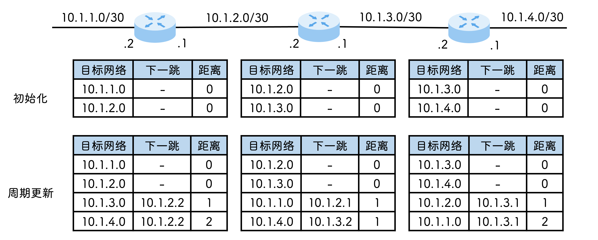

- `坏消息传的慢`

  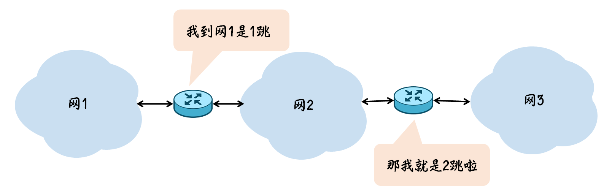

  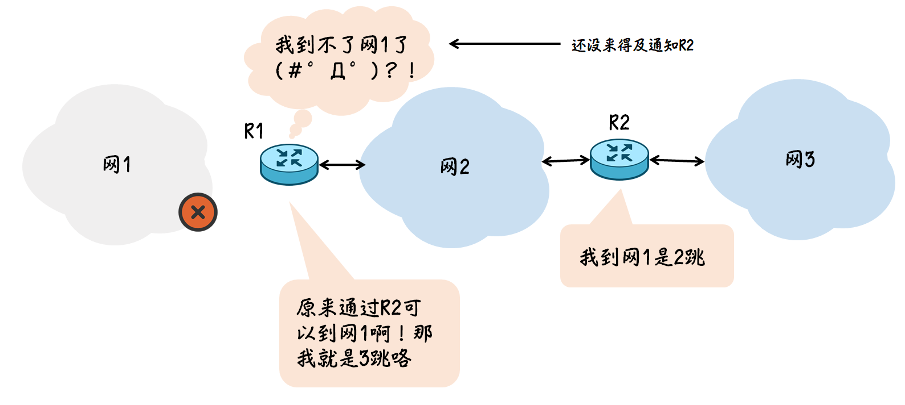

  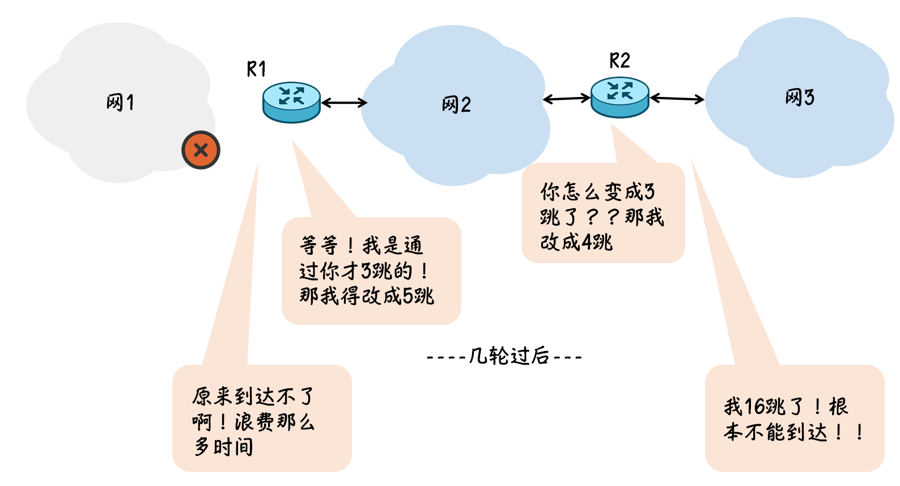

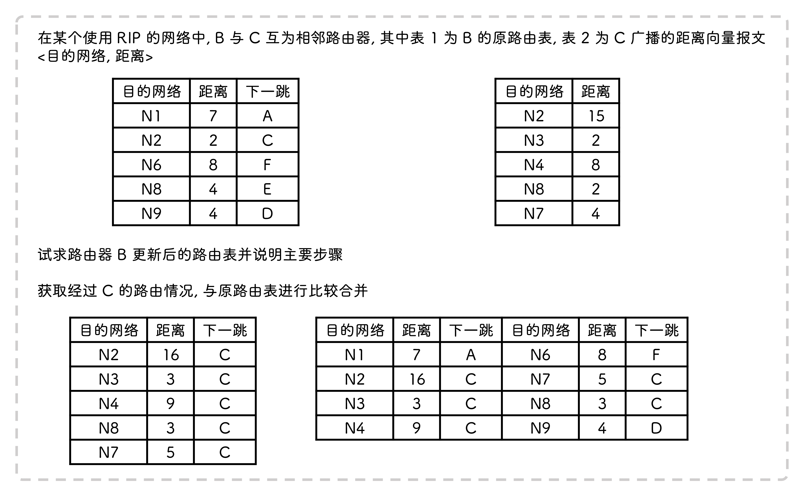

### 开放最短路径优先协议(OSPF)

`网络层协议(IP协议)` `分布式链路状态算法` `内部网关协议` `链路状态协议`

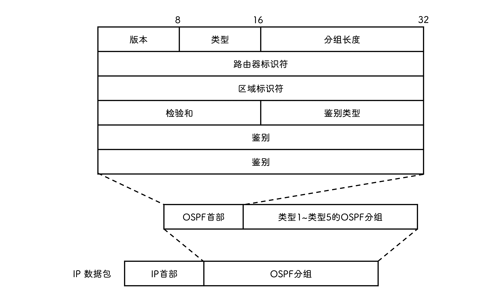

- `洪泛法` 只有链路状态发生变化, 才向邻近路由器发送消息, 邻近路由器再将该消息转发给自己邻近的路由器, 实际效果是向自治系统中的所有路由器发送信息

- 仅发送与自己相邻路由器的信息 ( 因此只发送路由表的一小部分 )

  - 哪些相邻路由器、距离、带宽、时延等

- 链路发生变化时发消息, 即使没变化也要至少 `30min` 广播一次

- 路由器最终能建立全网的拓扑结构图, 通过 `dijkstra 最短路径算法` 建立路由表

- 洪泛法仅在 `区域` 内交换链路状态信息

  - 区域内路由最好不要超过 `200` 个

  - 非主干区域间 `不允许` 直接发布区域间路由信息

  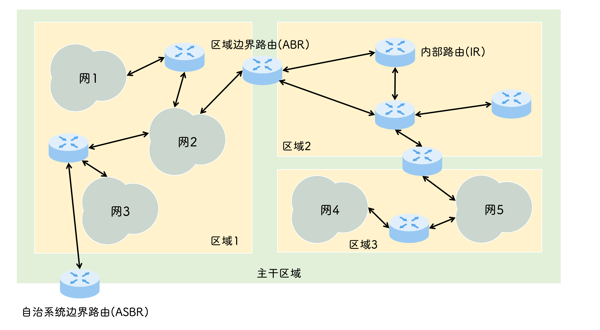

- 分组类型

  - `问候分组` 发现和维持邻站可达性, 每 `10s` 交换一次

  - `数据库描述分组` 和相邻路由器交换的数据(摘要信息)

  - `链路状态请求分组` 根据数据库描述向邻近路由器请求自己缺少的链路状态的详细信息

  - `链路状态更新分组` 用洪泛法对全网更新链路状态

  - `链路状态确认分组` 对链路更新分组的确认

### 边界网关协议(BGP)

`TCP 协议` `端口179` `外部网关协议` `路径向量协议` `应用层协议`

- 与邻近自治系统的 BGP 发言人通过 TCP 连接交换信息

  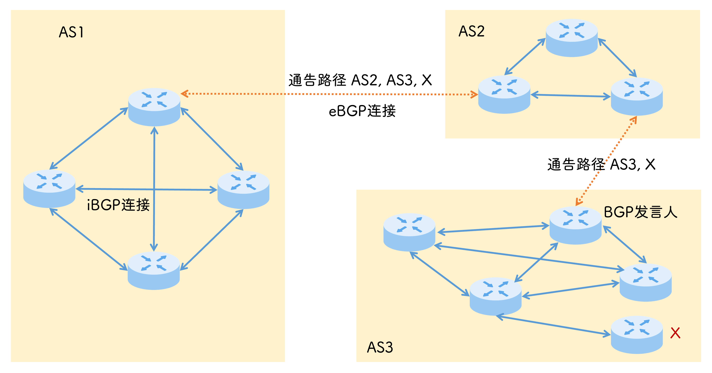

- 尽力寻找较好的路由, 而不是最佳路由
- 交换 `网络可达性` 的信息( 到达某个网站所经过的一系列 AS ), 根据所采用的策略找出达到各 AS 的最好路径

- 四种报文

  - `OPEN` 与邻近 BGP 发言人建立关系

  - `UPDATE` 通告新路径或撤销原路径

  - `KEEPALIVE` 周期性的证实邻站的可达性

  - `NOTIFICATIONL` 关闭连接 & 报告差错

- BGP 是由 AS1 构造的树型结构
  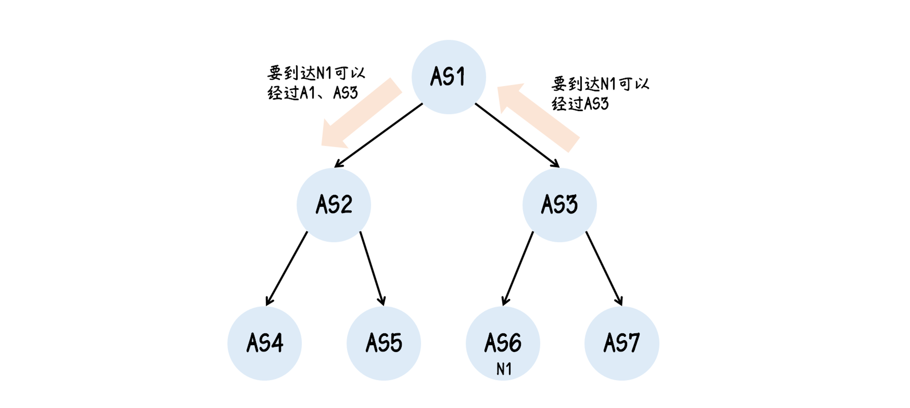

:::tip

OSPF 适合于在大型的、动态的互连网上使用, 而 RIP 适合于在小型的、静态的互连网上使用

:::
