尽可能屏蔽掉不同传输媒体和通信手段的差异

### 名词

- `调制解调器` 俗称 `猫` , 将数字信号转换成模拟信号

- `分组` 发送端系统将数据分段, 每段加上首部字节而组成的信息包

- `路径` 一个分组所经历的一系列通信链路和分组交换机

- `分组交换机` 路由器和链路层交换机统称

- `因特网服务提供商(ISP)` 端系统通过 ISP 接入互联网

- `请求评论(RFC)` 因特网工程任务组(IETF)的标准文件, 定义了 IP、TCP 等协议

- `网络协议` 定义了报文的格式和顺序/发送接收报文的动作

  - `硬件实现协议` 控制网络接口卡间的线上比特流

  - `拥塞控制协议` 控制发送方和接收方传输的分组发送速率

  - `路由器协议` 决定分组从源到目的地的路径

- `分布式应用程序` 涉及多个相互交换数据的端系统

- `套接字接口(socket interface)` 规定了交付数据的方式

- `边缘路由器(edge router)` 端系统到远程端系统路径上 `第一个` 路由器

- `接入网` 将端系统物理连接到边缘路由器的网络

- `流量强度` (分组到达队列的平均数率 × 分组长度) / 信道宽度(或传输速率)

- `信道` 信号的传输媒介, 往往代表向某个 `方向` 传输信息, 一条通信线路往往包含一条发送信道和一条接收信道

## 特性

### 接口特性

- `数据终端设备(DTE)` 具有数据处理和转发能力的设备

- `数据电路终结设备(DCE)` 提供信号变换和编码的功能

### 机械特性

接线器的形状、尺寸、引线数目、排列、固定和锁定装置

### 电气特性

- 发送器和接收器的 `电路特性` `负载要求` `传输速率` `连接距离`

- `发送信号电平` `发送器和接收器输出阻抗` `平衡特性`

### 功能特性

定义接线器每个引脚的作用

### 过程特性

指明 `不同功能` 的各种可能事件的出现顺序

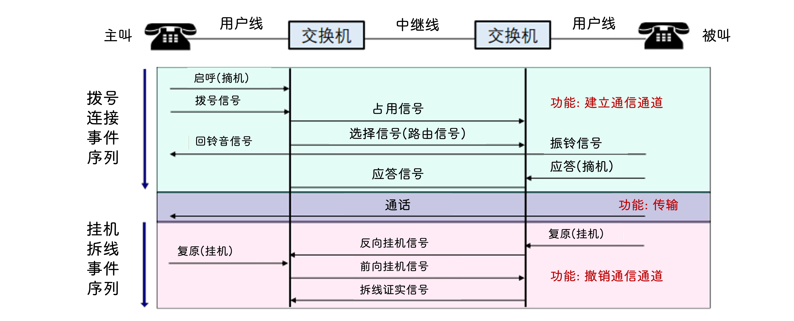

## 家庭接入

- `数组用户线(DSL, 调制解调器)`

  使用 `电话线` 与电话公司的 `本地中心局(CO)` 中的数字用户线接入 `复用器(DSLAM)` 交换数据

  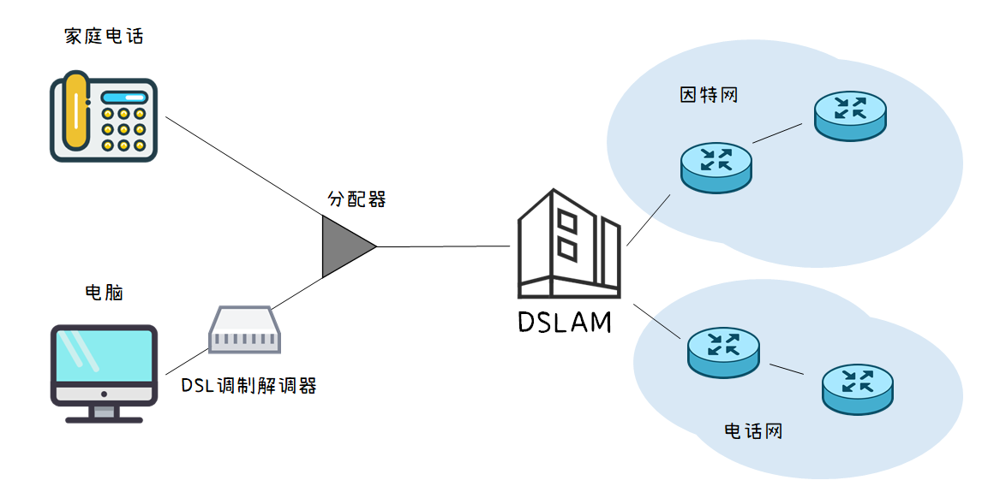

- `电缆(HFC, 混合光纤同轴)`

  电缆调制解调器通过 `以太网` 端口连接到家庭 PC, 与 `电缆调制解调器端接系统(CMTS)` 交换数据

  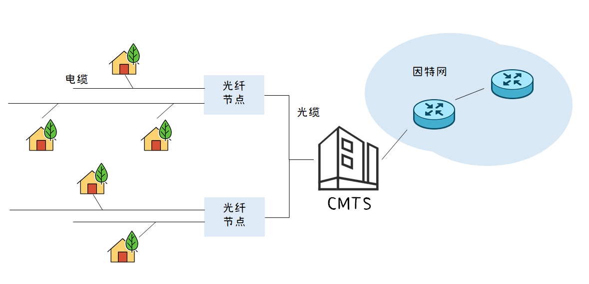

  - 共享广播媒体, 如果用的人多了挤占一条电缆导致实际上/下行速率小于电缆速率

- `光纤到户(FTTH)`

  光纤通过 `网络端接器(ONT)` 连接到分配器后通过 `光缆` 连接到中心局的 `光纤线路端接器(OLT)`

  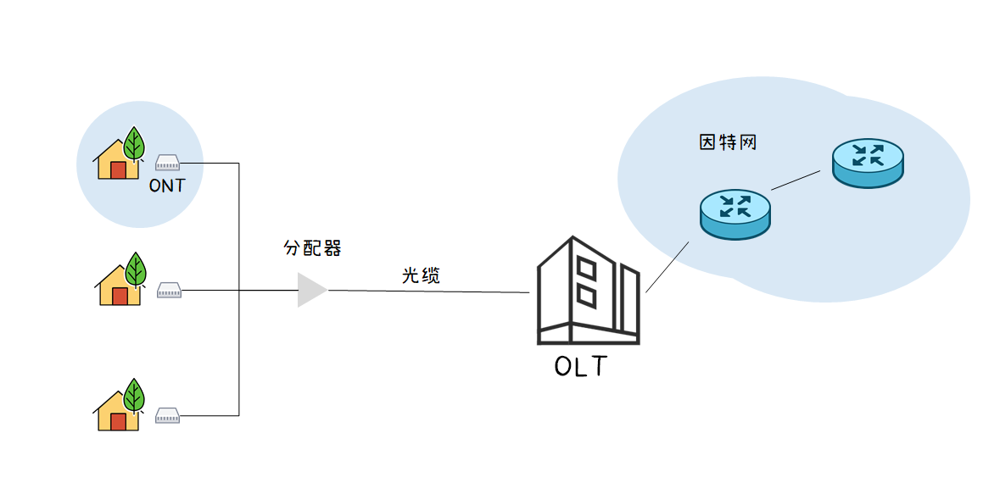

  - `有源光纤网络(AON)`

    - `OLT` 电信号和光信号间的转换

  - `无源光纤网络(PON)`

- `拨号`

- `卫星`

## 物理媒体

- `引导型媒体`

  - `双绞铜线`

    

    - `绞合` 减少相邻导线的电磁干扰

    - `屏蔽双绞线(STP)` 外层存在金属丝编织的屏蔽层

      

    - `非屏蔽双绞线(UTP)`

  - `同轴电缆`

    

    - 双向传输

    - 电缆上多个频率通道

    

  - `光纤`

    :::info
    
    纤芯折射率大于外层的折射率, 当入射角足够大就会引起 `全反射`
    
    :::

    - `多模光纤` 短距离传输

      - 不同 `入射角` 光波可以在一根光纤里传播

      - 光源 `发光二极管`

    - `单模光纤` 远距离传输

      - 纤心很细, 只有几微米( 直径减小到与光线的一个波长那么大 )

      - 光波能够笔直传播, 不会反射

      - 光源 `激光二极管`
  
  

- `非引导型媒体`

  - `陆地无线电频谱`

    - `短距离` 头戴式耳机等

    - `局域` WLAN(无线局域网)

    - `广域` 蜂窝

  - `卫星无线电频谱`

    - 同步卫星

    - 低轨卫星

  - `短波传输` 利用电离层

  - `散射传输` 利用大气传输媒介不均匀性对无线电波的散射作用进行超视距通信

  - `地面微波` 多路复用、射频工作、中继接力是其三个最基本的工作特点

    

  - `光播传输`

## 物理层

- `传输` 不是指在线路中传播速率, 而是将数据 `推向线路` 的速率

- `码元传输速率` 单位时间内传输的码元个数 `Baud/s`

- `信息(数据)传输速率` 单位时间内传输的二进制码元个数 `b/s`

- `波特率` 信号每秒变化的次数 `Baud`

  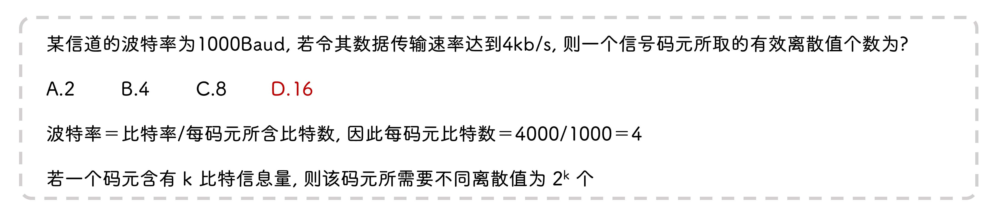

- `奈奎斯特定理`

  - 理想低通信道指 `无噪声` `带宽有限` 的信道

  - 极限( 最大 ee)码元传输速率 `2W`

    - `W` 是理想低通信道带宽

  - 极限数据传输速率

    - 

    - `V` 是码元离散电平数目

  - 码元传输速率有上限, 超过这个范围出现 `码间串扰` , 收到的信号波形失去了码元间清晰的界限

  - 信号的高频分量越多, 就可用更高的速率进行码元传输

  - 码元传输速率有限制, 为提高数据传输速率, 让每个码元携带更多比特

  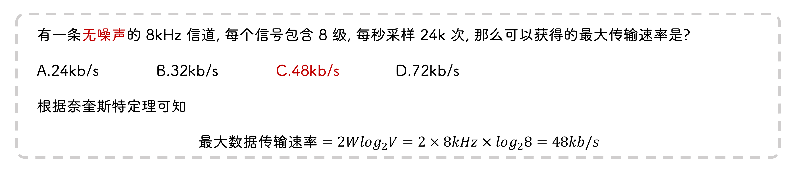

- `香农定理`

  - 带宽受限且具有 `高斯白噪声` 干扰的信道中

  - 极限数据传输速率

    

    - `S` 是信道传输信号的平均功率
    
    - `N` 是信道内部的高斯噪声功率

  - 信噪比

    

  - 影响信道最大传输速率的因素 `信道带宽` 和 `信噪比`

  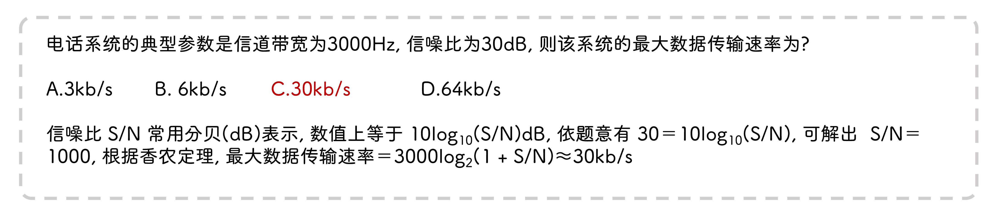

- `编码为数字信号`

  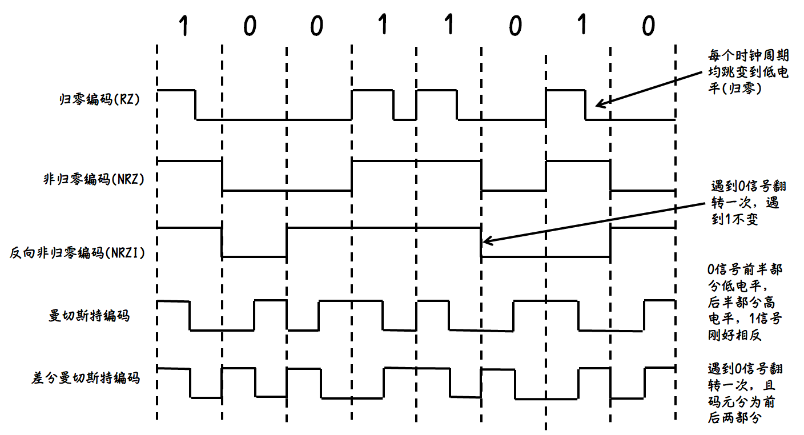

  - 反向非归零编码 `USB2.0`
  
  - 曼彻斯特编码 `以太网`

    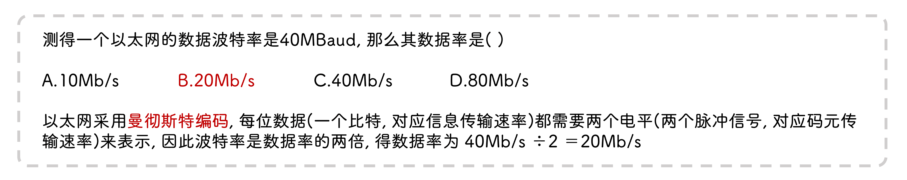
  
  - 差分曼彻斯特编码 `局域网`

  :::info
  
  除了 `非归零编码` 都带有时钟信号
  
  :::

- `编码为模拟信号(调制解调器)`

  - `幅移键控(ASK)` 改振幅代表 0 和 1

  - `频移键控(FSK)` 改频率代表 0 和 1

  - `相移键控(PSK)` 改相位代表 0 和 1

  - `正交振幅调制(QAM)`

    

    - `m` 相位数
    
    - `n` 振幅数
    
    - `B` 波特率

  - `编码为数字信号`

    - `脉冲编码调制(PCM)` 对音频信号进行编码
  
  - 将基带信号直接传送到通信线路( 数字信道 )上, 称为 `基带传输`
  
  - 把基带信号经过 `调制` 后送到通信线路( 模拟信道 ) 上, 称为 `频带传输`

- `并行传输` 距离短, 速度快

- `串行传输` 距离长, 速度慢

- `频带传输` 模拟信号经过调制后送到通信线路

- `物理层设备`

  - `中继器(转发器)` 将信号整形放大再转发, 消除长距离传输因噪声导致的失真和衰减

    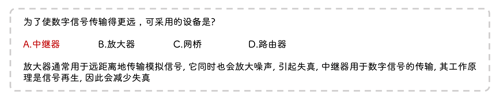

  - `集线器(hub)` 重新生成收到的比特, 将其能量强度放大

    - 多端口中继器
    
    - 将收集到的比特放大都向所有端口转发(广播)
    
    - 不能同时接收不同端口的数据, 发生碰撞而丢弃

    - 由集线器连接的网络在拓扑结构一般属于 `星型`
  
  - `转发器` 放大信号
  
  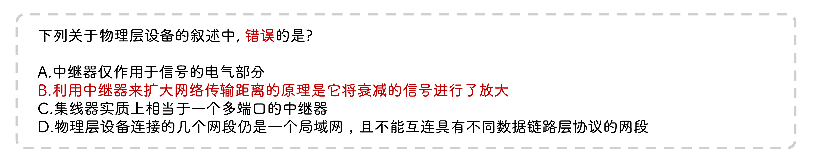

## 网络核心

### 两大功能

- 路由

- 转发

### 交换

- 分组交换

  - 存储转发传输

    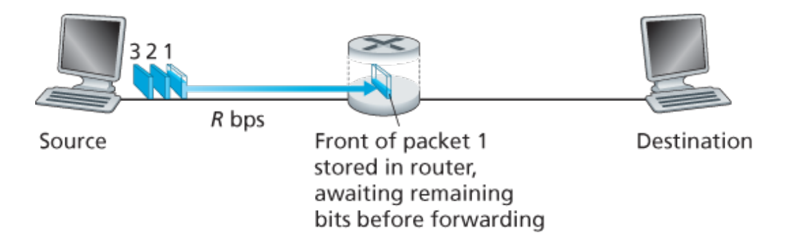
    开始向链路输出前需要 `等待` 所有分组到齐

  - `转发表` 将目的地址(或部分)映射成输出链路

    路由器接收到分组, 检查地址, 搜索自己的转发表, 找到出链路

- 报文交换

  - 数据交换的单位是报文(无大小限制)

  - `存储转发形式` 需要收到完整报文后才能向下一跳发送 ( 路由器 )

  - 动态分配线路

  - 提高线路利用率(非占有)

- 电路交换

  - 通常采用 `面向连接` 的方式

  - `预留` 端系统沿路径通信所需的资源

    

    两台主机间有 `专用` 的端到端连接, 因此传输性能好

  - 连接期间获得链路总容量的 `1/4`

  - 预留机制实现

    - `频分复用(FDM)`

      将整个带宽分成多份, 用户在同样的时间占用不同带宽资源

      

    - `时分复用(TDM)`

      由于计算机数据的 `突发` 性质, 用户对分配到的子信道的利用率不高

      

    - `统计时分复用(STDM)`

      动态按需分配共用信道的时隙

      

    - `波分复用(WDM)`

      同一光纤上发送不同波长的激光

    - `码分复用(CDMA)`

      每个站点有自己的 `码片序列` , 当要发送比特 `1` 时, 发送自己的码片序列, 当要发送比特 `0` 时, 发送序列的 `反码` , 不同站点的码片序列 `正交`

      :::tip
      
      正交非常重要, 这可以让站点码片序列乘其他站点的码片序列值为 0, 这样就可以得到乘上自身的结果, 是 1 就发送 1, 是 -1 就发送 0, 是 0 就没发送
      
      :::

      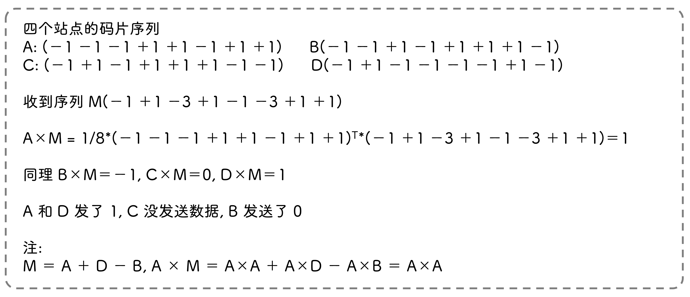

  - 通信双方拥有不同的信道, 不会产生冲突

  - 数据量大时采用

#### 比较

- 电路交换需要预留资源, 难以实现复用

- 分组长度小于报文长度, 因此分组交换时延小, 更灵活

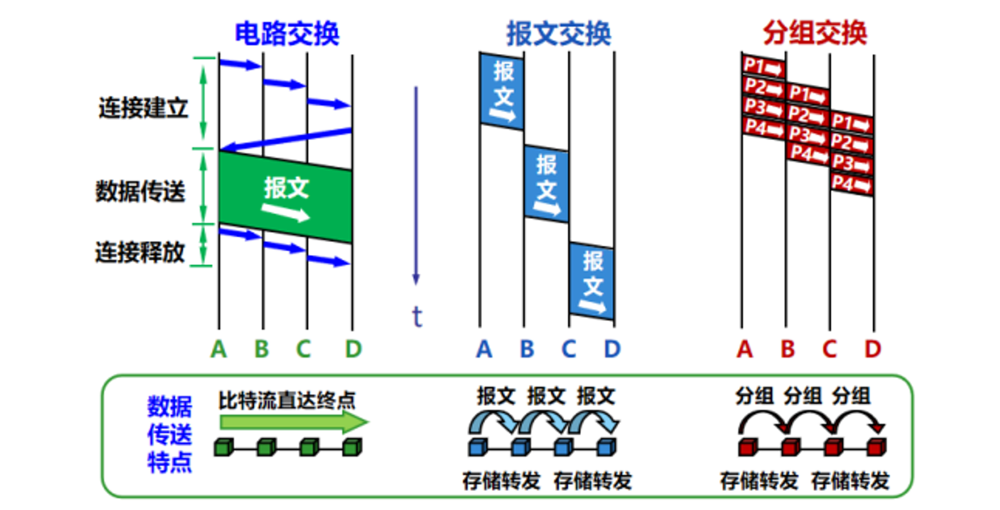

### 时延

- `处理时延` 检查分组头部和决定将分组导向何处的处理时间
  
  

- `排队时延` 分组在链路上等待传输的时间
  
  

- `传输时延` 路由器将分组输出到链路的时间

  `R=100Mbps(传输速率)` 表示一个出口在 `1s` 内允许 `10⁶bits` 数据出去

  

- `传播时延` 信号在链路中传播的时间

  

- `往返时延(RTT)` 分组经历客户端 → 服务器 → 客户端的时间

  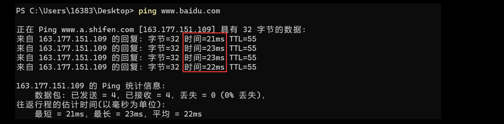

  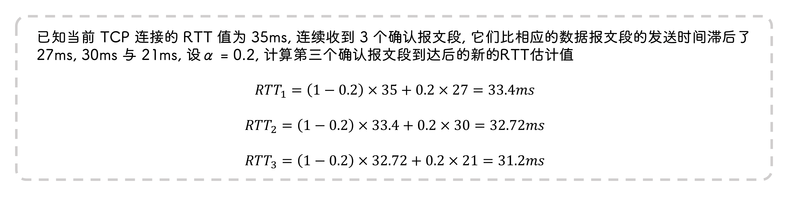

- `丢包` 没地方存放新来的分组, 因此路由器会将某些分组丢弃

  

- `时延抖动`

  - 时延在不断变化

  - 起源于网络中队列或缓冲, 难以预测

- `时延丢包`

  - 因为时延导致数据包已经没用了

  - 接收端自动丢弃无价值的包

### 网络结构

- 网络结构 I

  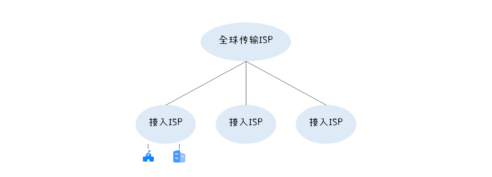

- 网络结构 II
  
  

- 网络结构 III

  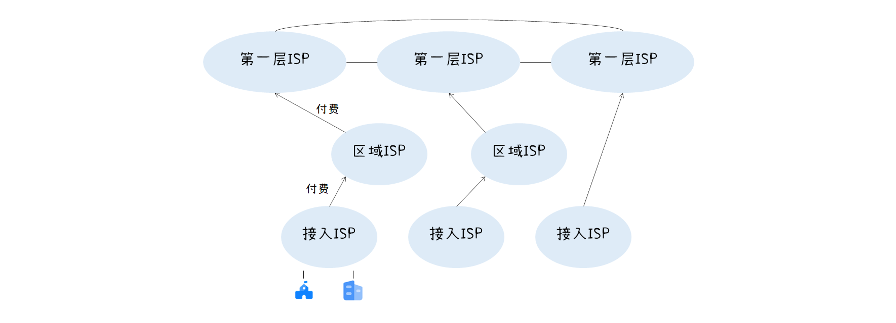

  数据经上游 ISP 中转

- 网络结构 IV

  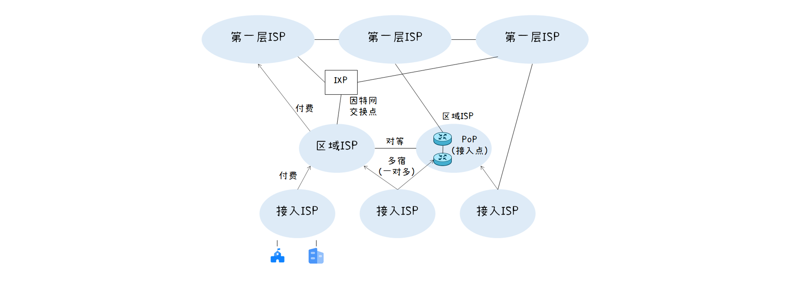

  `IXP` 多个 ISP 在一起对等并直接交换数据

- 网络结构 V
  
  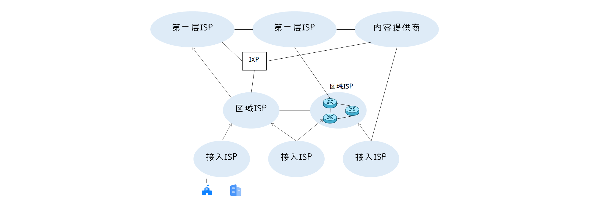

### Traceroute(路由跟踪)

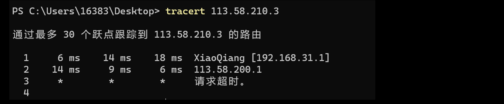

- `TTL(time-to-live)`

  数据最大转发次数, 由源决定, 超过该次数时数据包不再继续转发

  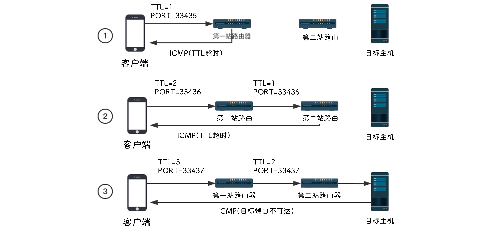

  源先发送一个 `TTL=1` 的数据包, 收到回复后再发一个 `TTL=2` 的数据包, 一共发送 `N` 个数据包, 表明源与目的主机间存在 `N - 1` 台路由器

- ping 使用的 ICMP 协议

  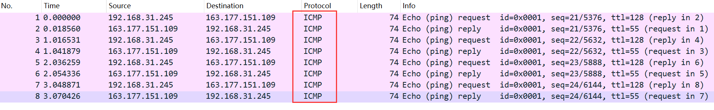

## 其他

- `吞吐量`

  - 瞬时吞吐量
  
  - 平均吞吐量
  
  - 吞吐量的大小取决于链路 `最小值` (瓶颈链路)

  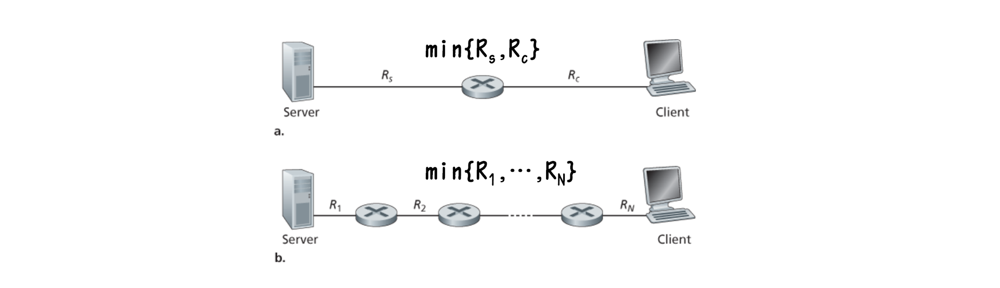

  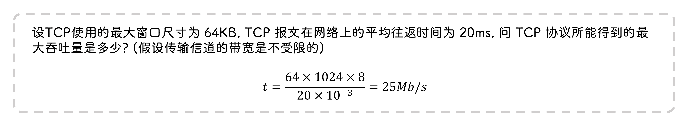

- `协议分层`
  
  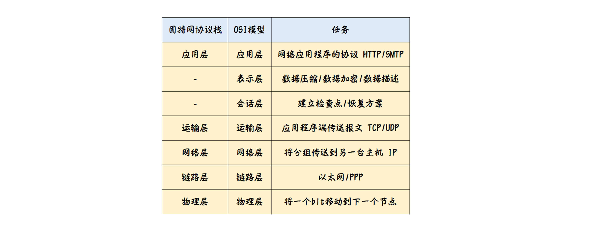

- `封装`
  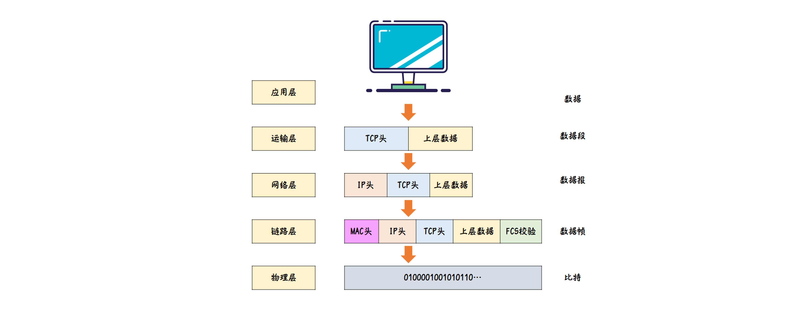

## 网络攻击

### 有害程序

- `病毒`

  - 需要某种形式的 `用户交互` 来感染用户设备
  - 如被附上恶意代码的电子邮箱附件

- `蠕虫`
  - 无需明显的用户交互
  - 利用 `系统漏洞` 通过网络进行传播的恶意程序
  - 不需要宿主(如附件)

### 攻击服务器

- `拒绝服务攻击(Dos)`

  - `弱点攻击` 攻击应用程序/操作系统

  - `带宽洪泛` 向主机发送大量分组

  - `连接洪泛` 伪造大量 TCP 连接

- `分布式DOS(DDos)`

  - 利用受害主机组成的 `僵尸网络` 进行攻击

  - 防止上游路由器检测同一个源而被阻拦

- `嗅探` 被动接收机, 获得传输的分组副本

- `IP 哄骗`

### 防御

- `身份验证`

- `保密`

- `完整性检查`

- `访问限制`

- `防火墙`
