:::info 优势

总线结构便于增加外设, 减少传输线的数量

:::

## 分类
- 数据传输方向

  - 单向传输总线 `控制总线`

  - 双向传输总线 `数据总线`

- 时序控制方式

  - `同步总线` 公共时钟实现同步

  - `异步总线` 应答机制实现同步

- 系统总线

  - `数据总线` 可传输 `数据` `指令` `状态信息(中断)` , 数据总线宽度即数据总线的 `
  条数`
  
  - `地址总线` 传输源数据、目的数据在主存单元、I/O 端口中的地址, `32` 根地址线最大寻址空间 `2^32`
  
  - `控制总线` 传输 `控制命令` `时序信号` , CPU 送往功能部件的 `读写` 控制信号, 功能部件送往 CPU 的状态信号、请求信号, 一条控制线是 `单向` 的, 整体是双向的

- 信号传输模式

  - 并行传输总线

  - 串行传输总线(同一时刻只能传输 `1bit` 的数据, 如 USB)

- 所处位置

  - `片内总线` CPU `芯片内部` 寄存器之间、寄存器与运算器之间数据通路连接、控制器与执行部件之间控制信号连接

  - `系统总线` 各功能部件(CPU、主存、I/O模块)相互连接的总线

  - `I/O 总线` 连接中低速 I/O 设备并通过 `桥接器` 与高速总线相连

  - `外部总线(通信总线)` 计算机系统或与 `其他系统` 之间进行数据通信

## 结构

### 单总线

:::info 优缺点

- `优点` 结构简单, 成本低, 易于接入新设备

- `缺点` 带宽低, 负载重, 存在竞争

:::

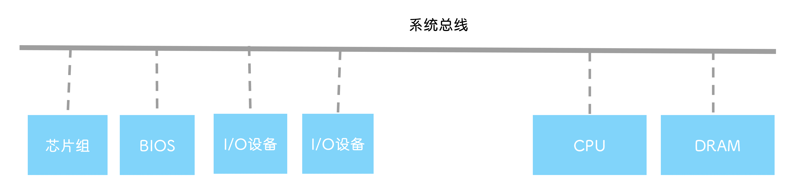

### 双总线

:::info 优缺点

- `优点` 实现存储器总线和 I/O 总线分离

- `缺点` 需要增加通道

:::

#### 高速存储总线

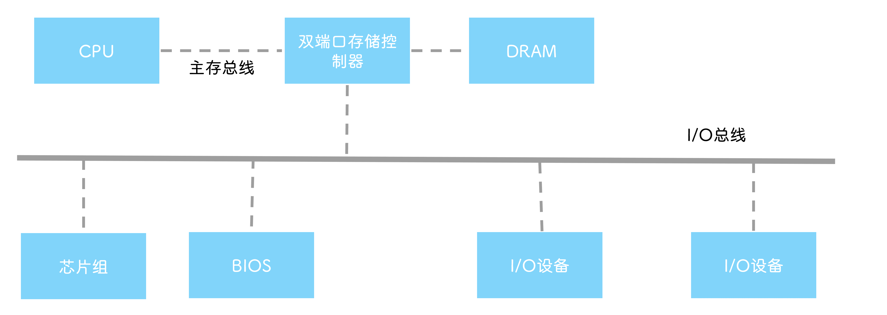

#### 桥接器

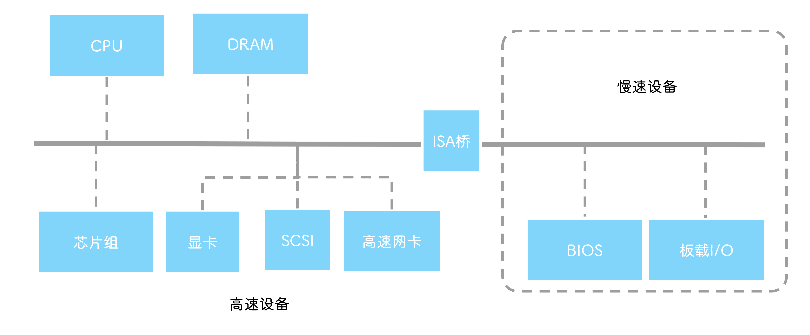

### 三总线

:::info 优缺点

- `优点` 更快的响应命令, 提高系统吞吐量

- `缺点` 系统工作效率低

:::

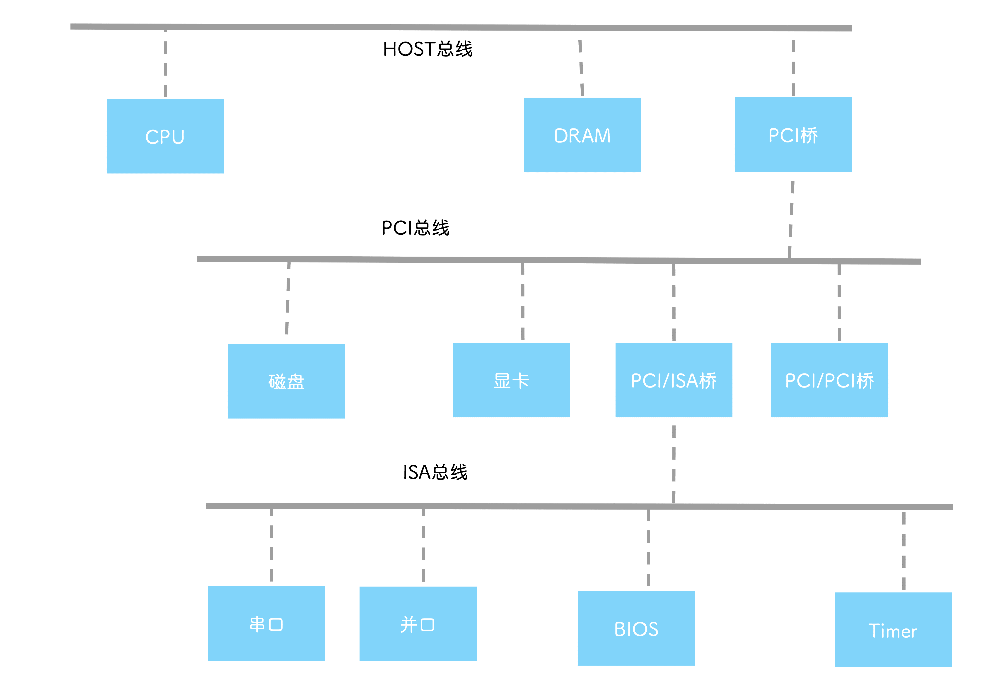

## 性能指标

### 总线带宽

总线宽度 × 时钟频率 ÷ 时钟周期数(或×单时钟传输周期) = 总线宽度 × 总线频率

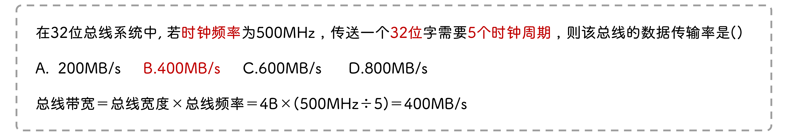

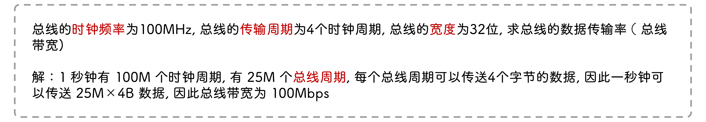

#### 提高总线带宽

1. 增加总线并行传输位数

2. 增加时钟频率

3. 缩短总线传输周期

### 总线时钟频率

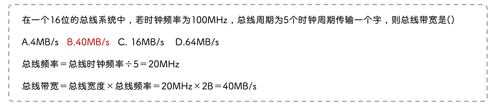

### 单时钟传输周期

一个时钟周期内传输数据的次数, 如总线周期为 `5` 个时钟周期传输 `一个字` , 则单时钟传输周期为 `0.2` 字

## 总线事务

### 过程

- `请求阶段` 请求获得总线控制权的过程

- `仲裁阶段` 决定下一个传输周期总线使用权归属

- `寻址阶段` 给出从设备地址及相关命令

- `传输阶段` 主从模块进行数据交互

- `结束阶段` 主模块相关信息从系统总线上撤销, 让出总线控制权

### 突发传送事务

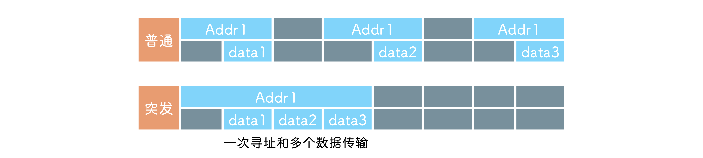

## 仲裁

### 集中式仲裁

#### 链式查询(菊花链查询)

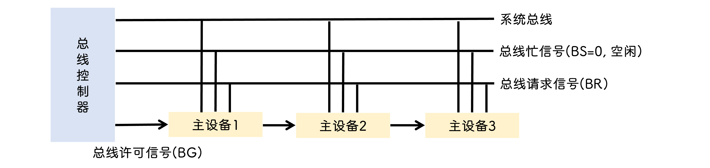

:::info 缺点

- 设备优先级固定

- 一个主设备故障, 后面的主设备不能用了

- BG 需要一个时钟周期才能传到下一台主设备, 响应速度慢

:::

#### 计数器定时查询

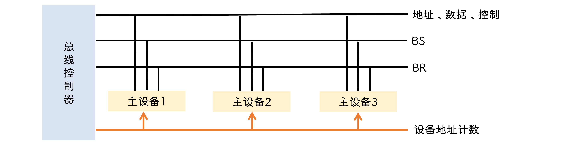

收到请求计数器开始 `计数` , 符合当前计数值的设备不用总线, 则没过一个时钟周期计数器加一

:::tip

计数器初始值不能恒定, 这样就与链式一样了

共需要 $log_2n$ 条总线许可, 因为 $2^{log_2n}$ 可以唯一标识 n 个设备

:::

#### 独立请求

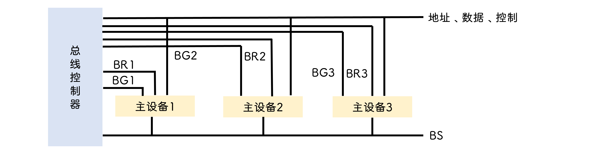

### 分布式仲裁

#### 自举分散式仲裁

设备发送请求后查看高优先级设备是否也发送了请求, 高优先级优先获得控制权

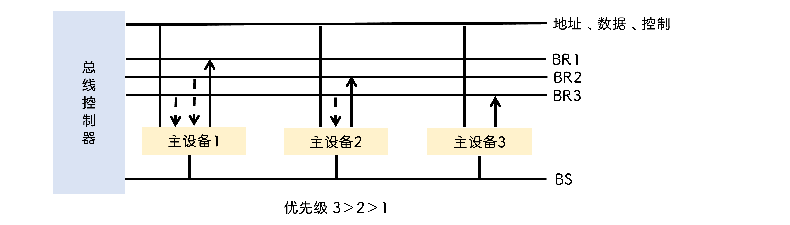
#### 并行竞争仲裁

设备存在一个 `仲裁号` , 仲裁号越大, 优先级越高

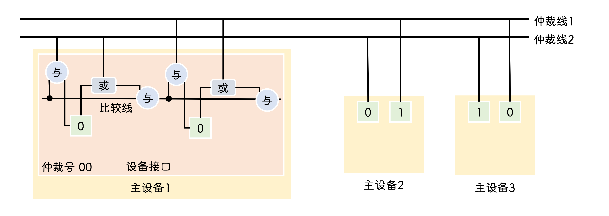
#### 冲突检测分散式仲裁

- 发生冲突后各自延迟一段时间再请求

- 获得总线控制权后持续监听一段时间, 避免同时监听到总线空闲

## 定时

### 同步

- `寻址阶段` 目标地址送入地址总线

- `数据阶段` 读出数据到数据总线, 设备从数据总线上取走数据

- `结束阶段` 主设备撤销相关地址, 命令和状态, 从设备停止数据传输

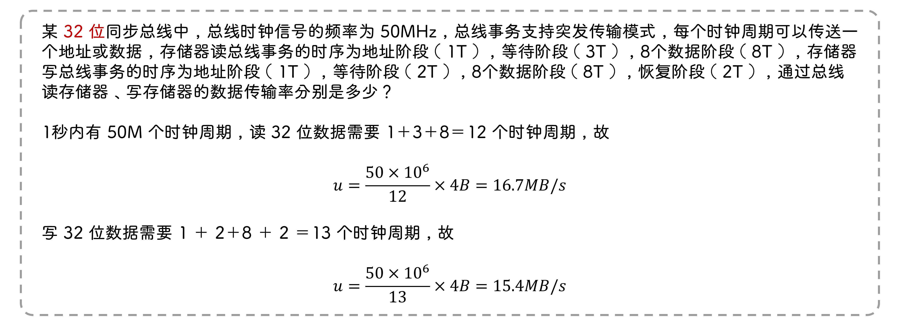

### 同步读

### 同步写

### 异步

应答实现定时, 按需分配时间

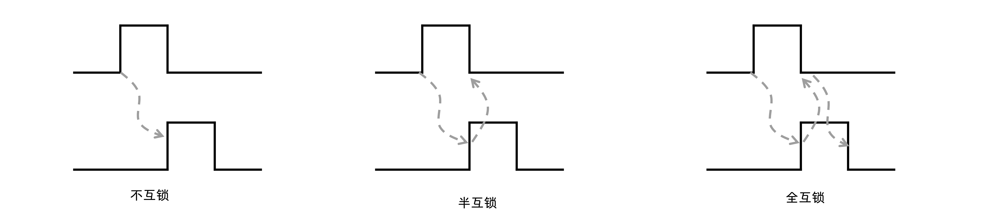

- 非互锁方式
  
  - 主设备发出 `请求信号`, 过一段时间 `自动撤销` , 无论从设备收没收到
  
  - 从设备收到请求信号后才发出 `应答信号`, 过一段时间也 `自动撤销`

- 半互锁方式(两次握手)
  
  - 主设备发出请求信号, 只有 `收到` 从设备 `应答` 后才撤销
  
  - 从设备应答信号过一段时间 `自动` 撤销

- 全互锁方式(三次握手)
  
  - 主设备收到应答信号才能撤销请求信号
  
  - 从设备收到主设备撤销请求信号的信号后才撤销应答信号

### 半同步

- 通过 `wait` 信号让主设备等待

- 握手信号总是在 `时钟` 触发时被采样

## 异步串行传送

- 波特率(bit/s) = 字符位数 × 字符/s

- 数传率(比特率) = 有效数据位数 × 字符/s

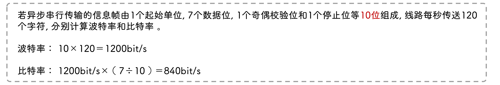

### 串行总线带宽

总线时钟频率 × 编码效率 × 并发通路数

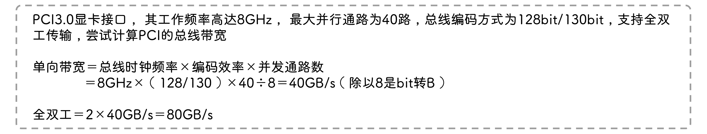