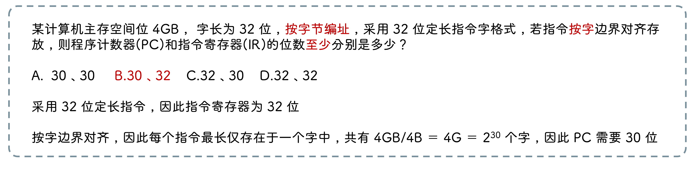
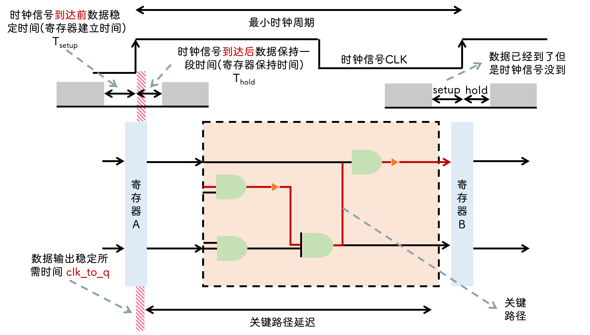
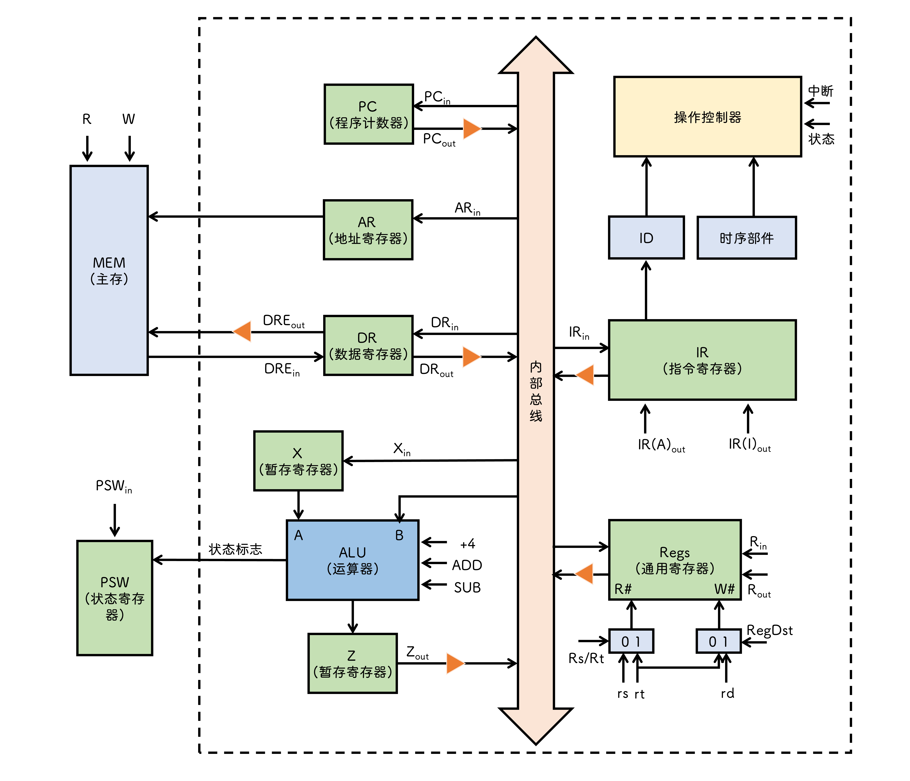
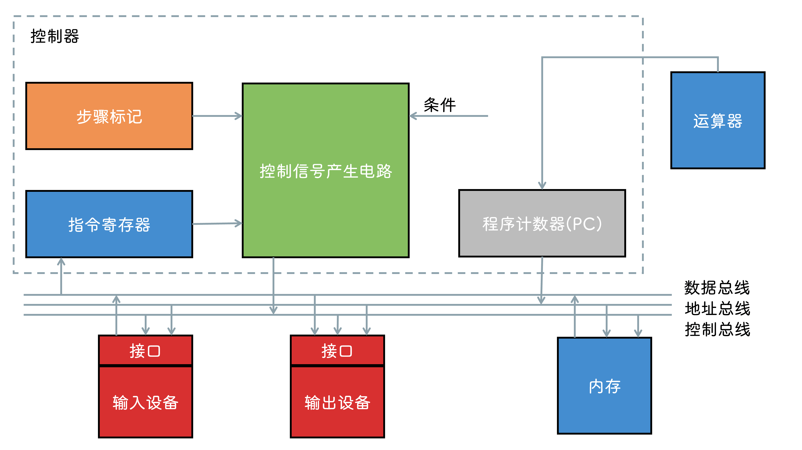

## CPU

### 功能

指令控制, 操作控制, 时间控制, 数据加工, 中断处理

### 基本结构

#### 运算器

- `算数逻辑单元(ALU)`

- `暂存寄存器` 暂存从主存中读取的数据

- `累加寄存器` 暂存 ALU 运算结果

- `通用寄存器` 存放操作数和地址信息, 包括 `AX` `BX` `CX` `DX` `SP`

- `程序状态寄存器` 包括 `溢出标志(OF)` `符号标志(SF)` `进位标志(CF)` `零标志(ZF)
` 等

- `移位器` 对操作数或运算结果进行 `移位运算`

- `计数器` 控制 `乘除` 运算的操作步骤

#### 控制器

- `程序计数器(PC)` 下一条指令在主存中的存放位置

- `指令寄存器(IR)` 保存正在执行的指令

- `指令译码器` 对操作码进行译码, 向控制器提供操作信号

- `存储器地址寄存器(MAR)` 存放要访问的主存单元地址

- `存储器数据寄存器(MDR)` 存放向主存 `写入` /从主存 `读出` 的信息

- `时序系统` 产生时许信号

- `微操作信号发生器`

:::info
计算机中 `指令寄存器` 对用户透明(即用户不知道它的存在, 改不了它)
:::

## 数据通路

### 单总线数据通路

## 控制器

### 结构

### 控制方式

#### 同步控制方式

系统存在 `统一时钟` , 以相同时间间隔和相同数目的节拍作为机器周期运行不同的指令

:::info 优缺点
优点: 控制电路简单

缺点: 运行速度慢
:::

#### 异步控制方式

通过 `应答` 方式进行联络

#### 联合控制方式

大部分采用同步, 小部分采用异步

