## I/O接口

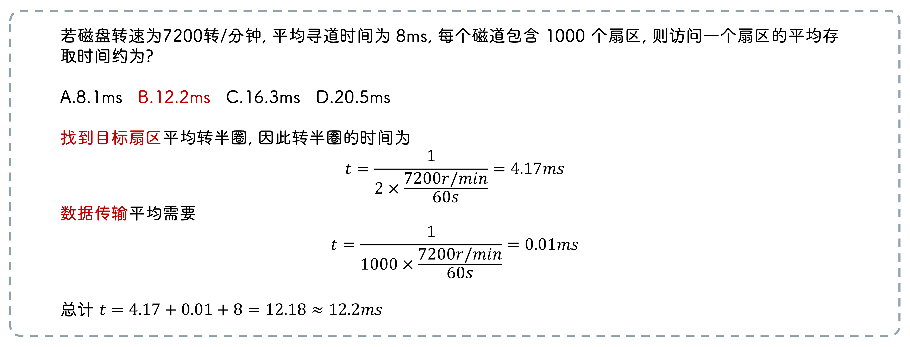

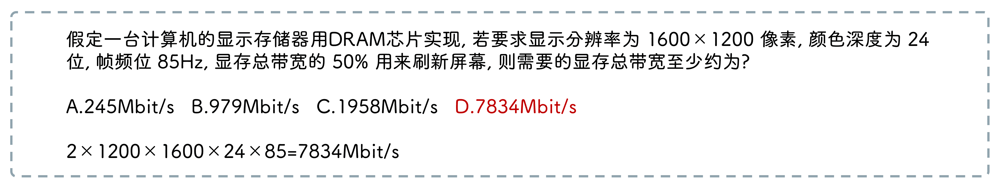

### 功能接口

1. `设备寻址` 通过 `译码电路` 选择对应外部设备的寄存器或存储器

2. `数据交互` 实现外部设备、主存、CPU的数据交换

3. `状态检测` 设备忙、设备就绪、设备故障、中断请求

4. `数据缓冲` CPU 传送数据远快于外部设备, 数据缓冲寄存器 `暂存数据`

5. `格式转换` 并串、串并转换, 电平转换

### 接口结构

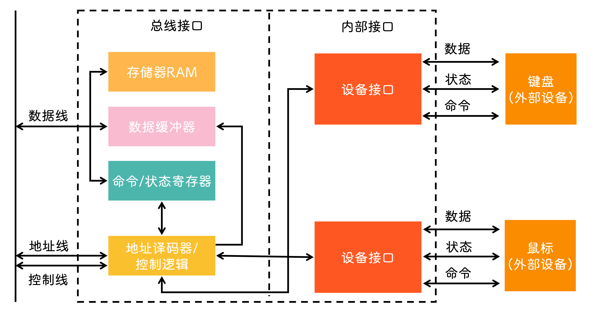

- `数据缓冲寄存器(DBR)` 存放从I/O设备读取的数据、暂存 CPU 送来的数据

- `设备状态寄存器(DSR)` 反馈设备状态

- `设备命令寄存器(DCR)` 接收 CPU 发送的设备控制命令

- `存储器` 用于自身的运算和处理

- `I/O控制逻辑` 译码, 收集外设状态, 接收外设数据和转发寄存器数据到外设

:::info
数据线也可以传输设备控制命令、状态信息
:::

### 编址

- `统一编址` 内存映射编址

  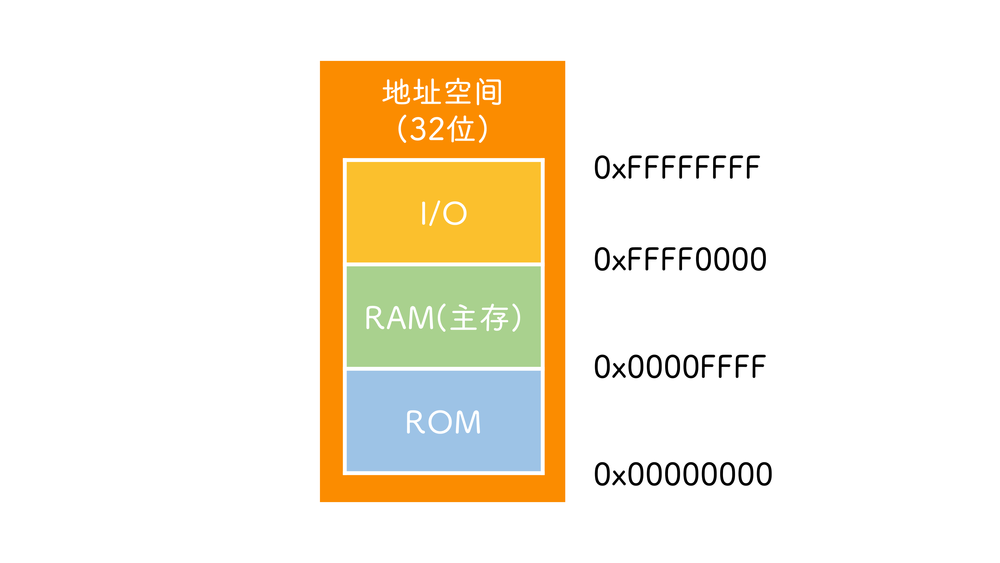

  - `不需要专用` 的 I/O 指令, 仅采用 load/store 访存指令
  
  - 通过 `不同的地址码` 区分存储单元和外部设备
  
  - 大部分 I/O 接口地址是固定的, 通过 `地址码` 区分
  
  - 通过 `扩展卡` 扩展, `热插拔` 设备的 I/O 地址是 `动态` 分配的
  
  - 接口中的数据是 `动态变化` 的, `不能使用` cache
  
  - 使用 `访存指令` 进行输入输出, 访问I/O设备

  :::info
  设备地址会占用主存空间
  :::

- `独立编址` 端口映射编址

  - 必须通过 `专门` 的I/O指令才可以访问I/O地址
  
  - 不同寄存器和存储器存在 `唯一` 的 `端口` 地址
  
  - 通过 `不同命令` 区分相同地址( `MOV` 访问主存, `IN/OUT` 访问外部设备)
  
  - `80×86` 处理器上主存空间 `00000000~FFFFFFFF` 与地址空间 `0000~FFFF` 重叠

## 程序控制方式

- CPU 通过 `状态寄存器` 查询设备状态

- 通过 `轮询` 的方式查询设备状态

- CPU 浪费大量的时间查询和等待

- `串行` 工作

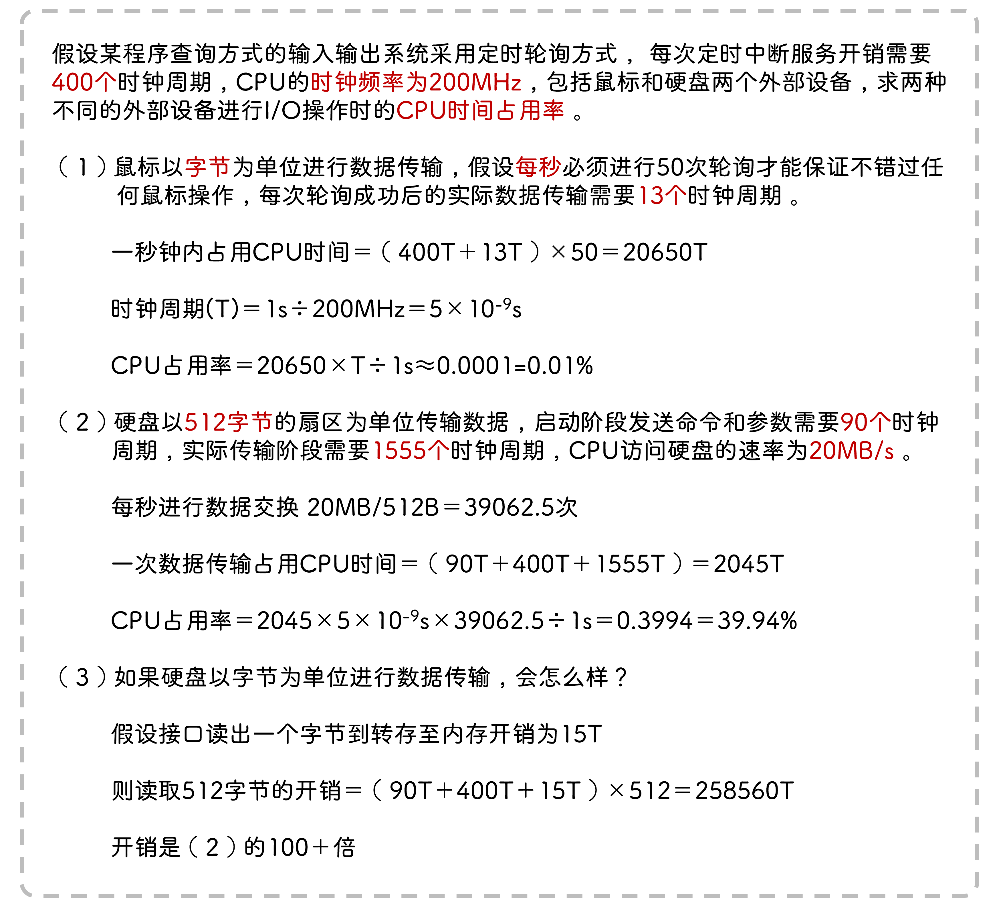

### 简单设备

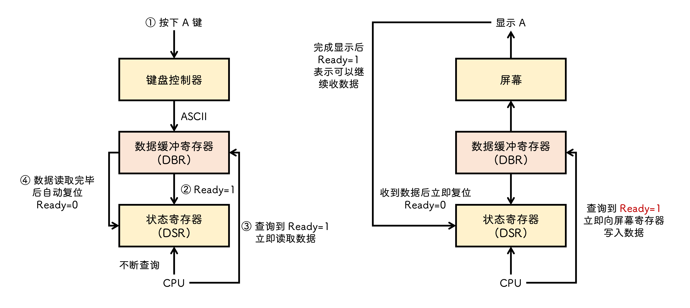

### 复杂设备

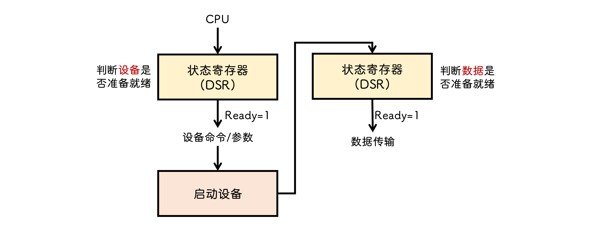

### 轮询策略

- `忙等待`
  
  - CPU 不停查询设备状态, 期间不进行任何操作
  
  - 对于 `超高速设备` 可以接受

- `定时轮询`

  - 进程 `挂起` , 启动定时器, 到时间后启动 `中断服务程序` , 重新查询设备状态

  - 简单设备以 `字节` 为单位传输, 基本不会影响 CPU 性能

  - 复杂设备以 `块` 为单位传输

## 程序中断控制方式

:::info
中断响应总是在一条指令执行末尾
:::

### 作用

- 提升并行性(其他任务/进程)

- 程序调试(打断点)

- 故障处理

- 实时处理(如设备主动向 CPU 发送中断请求，使得数据被及时处理)

- 实现多任务

### 中断类型

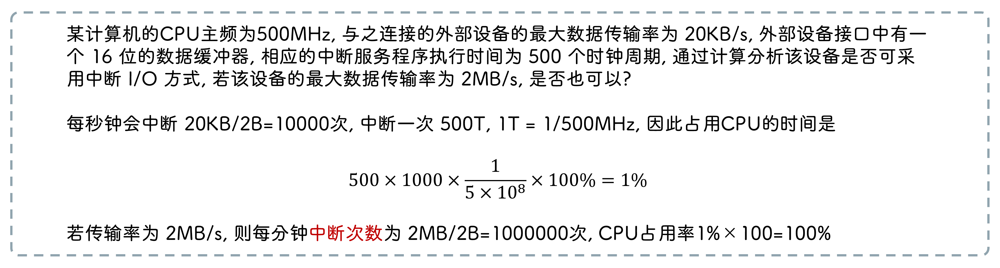

#### 内部异常

- 故障 `软件中断` 

- 自陷 `软件中断` 

- 终止 `硬件中断`

::: info
未定义指令, 越权指令, 段页故障, 存储保护异常

据未对齐, 除零异常, 运算溢出, 自陷调用, 程序断点
:::

#### 外部中断

- 可屏蔽中断 `INTR`

- 不可屏蔽中断 `NMI`

#### 向量中断

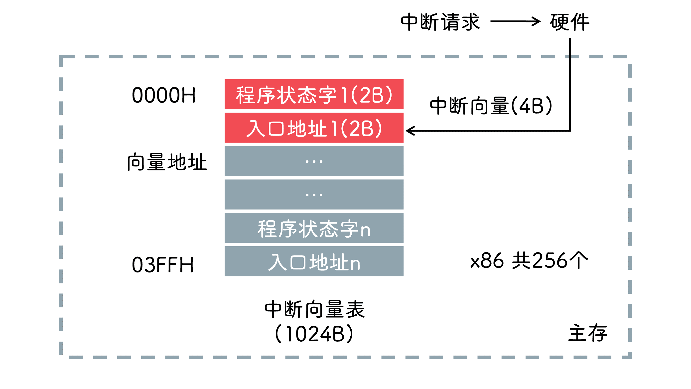

- 中断向量是中断服务程序入口地址的地址

#### 单级中断

中断程序不受优先级控制, 一旦开始就不会被其他中断请求所中断

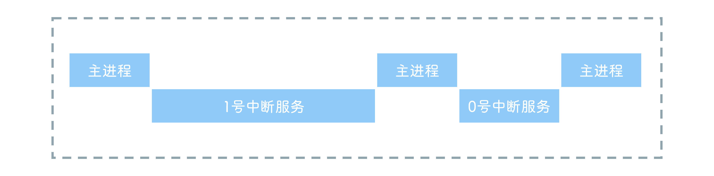

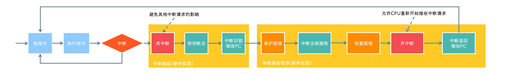

#### 多级中断

优先级高的会中断优先级低的

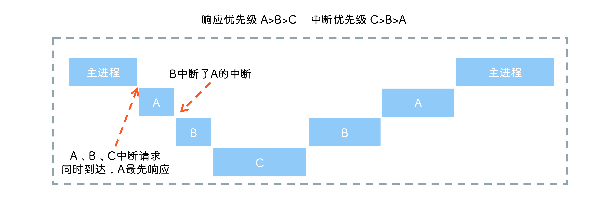

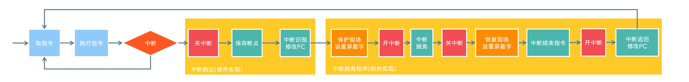

### 中断屏蔽字

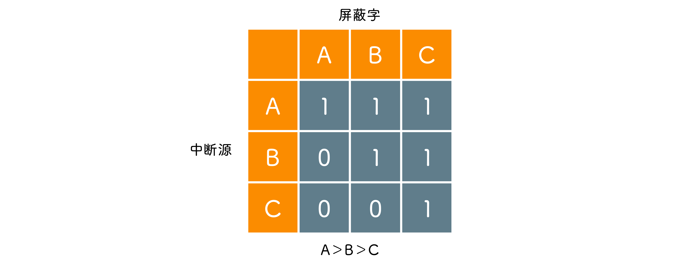

:::info
至少要能够屏蔽自身的中断请求
:::

### 中断请求方式

#### 独立请求方式

#### 链式请求方式

#### 中断控制器

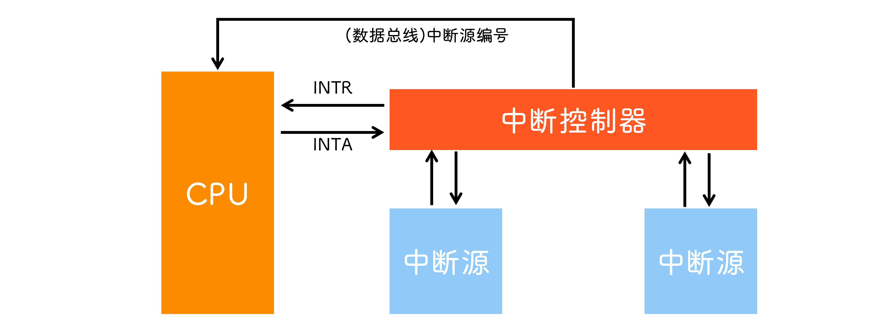

#### 分组链式

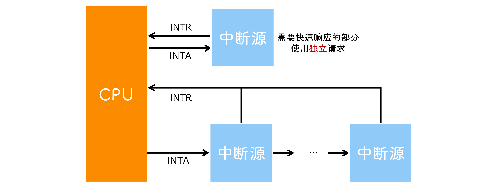

## DMA 方式

### 特点

- 主存与CPU固定关系 `脱钩` , 主存既可以被CPU访问, 又可以被外设访问

- 主存地址的确定, 传送数据的计数由 `硬件` 实现

- CPU和外设 `并行` 工作

- 传送开始前需要 `预处理` , 结束后要对中断方式进行 `后处理`

- 需要开辟专用缓冲区

### 组成

- `主存地址计数器` 存放交换数据的主存地址

- `传送长度计数器` 记录传说数据的长度

- `数据缓冲寄存器` 暂存每次传送的数据

- `DMA请求触发器` I/O设备准备好后发出控制信号

- `控制/状态逻辑` 指定传送方向, 修改传送参数

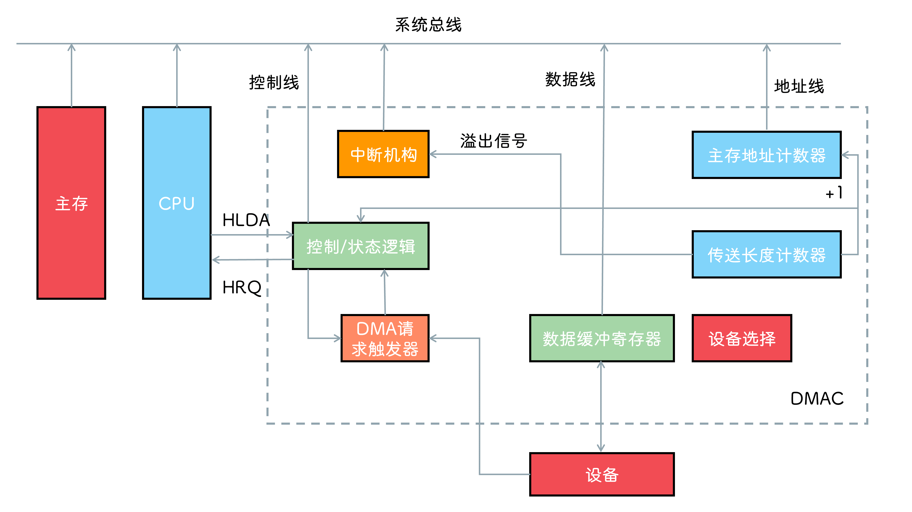

### 传送方式

- `停止 CPU 访问` DMA 控制器向 CPU 发送 `停止信号` , CPU 暂时停止访问主存, 直到 DMA 传送完数据, 把总线控制权 `交还` 给 CPU

- `周期挪用` 当存在 DMA 请求时, CPU 正在访存, 则等待 `存取周期结束后` CPU 才交出总线控制权, 若 I/O 和 CPU `同时` 访存, 则 CPU 会让出控制权, I/O 会挪用一个或几个存取周期

:::info
I/O 的数据不立即读取就会消失, 因此优先级更高
:::

- `DMA与CPU交替访存`

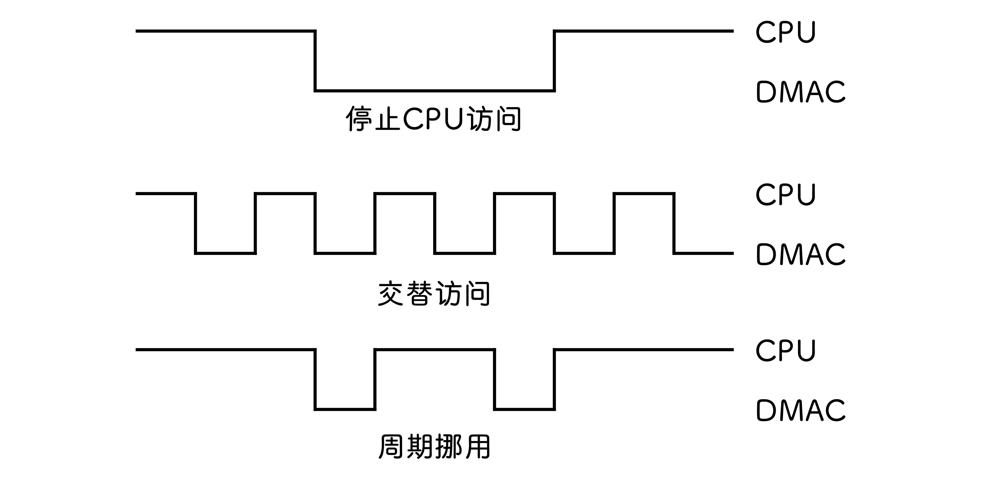