:::info

详细可看: [掘金](https://juejin.cn/post/7096369719581769741)

:::

## 机器码

- `原码`
  
  - 符号位 `相同` 则数值位直接 `相加` , 符号位不变
  
  - 符号位 `不同` 则数值 `大` 的减数值小的, 符号位与数值 `大` 的相同

- `反码`

  - 符号位不变, 其余取反

  - 直接相加, 循环进位

  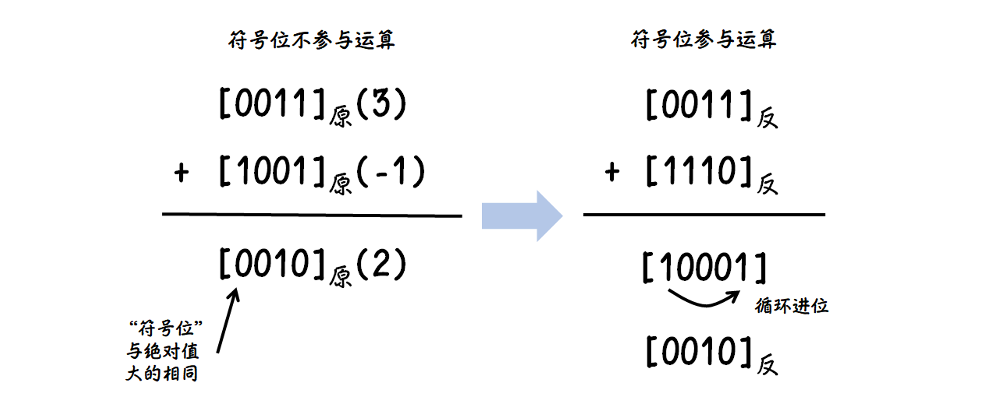

- `补码`

  - `反码法` 符号位不变, 按位取反, 最后加 `1`

  - `扫描法` 符号位不变, 右起 `第一个` `1` 及其右边的 `0` 不变, 其余取反

  

  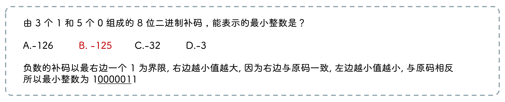

  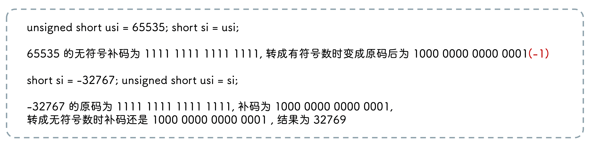
  
  - 减去一个数的补码, 等于加上其相反数的补码

  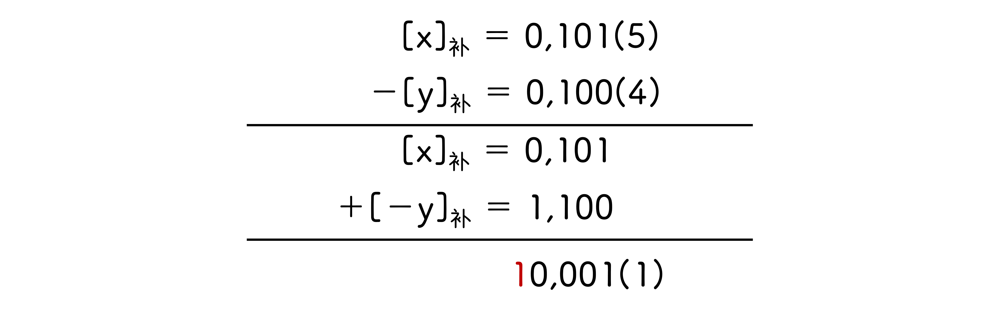

  - [x - y]补 = \[x\]补 - \[y\]补 = \[x\]补 + \[-y\]补

### 溢出判断

:::info
只有 `正数+正数` 或者 `负数+负数` 时才会溢出
:::

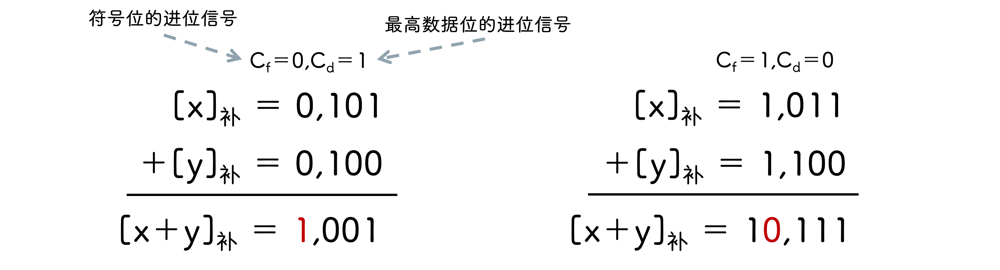

#### 变形补码

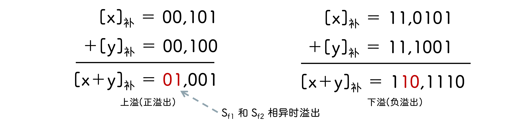

## 校验

### 概念

- `码距` 两个编码 `对应位置` 二进制 `不相同` 的个数

- `编码集码距` 系统中 `任意两个` 有效编码的 `最小码距`

:::info
如 `0000` `0011` `0101` `0110` `1001` `1010` `1100` `1111` 的码距为 `2`
:::

### 海(汉)明校验

三管试剂检测阳性患者, 前提是仅有一人阳性

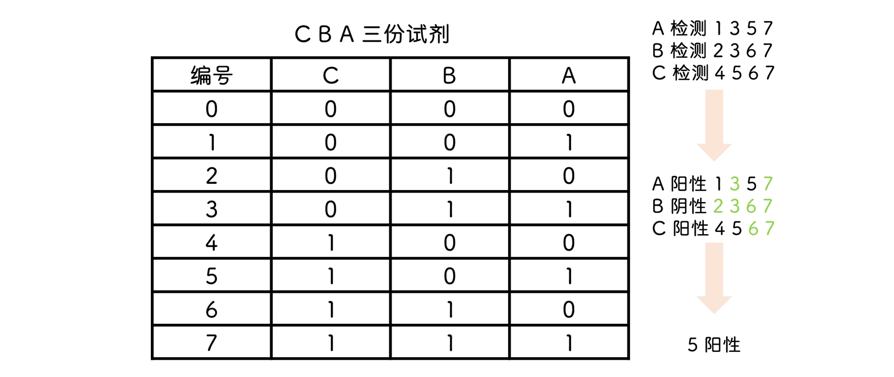

缺点是 `0` 号人员不需要做检验, 而 `7` 号却要做三次

由上图可知, 试剂 `A` 可以校验编号第 `1` 位为 `1` 的人员, 试剂 `B` 可以校验编号第 `2` 位为 `1` 的人员, 试剂 `C` 可以校验编号第 `3` 位为 `1` 的人员

因此可在 `2^r` 处放置校验码, 分别校验对应位置为 `1` 的数据

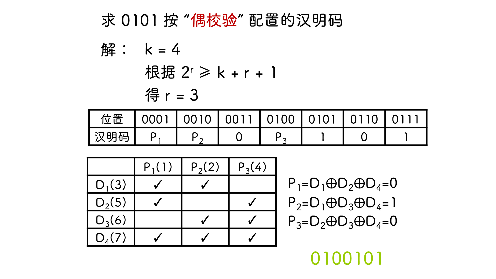

- `偶校验` P = D1 ⊕ D2 ⊕ D4

- `奇校验` P = ¬(D1 ⊕ D2 ⊕ D4)

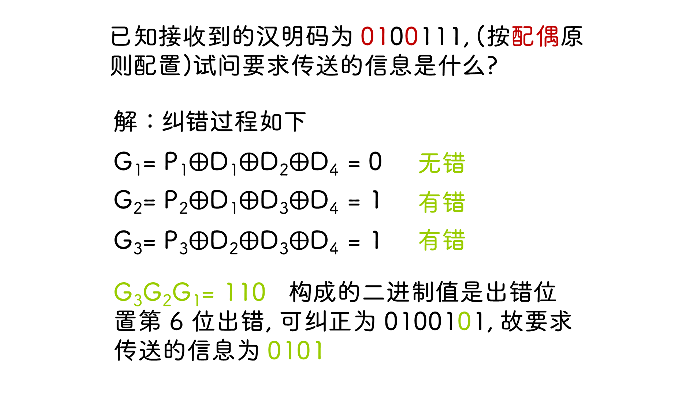

奇校验 `G=1`, 偶校验 `G=0` 无错

## 定点数运算

- `正数` `负数` `原码` 右移符号位不动, 空缺位补充 `0`

- `正数` `负数` `补码` 右移最右补充符号位

### 原码一位乘

### 原码两位乘

两位乘存在 `4` 种情况

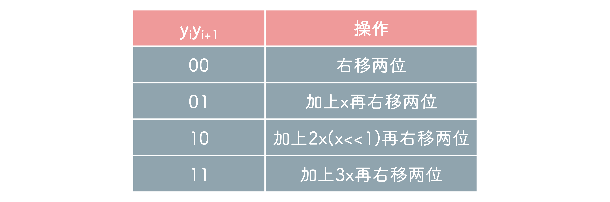

`+3x` 使用 `-x` 与 `+4x` 代替, 而 `+4x` 又可以使用 `进位` 代替

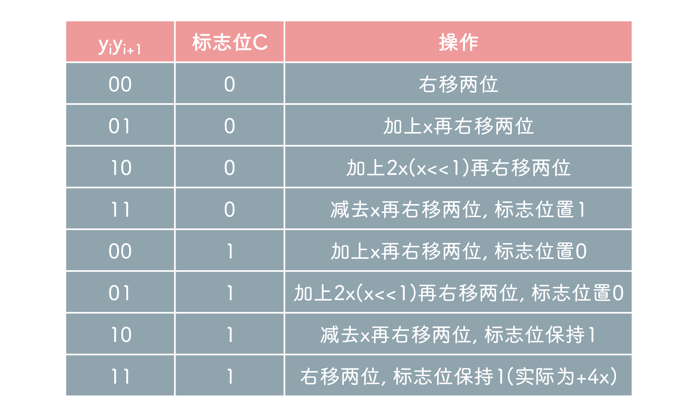

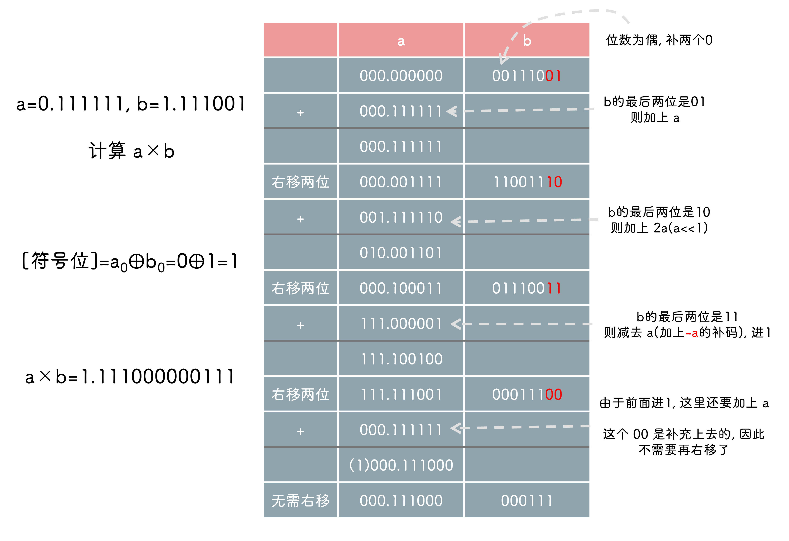

位数为奇数时

### 补码一位乘

#### 乘数为正

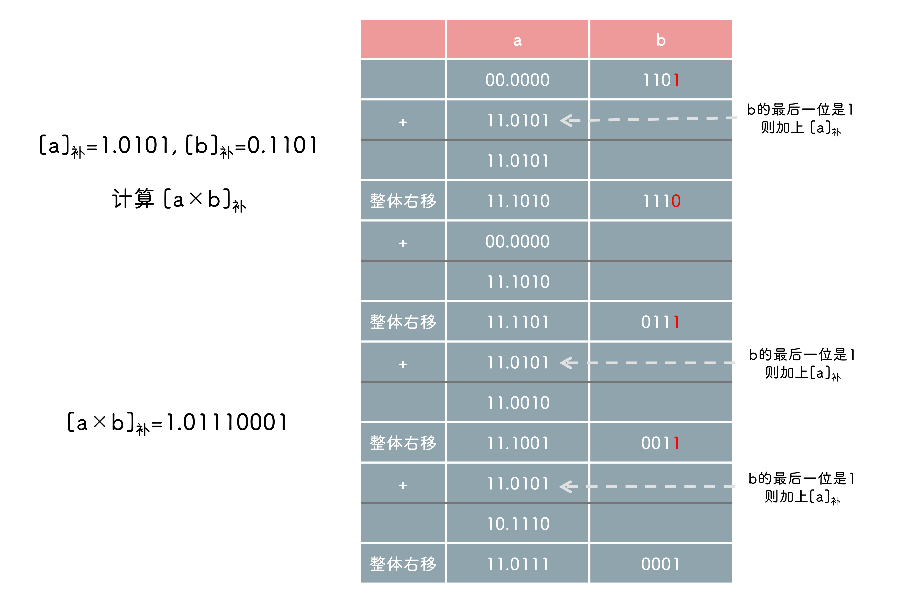

符号位参与运算, 所得结果不需要再通过异或求符号位

#### 乘数为负

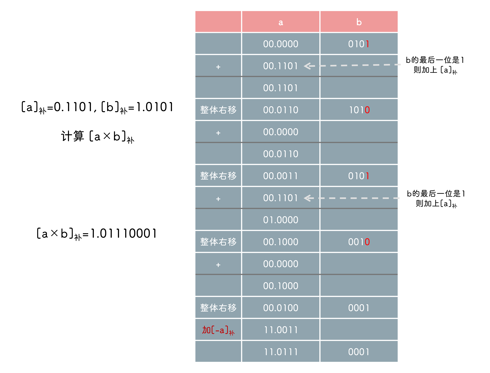

和乘数为正时一致, 不过结果要加上 `[-x]补`

#### booth

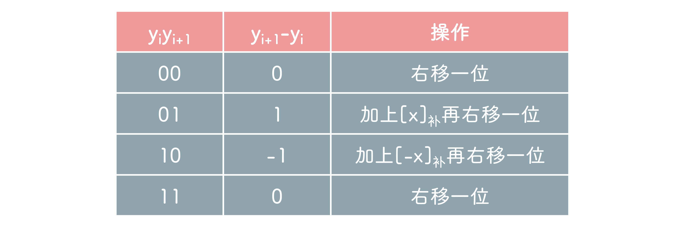

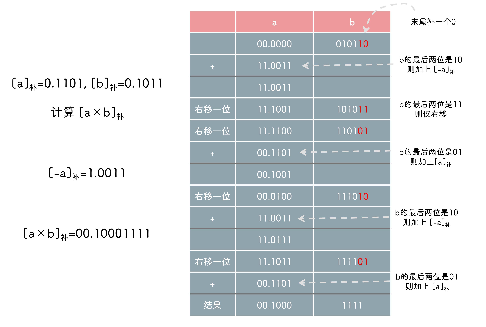

:::info
右移次数与乘数的小数点位数相关
:::

### 补码两位乘

`011` 先看 `11` , 为右移一位, 再看 `01` , 为加 `[x]补` 再右移一位

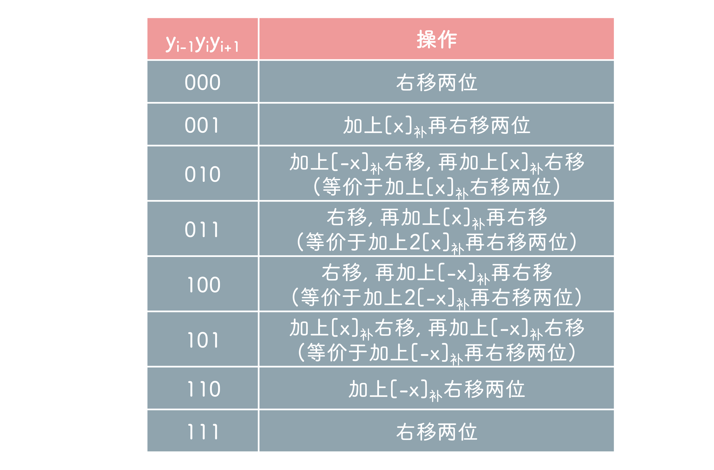

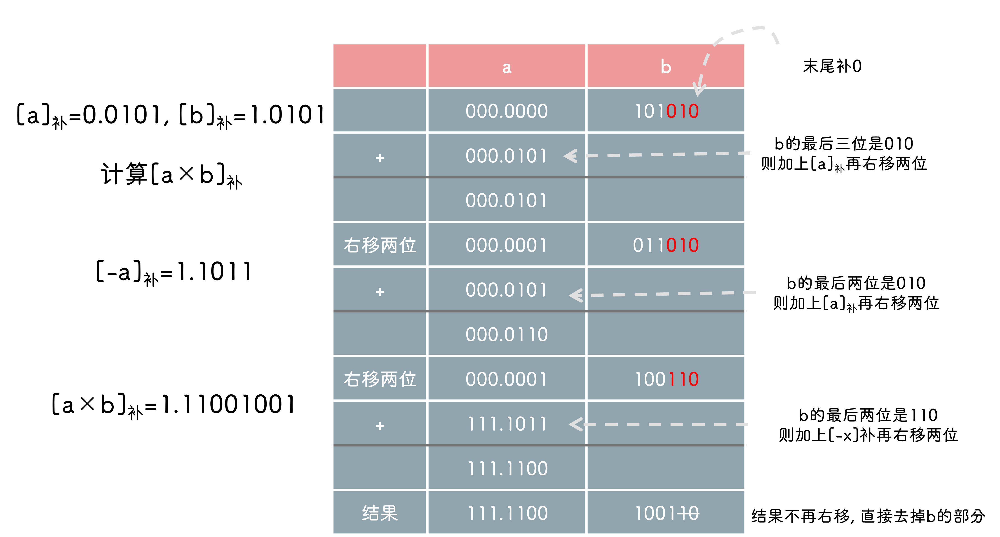

### 原码除法

余数使用的是 `原码` , 但加减是使用 `补码`

#### 恢复余数法

先加上 `[-|b|]补` , 结果为负数则加上 `[|b|]补` , 商为 `0`

:::info
计算结果为负数时, 其实直接使用没有加 `[-|b|]补` 的余数即可, 不需要加上 `[|b|]补`
:::

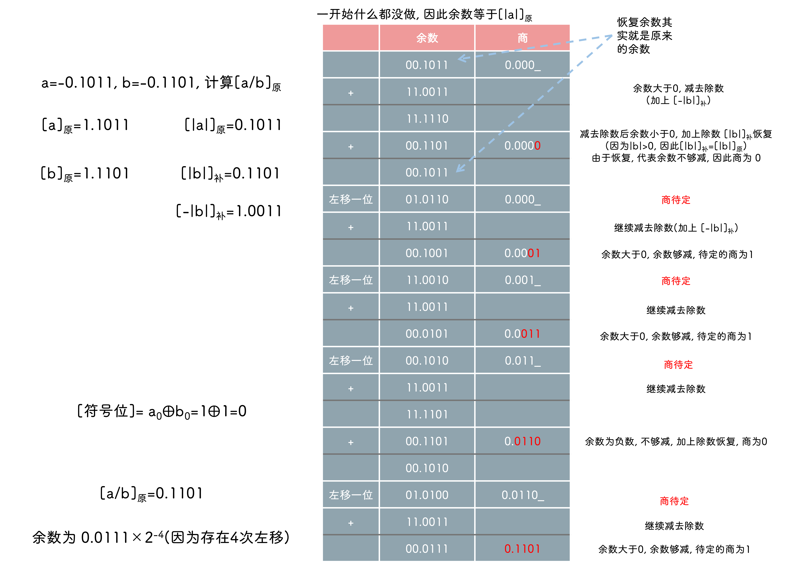

#### 加减交替法

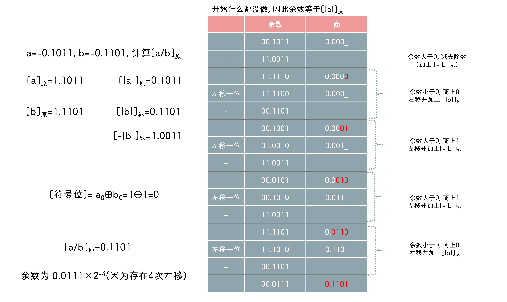

:::info
最后余数可能为 `负`, 此时要加上 `[|y|]补` 恢复成正数
:::

### 补码除法

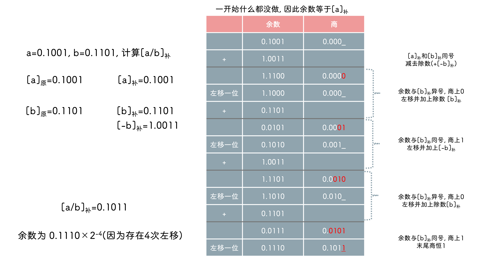