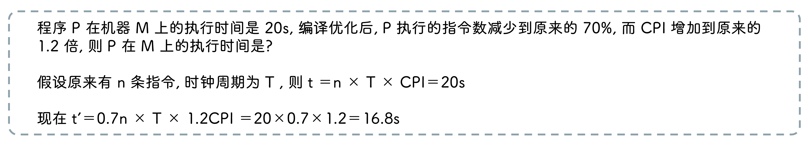

## 性能指标

### CPI

执行每条指令所需要的平均时钟周期

### CPU 时间

$$
t = \frac{时钟周期数}{时钟频率} = 指令条数 × \frac{CPI}{时钟频率}
$$

### MIPS

每秒执行多少百万条数据

$$
MIPS = \frac{指令条数}{执行时间 × 10^6} = \frac{主频}{CPI × 10^6}
$$

### 字长

- `机器字长` CPU 整数运算的数据通路宽度

- `指令字长` 一条指令中包含的二进制位数

- `存储字长` 一个存储单页存储的二进制位数