## 基础

### 控制块(FCB)

- 包括 `文件数据` `名称` `类型` `创建者` `所有者` `位置` `大小` `保护` `创建时间` `最后修改时间` `最后存取时间` `权限`

- `FCB` 的有序集合称为 `文件目录`

#### 索引结点(inode)

将文件名和文件描述信息分开, 将 `文件描述信息` 单独成索引结点

- 磁盘索引结点

  包括 `文件主标识符` `文件类型` `文件存取权限` `文件物理地址` `文件长度` `文件链接计数` `文件存取时间`

- 内存索引节点

  包括 `索引结点编号` `状态` `访问计数` `逻辑设备号` `链接指针`

### 文件操作

1. `创建文件` 先分配外存空间, 再加入目录项中

2. `写文件` 先找到文件位置, 根据 `写位置指针` 进行写操作

3. `读文件` 读写共用一个指针

4. `重新定位文件`

5. `删除文件` 目录中找到指定目录项, 释放该内存空间, 删除目录项

6. `截断文件` 删除文件内容, 其他文件属性不变

#### 文件的打开和关闭

- 显式的通过系统调用 `open` 将文件属性载入内存的 `打开文件表` 中, 当用户发出文件操作请求后不需要再次查找文件, 文件不再使用后调用 `close` 关闭, 操作系统会将其从 `打开文件表` 中 `移除`

- 多进程时维护一个 `两级表` , 即 `进程表` 和 `系统表`

  - 进程表存储进程对文件的 `使用信息` , 系统表存储文件的具体信息

  - 打开文件时, 在其进程表中增加一个条目, 指向系统表中相应文件

  - 系统表为每个文件维护一个 `打开计数器` , 调用 `close` 使计数器减一, 当计数器为 `0` 时, 会自动把文件信息从系统表中删除

:::info

找到文件并将文件信息载入文件打开表后就不需要文件名了, 而是使用一个称为 `文件描述符` 的索引进行访问

:::

- 系统表中存储信息

  - `文件指针` 上次的读写位置作为当前文件位置指针

  - `文件打开计数` 跟踪当前文件打开和关闭的数量

  - `文件磁盘位置`

  - `访问权限`

### 文件保护

- 访问类型 `读` `写` `执行` `添加` `删除` `列表清单`

- 实现手段 `口令保护` `加密保护` `访问控制`

- 访问列表 `拥有者` `组` `其他`

- 口令和密码是防止他人窃取, 访问控制是对用户自身的控制

### 逻辑结构

- `无结构文件` 按顺序组织成记录并积累、保存, 只能通过穷举进行搜索

- `有结构文件`

  - `顺序文件` 记录通常是 `定长` 的

    - `串结构` 按照存入时间排序

    - `顺序结构` 按照关键字排列, 可折半查找

  - `索引文件` 使用一个 `定长` 的索引表保存 `变长` 的记录

    

  - `索引顺序文件` 将顺序文件分组, 将每组第一个加入索引表中
    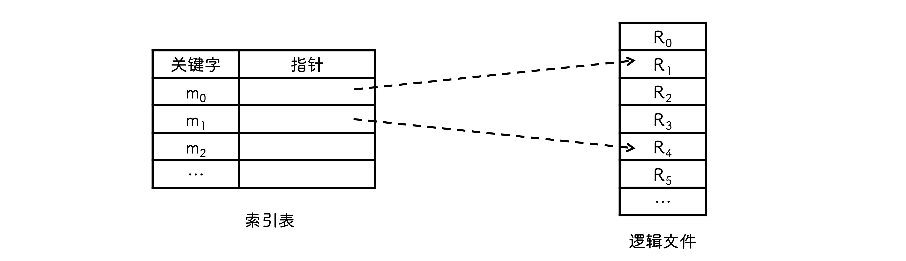

### 物理结构

- `连续分配` 每个文件占有一组连续的块

  - 寻道数和寻道时间最小

  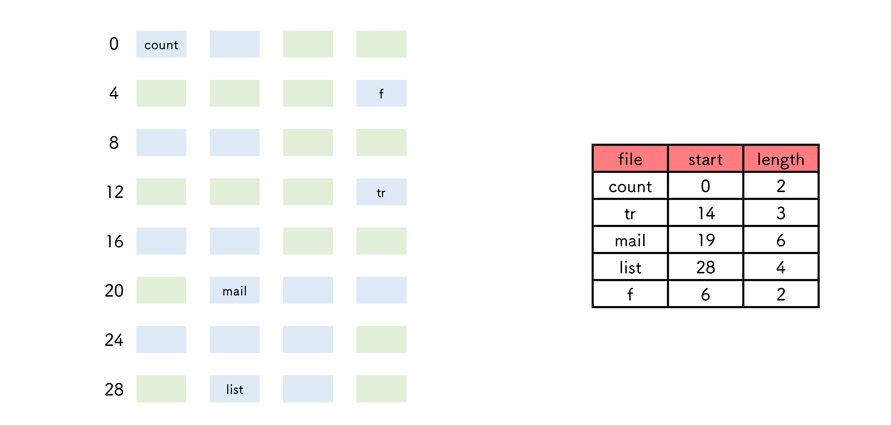

- `链接分配`

  - `隐式链接`

    - 每个磁盘块包含下一块地址
    - 不能跳着访问磁盘块, 只能一个个遍历

    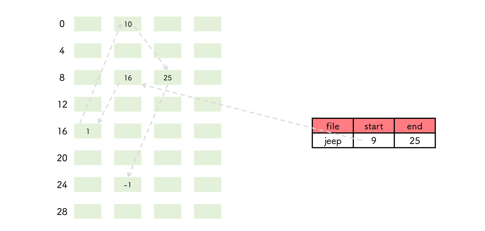

  - `显式链接` 文件分配表(FAT)中设置下一块地址

    

- `索引分配`

  - 支持跳跃式访问磁盘块

  - 要读第 `i` 块, 就通过索引的第 `i` 个条目的指针来访问

  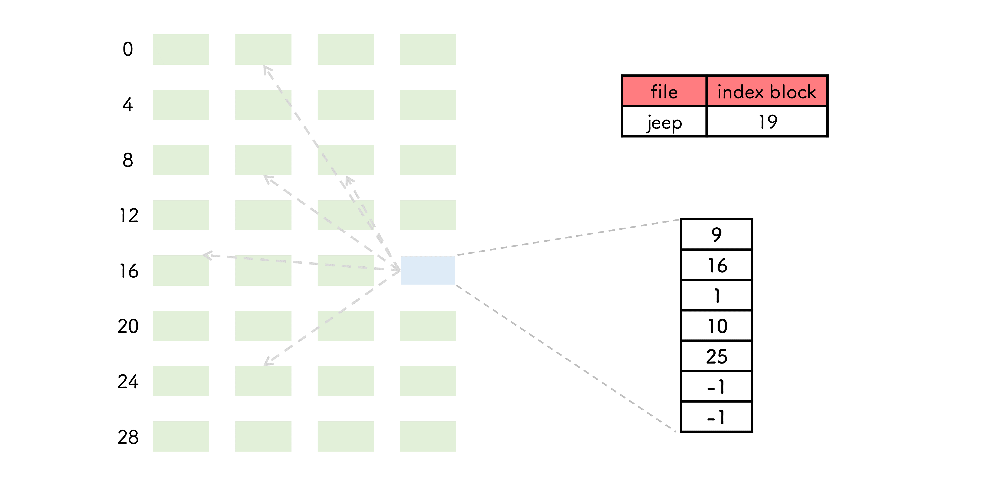

- `混合索引分配`

  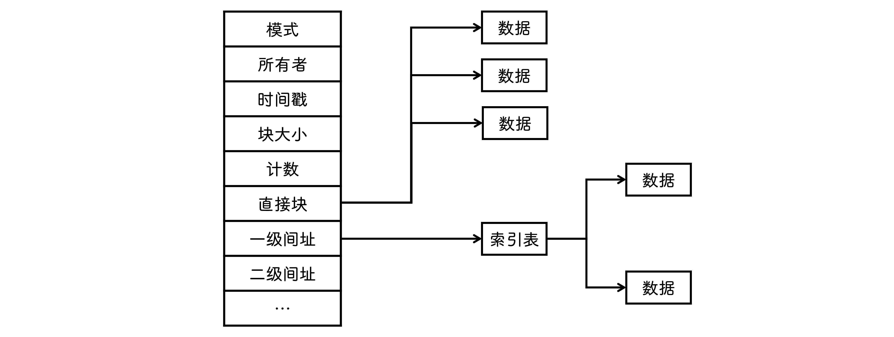

## 目录

### 结构

- `单级目录结构`

  - 按名存取
  - 查找速度慢, 文件不允许重名, 不便于文件共享

  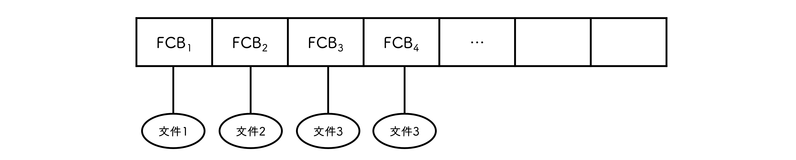

- `两级目录结构`

  - `主文件目录` 记录用户名和用户文件目录
  - `用户文件目录` 记录用户自己文件的 FCB 信息

  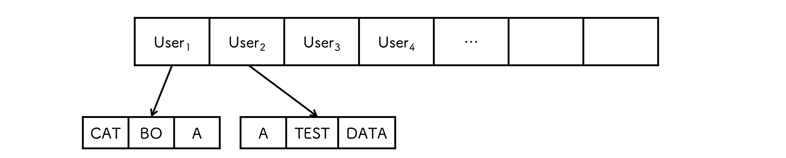

- `树形目录结构`

  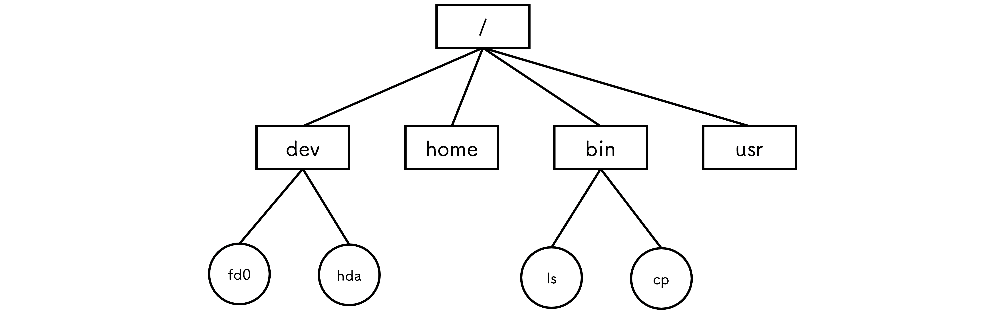

- `无环图目录结构`

  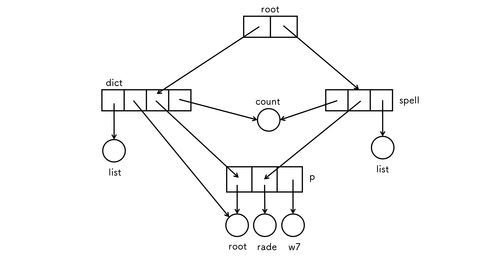

### 文件共享

- `索引节点(硬链接)`

  - 同一文件的不同别名

  - 不可以跨文件系统

  - 硬链接文件的 inode 与被链接文件的 inode 相同

  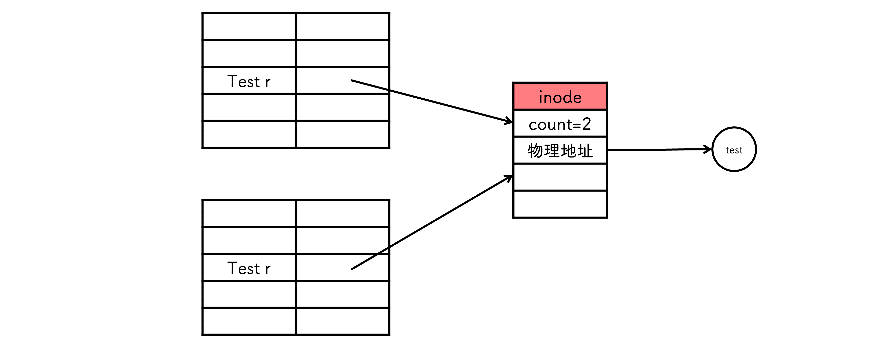

- `符号链(软连接)`

  - 其他用户只保存路径名

  - 链接文件具有新的 inode

  - 可以跨文件系统

## 文件系统

### 结构

- `I/O控制`

  - `设备驱动` 告诉 I/O 控制器对设备的什么位置采取什么动作

  - `中断处理程序`

- `基本文件系统` 发送通用命令, 保存文件系统、目录和数据块缓存

- `文件组织模块` 将逻辑块地址转为物理块地址

- `逻辑文件系统` 管理元数据信息, 不包括文件内容

### 文件系统布局

#### 在磁盘中的结构

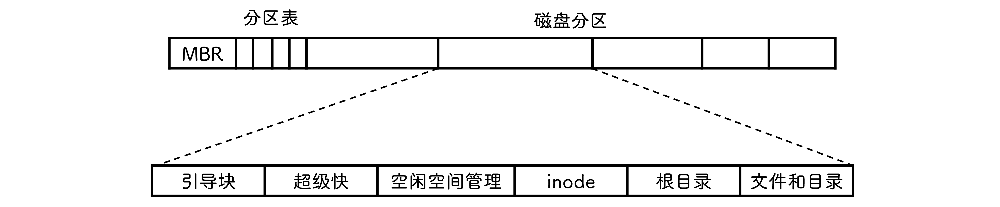

- `主引导记录(MBR)` 位于磁盘 `0` 号扇区, 引导计算机

- `引导块` 被 `MBR` 读入后执行里面的程序

- `超级块` 包含文件系统的所有关键信息

#### 在内存中的结构

- `安装表`

- `进程打开文件表`

- `系统打开文件表`

### 外存空闲空间管理

- 包含文件系统的分区称为 `卷`

- 存放数据的空间(文件区)和 FCB(目录区) 是分离的

- `空闲表法`

  - `顺序` 搜索空闲表查找 `符合条件` 的空闲区, 将其分配给用户后修改空闲表

  

- `空闲链表法`

  - `空闲盘块链` 把空闲空间以 `块` 为单位拉成一条链, 每次从链上取下一部分分配给用户

  - `空闲盘区链` 每个盘区可能包含若干盘块

- `位示图法` 使用二进制表示盘块的空闲

- `成组链接法`

### 虚拟文件系统(VFS)

为用户提供了文件系统操作的 `统一接口`

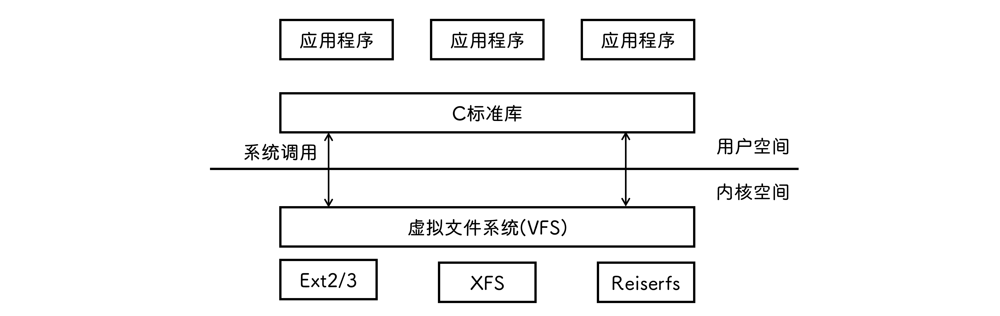

- `超级块对象`

- `索引结点对象`

- `目录项对象`

- `文件对象`

