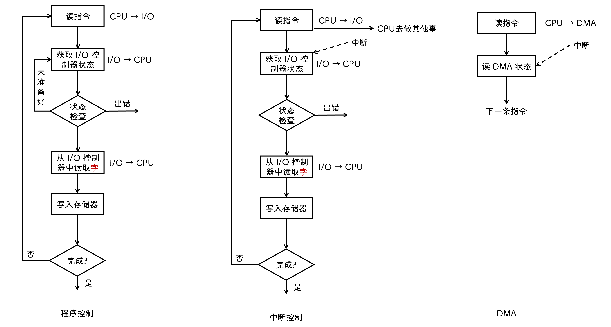
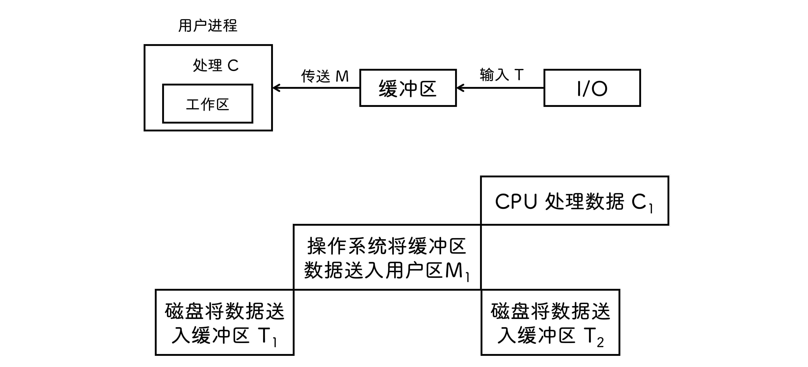
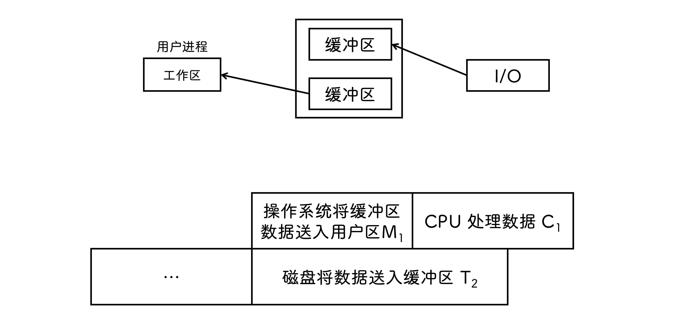

## 概述

### I/O 设备

- `块设备` 信息交换以 `数据块` 为单位, 传输速率高、可寻址, 如磁盘

- `字符设备` 信息交换以 `字符` 为单位, 不可寻址

- `低速设备` 每秒几字节到几百字节, 如键盘、鼠标

- `中速设备` 每秒几千到几万字节, 如激光打印机

- `高速设备` 每秒百千字节到千兆字节, 如磁盘机

### I/O 端口

- `独立编址` 只能使用特殊的 I/O 指令才能访问

- `统一编址` 每个端口被分配到唯一内存地址

### I/O 控制方式

- `程序直接控制` 通过轮询的方式对外设状态进行检查, CPU 利用率低

- `中断驱动方式` 数据在存储器和 I/O 控制器之间的传输必须经过 CPU , 因此会消耗较多的 CPU 时间

- `DMA方式` 数据直接从内存读取/写入, 只有数据传送开始和结束时需要 CPU 参与

### I/O 软件层次

- `用户层I/O软件` 用户直接调用与 I/O 操作相关的库函数

- `设备独立性软件` 执行所有设备的公有操作, 向用户层提供统一接口

- `设备驱动程序` 具体实现系统对设备发出的操作指令, 驱动 I/O 设备工作

- `中断处理程序` 保护现场和恢复现场

### I/O 接口

- `字符设备接口` 不可寻址, 采用顺序存储, 设立字符缓冲区, 在缓冲区中读取/写入字符

- `块设备接口` 

- `网络设备接口`

- `阻塞/非阻塞 I/O` 当用户进程调用阻塞 I/O 操作时, 进程会被阻塞, 需要等待 I/O 操作完成才被唤醒 

## 设备独立性软件

### 高速缓存/缓冲区

磁盘高速缓存逻辑上属于磁盘, 物理上是驻留内存的盘块

#### 缓冲区

1. 缓和 CPU 与 I/O 设备速度不匹配的矛盾

2. 减少 CPU 中断频率

3. 解决基本数据单元大小不匹配问题

4. 提高 CPU 和 I/O 设备之间的 `并行性`

#### 实现

- `单缓冲区`
  
  送入用户区这段时间 CPU 空闲

  数据处理用时 `max(C,T)+M`

  

- `双缓冲区`

  送入用户区并处理完后才能继续送入缓冲区

  数据处理用时 `max(C+M, T)`

  

- `循环缓冲` 双指针 `in` 和 `out`
  
  - `in` 指向空缓冲区
  - `out` 指向满缓冲区

- `缓冲池`

  - 三队列
    
    - `空缓冲队列` 输入/输出时取出队首作为收容输入/收容输出
    
    - `输入队列` 要计算时取出队首作为提取输入
    
    - `输出队列` 要输出时取出队首作为收容输出
  - 四缓冲区
    
    - `收容输入` 装满后插入输入队列
    
    - `提取输入` 取完了再插入空缓冲队列
    
    - `收容输出` 装满后插入输出队列
    
    - `提取输出` 取完了再插入空缓冲队列

## 磁盘和固态

### 磁盘

- 磁盘盘面上的数据存储在一组同心圆中, 称为 `磁道`

- 磁道划分为几百个 `扇区` , 一个扇区称为一个 `盘块`

- 扇区的圆心角固定, 从外到内密度逐渐增加

- 盘面上相对位置相同的磁道组成 `柱面`

- 磁头可以移动, 称为 `活动头磁盘`

- 磁头 `径向` 方向固定, 称为 `固定头磁盘`

- 磁盘永久固定在磁盘驱动器内, 称为 `固定盘磁盘`

- 磁盘可移动可替换, 称为 `可换盘磁盘`

### 磁盘管理

#### 分区

- 一个分区由一个或多个柱面组成

- 每个分区起始扇区和大小记录在磁盘的 `主引导记录` 的分区表中

- 创建文件系统称为 `逻辑格式化`

- 多个扇区组成一个 `簇` 或 `块`

- 一簇只能存放一个文件的内容

#### 指标

- `寻找时间` 将磁头移到指定磁道所需要的时间

  

- `旋转延迟时间` 定位到某磁道扇区的时间

  

- `传输时间` 从磁盘读出/向磁盘写入所经历的时间

  

- `平均存取时间`

  

#### 调度算法

- `最短寻找时间` 选择当前磁头所在磁道距离最近的磁道

- `先来先服务` 根据请求访问磁盘的先后顺序调度

- `扫描算法` 最短寻址的前提下规定当前移动方向

- `循环扫描` 单向移动, 到头了立即返回到开头, 继续新的扫描