## 功能

1. 内存空间的分配与回收

2. 逻辑地址与物理地址的转换

3. 利用虚拟存储对内存空间进行扩充

4. 内存共享

5. 存储保护

## 链接与装入

1. `编译` 源代码转成 `目标模块`

2. `链接` 目标模块与库函数链接成 `装入模块`

3. `装入` 将装入模块装入内存中运行

### 链接

1. `静态链接`

2. `装入时动态链接` 边装入边链接, 便于修改和更新

3. `运行时动态链接` 需要时才调入内存中链接

### 装入

1. `绝对装入` 程序中的逻辑(相对)地址与物理地址相同

2. `可重定位装入` 装入时将相对地址转成物理(绝对)地址

   

3. `动态运行时装入` 装入后是相对地址, 根据 `基质` 获取绝对地址

   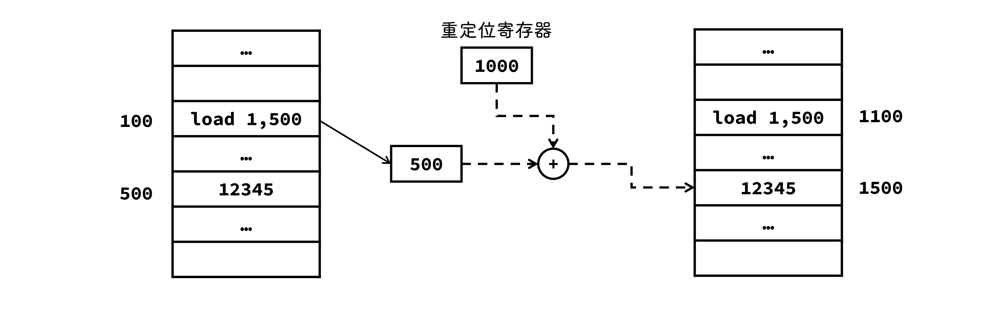

## 逻辑地址与物理地址

- 编译后目标模块都是从 `0` 开始编址

- 内存管理机制是透明的

- 相同的逻辑地址可以映射到主存的不同位置

- 地址转换由内存管理部件 `MMU` 实现

### 地址变换

- `共享库` 存放进程用到的共享函数库代码

- `.data` 是已初始化的全局变量和静态变量, `.bss` 是未初始化和所有初始化为 `0` 的全局变量和静态变量

- `.init` 是程序初始化时调用的 `_init` 函数, `.text` 是用户程序的机器代码, `.rodata` 是只读数据

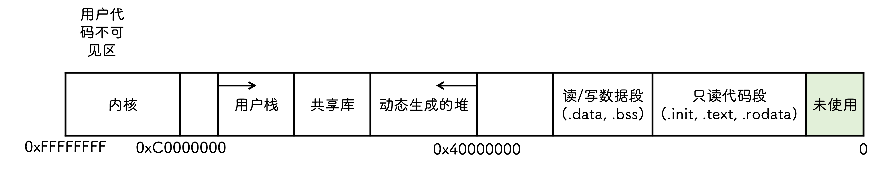
### 内存共享

- 只有只读区域才可以共享

- `可重入代码`

  又称为 `纯代码` , 只允许多个进程访问但不允许修改的代码

### 内存保护

- `上下限寄存器`

  存放用户作业在主存中的上限和下限地址, 每当 CPU 要访问一个地址时就与之对比, 判断是否 `越界`

- `重定位寄存器(基地址寄存器)` 与 `界地址寄存器(限长寄存器)`

  最小物理地址 + 最大逻辑(相对)地址判断是否越界

  

## 连续分配管理

- `单一连续分配`

  - `系统区` 仅操作系统使用

  - `用户区` 只有一个用户程序, 整个用户空间由该程序独占

- `固定分区分配` 用户空间被划分成若干区域

  - `分区大小相等` 文件太小时独占一个分区, 可能存在 `内存碎片`

  - `分区大小不等` 提前划分大小不等的分区, 找不到合适的就不分配

    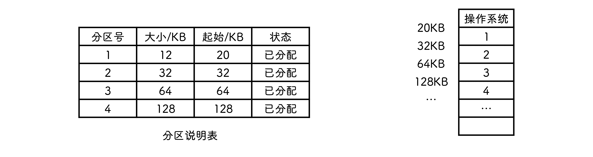

- `动态分区分配` 分区的大小和数目是可变的

  随着分配的进行, 可能会产生许多小的内存块, 称为 `外部碎片` , 独立于分区外

  

  - `首次适应` 空闲空间形成链表, 从链首开始查找, 找到第一个大小合适的分区进行分配

  - `邻近适应` 从上一次分配的位置开始查找, 前面分区释放后不会再使用, 造成碎片

  - `最佳适应` 空闲空间按 `容量` 递增的顺序形成链表, 找到第一个大小最接近的分区进行分配, 会产生越来越小的碎片

  - `最坏适应` 空闲空间按照 `递减` 的顺序形成链表, 从最大的空间中划分一点给作业, 容易把大内存块切小导致后面找不到大的内存分配

## 分页管理

与 `固定分区` 类似, 将内存划分成一个个很小的 `块` (比分区小很多), 进程按照块进行划分, 仅在最后一块产生碎片

- `页` `页面` 进程中的块

- `页框` `页帧` 内存中的块

- `盘块` 外存中的块

### 逻辑地址结构

### 页表

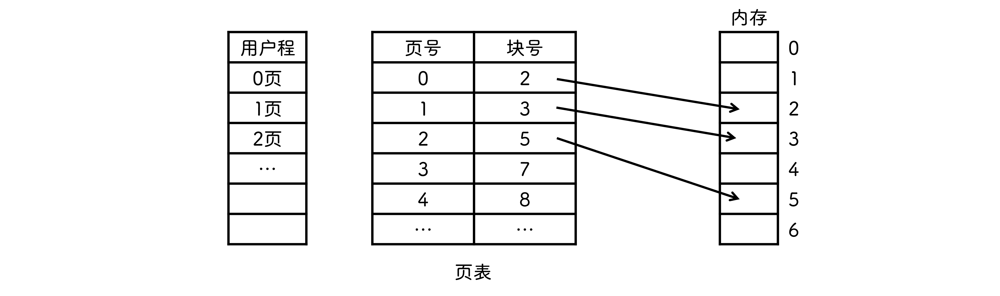

#### 基本地址变换

根据 `页表起始` 和 `页号` 在页表中找到 `页表项` , 取出其中的 `块号` 和 `页内偏移` 获得物理地址

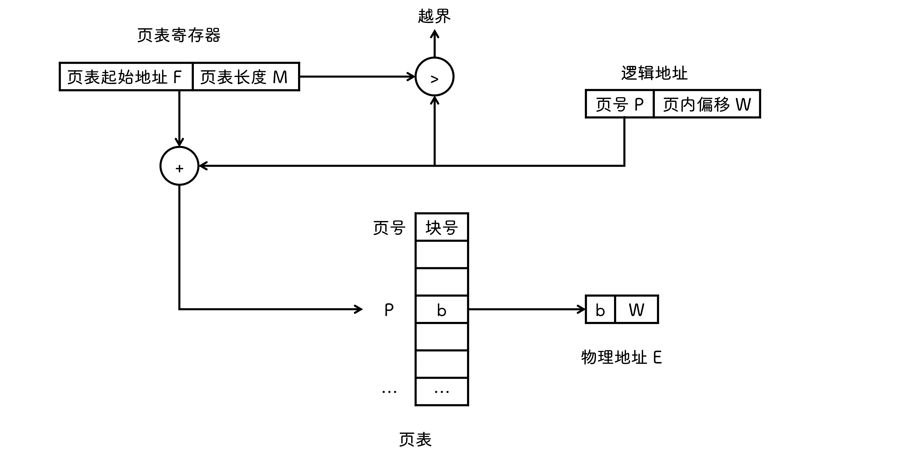

::: tip
页地址空间是一维的, 因为页的逻辑地址是连续, 且页大小是固定的, 根据页地址, 可以通过 mod 运算计算出页偏移, 而段大小不是固定的, 因此必须有段号和段内偏移, 段地址空间是两位的
:::

#### 块表的地址变换

块表, 又称为 `相联存储器(TLB)` , 先找块表, 未命中才去主存中找

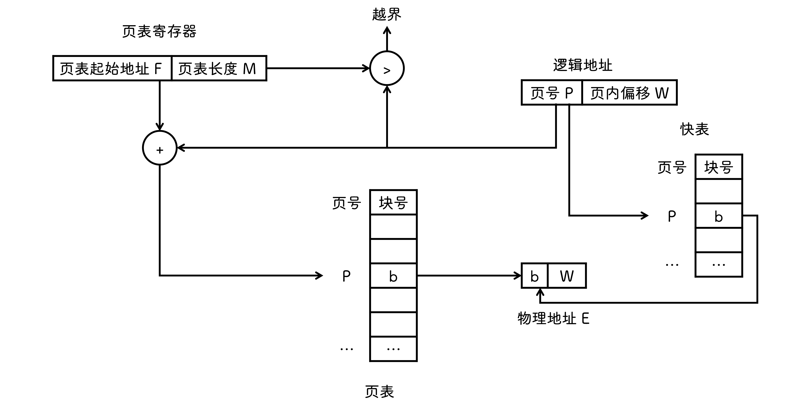

## 分段管理

用户进程划分成 `5` 段 `主程序段` `两个子程序段` `栈段` `数据段`

### 逻辑地址结构

### 段表

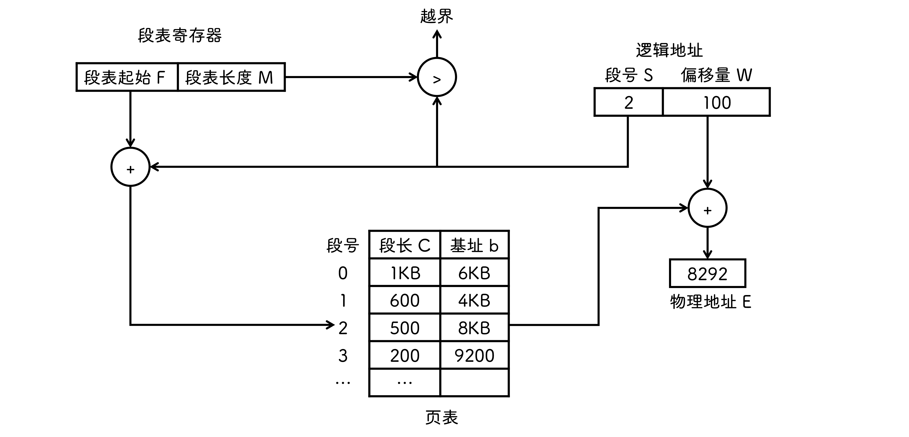

## 段页式管理

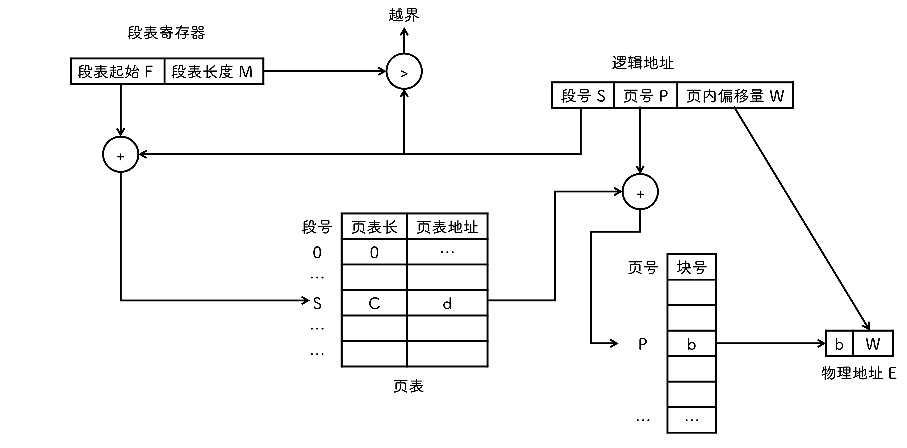

## 虚拟内存管理

- 许多不用或者暂时不用的程序/数据占据了大量的内存空间

- 操作系统将内存中暂不适应的内容换出到外存上, 系统好像提供了一个比实际内存容量大得多的存储器

### 特征

- `多次性` 只须将使用的部分调入内存中

- `对换性` 允许不用的数据调至外存对换区, 需要用时再调入内存

- `虚拟性` 逻辑上扩充内存容量

### 请求页式管理

- `状态位` 是否以调入内存

- `访问字段` 记录本页在一段时间内被访问的次数

- `修改位` 标记该页调入内存后是否被修改, 确定是否写回外存中

- `外存地址` 该页在外存上的地址

#### 地址变换

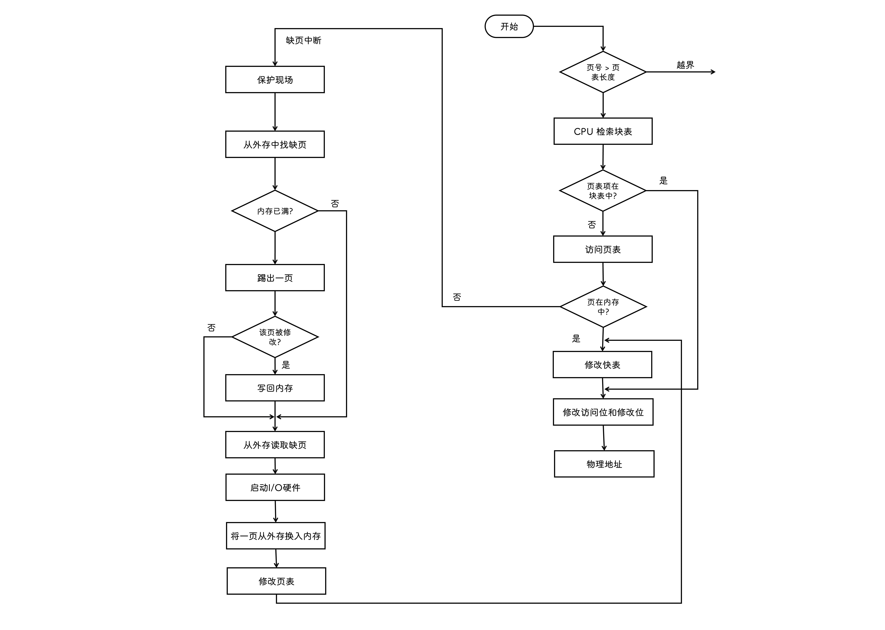

### 页框分配

- `驻留集`

  - 不需要把进程的所有页读入主存, 因此操作系统要决定读取进程的多少页进入主存中
  
  - 给进程分配的物理页框的集合称为 `驻留集`

- `内存分配策略`

  - `固定分配局部置换` 固定进程在内存中的页数, 如果缺页了只能换出内存中的一页, 再读入一页

  - `可变分配全局置换` 缺页了就在内存中再分配一页空间给进程, 然后调入缺失页

  - `可变分配局部置换` 保持缺页率在一定的水平, 如果过低就减少内存页分配, 过高就增加内存页分配, 差不多就固定页数

- `物理块调入算法`

  - `平均分配算法` 把系统中可供分配的物理块均分给各个进程

  - `按比例分配算法` 根据进程大小分配物理块

  - `优先权分配算法` 重要进程分配较多物理块

- `调入页面的时机`

  - `预调页策略` 一次调入若干可能会被访问的页

  - `请求调页策略` 每次调入一页, 由进程提出请求, 系统将页面调入内存

### 页置换算法

- `最佳置换算法` 换出以后 `不再使用` 的或者最长时间内 `不再访问` 的页面

  

- `先进先出页面置换算法`

  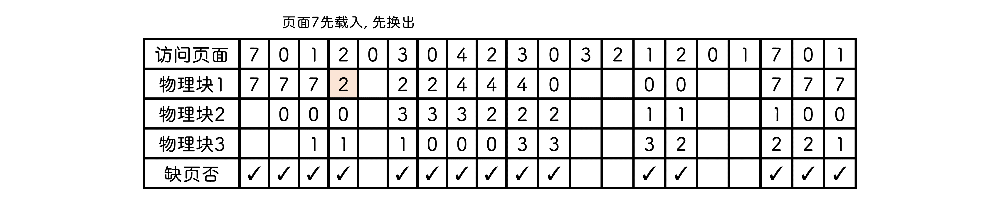

- `最近最久未使用置换算法` 最长时间未使用的

  注意 `OPT` 是未来最长时间不使用, 而 `LRU` 是过去最长时间未使用

  

- `时钟置换算法`

  - `简单时钟置换`

    循环检查页面, 要换出某页时, 如果访问位是 `0` 就换出, 并把指针指向下一页, 当访问位是 `1` 时, 置 `0` 但不换出, 继续查找下一页, 到达队尾了还没有换出, 重头开始检查

    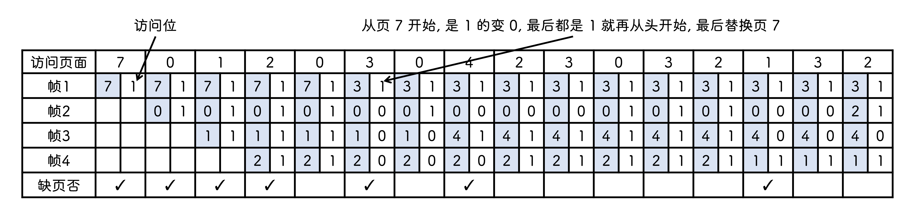

  - `改进时钟置换`

    增加一个修改位

    - `1类` `未访问未修改` 最佳淘汰页
    - `2类` `未访问被修改` 不是很好的淘汰页
    - `3类` `访问但未修改` 可能再次访问
    - `4类` `访问但被修改` 可能再被访问

    从指针当前位置开始, 先扫描一遍, 找到第一个 `1类` 的页面作为淘汰页, 找不到重新开始扫描, 找 `2类` 的, 边找边将访问位置 `0` , 如果还找不到, 重新开始找 `1类`

### 抖动

- 刚刚换出的页面又要换入内存, 刚刚换入的页面又要换出主存, 称为 `抖动` 或者 `颠簸`

- 由于系统的进程太多, 分给进程的物理块太少导致的

- 工作集

  分配给进程的物理块数一定要大于工作集大小

  