## 进程

具有 `独立功能` 的程序在一个数据集合上运行的过程, 是系统进行 `资源分配` 和 `调度` 的独立单位

:::info 并行与并发区别

并行: 多个进程同时进行

并发: 多个程序交替运行

:::

### 特征

1. `动态性` 具有一定的生命周期, 动态的产生、变化和消亡

2. `并发性` 多个进程实体同存于内存中, 能在一段时间内同时运行

3. `独立性` 进程实体是一个能独立运行、独立获得资源和独立接收调度的基本单位

4. `异步性` 进程按照各自独立的、不可预知的速度向前推进

### 状态

1. `运行态(running)` 进程在处理机上运行

2. `就绪态(ready)` 进程获得除处理机外的一切所需资源

3. `阻塞态(blocked)` 处理机空闲, 进程暂停运行

4. `创建态(new)` 进程正在被创建

5. `结束态(terminal)` 进程从系统中消失, 资源释放和回收

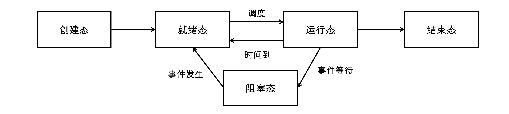

### PCB

又称为 `进程控制块` `进程表`

|  进程描述信息   | 进程控制和管理信息 | 资源分配清单 |  处理机相关  |
| :-------------: | :----------------: | :----------: | :----------: |
| 进程标识符(PID) |      进程状态      |  代码段指针  | 通用寄存器值 |
| 用户标识符(UID) |     进程优先级     |  数据段指针  |  地址寄存器  |
|    所处目录     |    代码运行入口    |  堆栈段指针  | 控制寄存器值 |
|                 |    程序外存地址    |  文件描述符  | 标志寄存器值 |
|                 |    进入内存时间    |     键盘     |    状态字    |
|                 |     处理机占用     |     鼠标     |              |
|                 |     信号使用量     |              |              |

### 控制

#### 创建

1. 分配唯一 `进程号` , 申请 `PCB` 表

2. 为进程分配资源

3. 初始化 `PCB` , 包括初始化标志信息、处理机状态信息、进程优先级等

4. 进程插入就绪队列, 等待调度器运行


```c
int main() {
  pid_t pid;
  pid = fork(); // 父进程中返回子进程 ID, 子进程中返回 0

  if (pid < 0) {
    printf("error in fork!");
    exit(-1);
  } else if (pid == 0) {
    // 当前处于子进程
    // 代替子进程执行, 执行成功, 进程结束, 执行失败, 进程继续后面的代码
    execlp("/bin/ls", "ls", NULL);
  }
  else {
    // 当前处于夫进程
    wait(NULL);
    printf("Child Complete");
  }

  printf("ok");
}

// 输出:
// 文件列表 => 子进程已经被 execlp 替换了, 不会输出 ok
// Child Complete
// ok
```

#### 终止

`正常结束` `异常结束` `外界干预`

1. 根据标识符获取进程的 `PCB` 表, 读取进程状态

2. 立即终止进程, 处理机资源分配给其他进程

3. 将所有子孙进程终止

4. 释放资源, 归还给父进程或操作系统

5. 将 `PCB` 表从所在队列中删除


#### 阻塞

1. 根据标识符获取进程的 `PCB` 表

2. 进程正在运行, 则保护现场, 转为阻塞态, 停止运行

3. 将 `PCB` 插入相应事件的 `等待队列`

#### 唤醒

1. 事件的等待队列中找到相应进程的 `PCB` 表

2. 将其从等待队列中删除, 转为就绪态

3. 把 `PCB` 插入 `就绪队列` , 等待调度器调度

### 通信

`共享内存` `消息传递` `管道`

#### 消息传递

- `直接通信` 发送方将消息发送到接收进程的 `消息缓冲队列` 中

- `间接通信` 发送方把消息发送到某个中间实体

#### 管道

共享内存的优化, 允许一个进程正在写时另一个进程读, 管道是一个固定大小的缓冲区

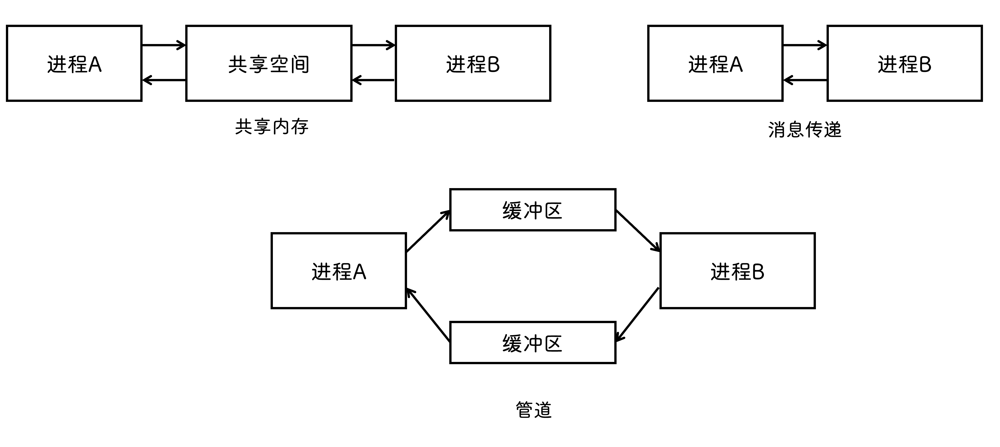

### 孤儿进程与僵尸进程

- `孤儿进程` 一个父进程退出, 而它的一个或多个子进程还在运行, 那么那些子进程将成为孤儿进程, 孤儿进程将被 init 进程(进程号为 1)所 `收养` , 并由 init 进程对它们完成 `状态收集` 工作

- `僵尸进程` 一个进程使用 fork 创建子进程, 如果子进程退出, 而父进程并没有调用 `wait` 或 `waitpid` 获取子进程的状态信息, 那么子进程的进程描述符仍然保存在系统中, 如果进程不调用 `wait/waitpid` 的话, 那么保留的那段信息就不会释放, 其进程号就会一直被 `占用` , 但是系统所能使用的进程号是 `有限` 的, 如果大量的产生僵死进程, 将因为没有可用的进程号而导致系统不能产生新的进程, 即僵尸进程是有害的, 应当避免

### 进程与程序

- 进程是动态的, 有一定的生命周期, 程序是静态的, 只是一系列指令集

- 一个程序可以对应多个进程(如可以同时打开两个 QQ, 同一个程序, 两个进程), 但一个进程只能对应一个程序

- 进程由程序、数据、进程控制块三部分组成

## 线程

- 轻量级进程, 是进程中的一个实体, 被系统独立 `调度` 和 `分派` 的基本(最小)单位

- 不拥有系统资源, 与本进程中其他线程共享进程资源

- 每个线程具有各自 `独立` 的寄存器和栈

  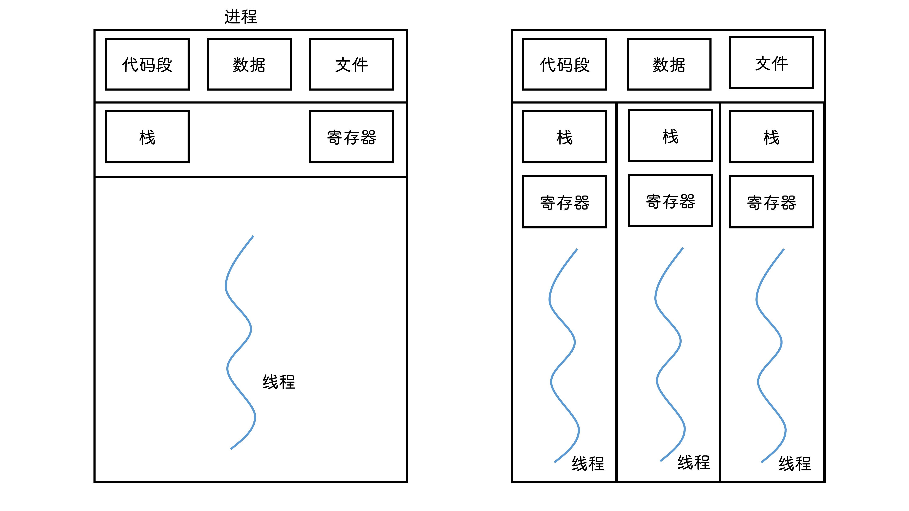

### 实现

#### 用户级线程

- 进程中 `仅一个` 线程能执行
- 线程执行一个 `系统调用` 时, 会把改进程内 `所有` 线程都阻塞了
- 与操作系统无关, 允许每个进程拥有自己的调度算法

#### 内核级线程

- 能同时调度进程中的多个线程并行执行

- 一个线程被阻塞, 可以让其他线程占用当前进程的处理机

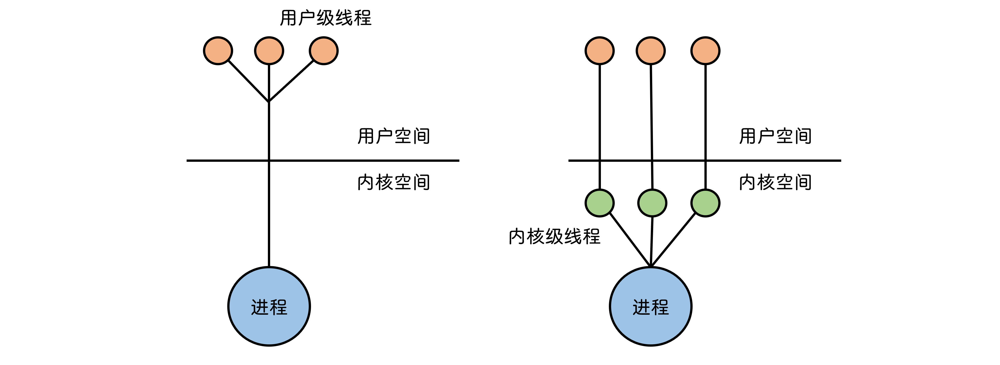

## 调度

### 层次

1. `高级调度(作业调度)` 内存与辅存之间的调度, 从后备队列中挑选简历进程

2. `中级调度(内存调度)` 暂不使用的进程调入 `外存` 进行等待, 俗称 `挂起` , 等到一定条件后调入内存中的 `就绪队列` 中

3. `低级调度(进程调度)` 从 `等待队列` 中取出一个进程

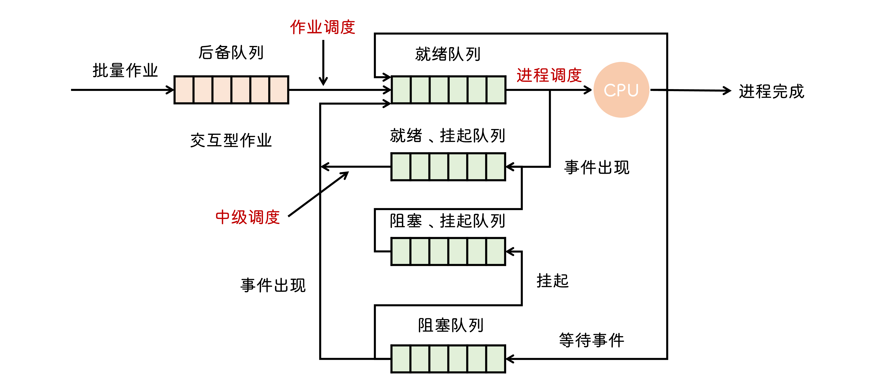

### 指标

- `CPU利用率` 有效时间 / (有效时间 + 等待时间)

- `系统吞吐量` 单位时间内 CPU 完成作业数

- `周转时间` 作业提交到作业完成的时间

- `带权周转时间` 周转时间 / 运行时间

- `等待时间` 进程等待处理机的时间之和

- `响应时间` 用户提交到系统首次响应的时间

### 调度方式

- `非抢占调度` 更优先的进程进入就绪队列, 但仍然等待当前进程执行结束或进入阻塞态

- `抢占调度` 会暂停正在执行的进程, 将处理机分配给紧急任务

### 算法

#### 先来先服务(FCFS)

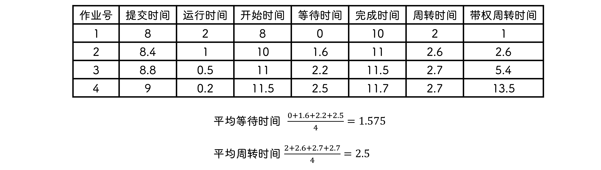

对所有作业公平, 但是 `长作业` 先到, 会导致整体的平均周转时间变长, 因为许多短作业都要一直等待

#### 短作业优先(SJF)

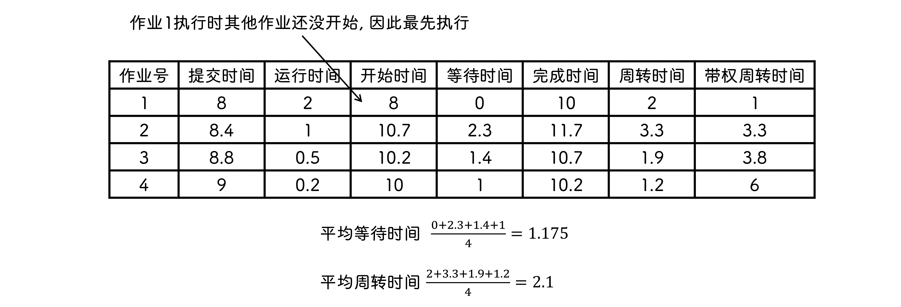

从就绪队列中选一个运行时间最短的作业, 其平均等待时间和平均周转时间最少, 但是未考虑进程的 `紧迫` 程序

#### 优先级调度

- 系统进程 > 用户进程

- 交互型进程 > 非交互型进程

- I/O 型进程 > 计算型进程

#### 高响应比优先


- 等待时间相同, 运行时间越短, 响应比越高, 为短作业优先

- 运行时间相同, 等待的时间越长, 响应比越高, 优先级就会提高

#### 时间片轮转

进程一个一个的执行, 但只能执行一个时间片(50ms)的时间, 到时间后切换到下一个进程

## 同步与互斥

- `竞态` 当两个线程竞争同一资源时, 如果对资源的访问顺序敏感

  :::info 竞争条件
  多个进程/线程尝试更新同一个共享资源时, 结果可能是无法预测的
  :::

- `临界资源` 一次只能一个进程使用

- `临界区` 访问临界资源的代码

- `同步` 完成某个任务要求多个进程按照 `次序` 进行

- `互斥` 一个进程进入临界区后另一个进程必须 `等待`

### 实现

### 锁变量

```c
// p0
// turn == 0 允许进入临界区
while(turn == 1);
turn = 1; // 不允许其他进程进入

// 临界区代码...

turn = 0; // 退出区

// 其他代码

// p1
while(turn == 1);
turn = 1;

// 临界区代码...

turn = 0;

// 其他代码
```

存在问题: `p0` 发现 `turn==0` 后进程挂起, `p1` 也会发现 `turn==0` , 结果就是都能进入临界区, 因为锁为 `非互斥访问`

#### 单标志法

又称为 `严格轮换法` , 两个进程严格进行交替访问

```c
// p0
// turn == 0 允许进入临界区
while(turn != 0); // 轮询, 又称为 "忙等待"

// 临界区代码...

turn = 1; // 退出区

// 其他代码

// p1
while(turn != 1); // turn == 0 时进入无限循环

// 临界区代码...

turn = 0;

// 其他代码
```

```cpp{22-24}
#define THREAD_NUM 4

// 计算 PI
void *busywaiting(void *parm) {
  threadParm_t *p = (threadParm_t *) parm;
  int r = p->threadId;
  int n = p->n;

  int my_n = n / THREAD_NUM;

  int my_first = my_n * r;
  int my_last = my_first + my_n;
  double my_sum = 0.0, factor;

  if (my_first % 2 == 0) factor = 1.0;
  else factor = -1.0;

  for (int i = my_first; i < my_last; i++, factor = -factor) {
    my_sum += factor / (2 * i + 1);
  }

  while (flag != r) Sleep(0);
  sum += my_sum;
  flag++; // 这里把执行权交给下一个进程
  pthread_exit(NULL);
}
```

存在问题:

- `p1` 不进入的话 `p0` 无法再次进入, 因为 `turn` 一直等于 `1`

- 只能两个进程竞争

#### 双标志先检查

```c
// p0
while(flag[j]); // 判断 p1 是否正在访问
flag[i] = true; // 标记自己正在访问

// 临界区代码...

flag[i] = false;

// 其他代码

// p1
while(flag[i]); // 如果 p0 在访问, 就无限循环卡住进程
flag[j] = true;

// 临界区代码...

flag[j] = false;

// 其他代码
```

存在问题: 两个进程 `同时` 检查发现资源没有在使用后 `同时` 标记使用, 就会同时进入临界区

#### 双标志后检查

```c
// p0
flag[i] = true; // 先标记自己要访问
while(flag[j]); // 再判断 p1 是否正在访问

// 临界区代码...

flag[i] = false;

// 其他代码

// p1
flag[j] = true;
while(flag[i]);

// 临界区代码...

flag[j] = false;

// 其他代码
```

存在问题: 两个进程同时标记自己要访问, 最后检测到对方也要访问, 就会 `卡死`

#### peterson

```c
// p0
flag[i] = true; // 想访问
turn = j; // 交出使用权

// 同时要使用, 但是对方后于我们把 turn 置为 i 了
// 说明对方让我们先访问
// turn == j 说明 j 可以执行
// 下面的 while 意思是 “j 要访问且 j 有权访问”
while(flag[j] && turn == j);

// 临界区代码

flag[i] = false;

// 其他代码

// p1
flag[j] = true;
turn = i; // 如果这语句比 turn = j 后执行, 说明要交出使用权

while(flag[i] && turn == i);

// 临界区代码

flag[j] = false;
```

体现了雷锋精神, 每次想访问的时候都交出访问权, 如果对方不想访问, 自己才能访问

### 信号量

- `wait` `P操作`

- `signal` `V操作`

#### 整型信号量

```c
// S: 资源数目, 有限个
wait(S) {
  while(S <= 0); // 资源数小于 0 的时候被阻塞
  S = S - 1; // 使用资源
}

// 唤醒等待中的进程
signal(S) {
  S = S + 1; // 通过释放资源
}
```

#### 记录型信号量

```c
typeof struct {
  int value;
  struct process *L;
} semaphore;

void wait(semaphore S) {
  S.value--; // 请求一次资源
  if (S.value < 0) { // 资源不够了
    S.L.push(this); // 加入等待队列
    block(S.L); // 自我阻塞
  }
}

void signal(semaphore S) {
  S.value++; // 释放资源
  if (S.value <= 0) { // 还存在进程被阻塞
    P = S.L.pop(); // 从等待队列中移除一个进程
    wakeup(P); // 唤醒该进程
  }
}
```

#### 实现同步

```c
semaphore S = 0;

P1() {
  x; // 执行语句
  V(S); // 语句执行结束后修改信号量
}

P2() {
  P(S); // 通过检测信号量得知 x 已经执行结束
  y; // y 能够利用 x 的结果了
}
```

#### 屏障

使各个线程阻塞, 直到各个线程都执行到某个相同的点, 再继续执行

#### 实现互斥

```c
semaphore S = 1;

P1() {
  P(S); // 加锁

  // ...

  V(S); // 解锁
}

P2() {
  P(S); // 加锁

  // ...

  V(S); // 解锁
}
```

### 同步问题

#### 生产者-消费者

缓冲区没满时, 生产者才能把消息放入, 缓冲区不为空时, 消费者才能取出消息

```c
semaphore mutex = 1;     // 信号量
semaphore empty = n;     // 空缓冲区数
semaphore full = 0;      // 满缓冲区数

producer() {
  while(1) {
    // 产生数据...
    P(empty);          // 空缓冲区--
    P(mutex);          // 加锁

    // 放入数据...

    V(mutex);          // 解锁
    V(full);           // 满缓冲区++
  }
}

consumer() {
  while(1) {
    P(full);          // 满缓冲区++
    P(mutex);

    // 取出数据...

    V(mutex);
    V(empty);         // 空缓冲区++

    // 消费数据...
  }
}
```

必须先 `P(empty)` 再 `P(mutex)` , 因为如果空缓冲区没了, `P(empty)` 就会被阻塞, 由于 `P(mutex)` 了, 也就是还没有解锁, 此时消费者由于被锁了无法进行消费, 从而造成死锁

#### 读者-写者

```c
int count = 0;           // 当前读者数
semaphore mutex = 1;     // 更新 count 时互斥
semaphore rw = 1;        // 保证读写互斥

writer() {
  while(1) {
    P(rw);               // 加锁, 阻塞读进程
    // writing...        // 写入
    V(rw);               // 解锁
  }
}

reader() {
  while(1) {
    P(mutex);
    if(count == 0) {
      P(rw);             // 阻塞写进程
                         // 仅第一个读进程进行加锁操作, 后来的读进程直接读就好了
    }
    count++;             // 读者++
    V(mutex);
    // reading...
    P(mutex);
    count--;             // 读者--
    if (count == 0) {
      V(rw);             // 最后一个读者读完了才解锁
    }

    V(mutex);
  }
}
```

存在问题: 写进程一直等待, 因此称为 `读进程优先`

```c
int count = 0;
semaphore mutex = 1;
semaphore rw = 1;
semaphore w = 1;

writer() {
  while(1) {
    P(w);               // 写操作加锁
    P(rw);              // 但是此时有读操作一样会被阻塞
    // writing...
    V(rw);
    V(w);
  }
}

reader() {
  while(1) {
    P(w);               // 写操作存在则直接阻塞
    P(mutex);
    if (count == 0){
      P(rw);
    }
    count++;
    V(mutex);
    V(w);
    // reading...
    P(mutex);
    count--;
    if (count == 0) {
      V(rw);
    }
    V(mutex);
  }
}
```

## 死锁

:::info 什么是活锁?

任务或执行者没有被阻塞, 由于某些条件没有满足, 导致一直重复尝试, 失败, 尝试, 失败

:::

### 原因

- 系统资源的竞争

- 请求和释放资源的顺序不当

- 必要条件

  - `互斥` 一个资源被某个进程使用, 其他进程要使用必须等待

  - `不剥夺` 资源在被某个进程获得之后使用结束之前不能被强行夺走

  - `请求并保持` 进程持有一个资源后又请求另一个资源

  - `循环等待` 存在进程资源循环等待链

### 预防

- `破坏互斥条件` 允许资源共享, 有些条件下不可行

- `破坏剥夺条件` 出现死锁后把自己所占用的资源都释放掉, 过一会再重新申请

  - 复杂系统不可行

- `破坏请求保持条件` 一次性申请所有可能用到的资源

  - 可能造成资源浪费, 其他进程长期处于等待状态

- `破坏循环等待条件` 进程必须按照顺序请求资源

### 避免

- `系统安全状态` 按照某种顺序给进程分配资源, 这种顺序称为 `安全序列`

  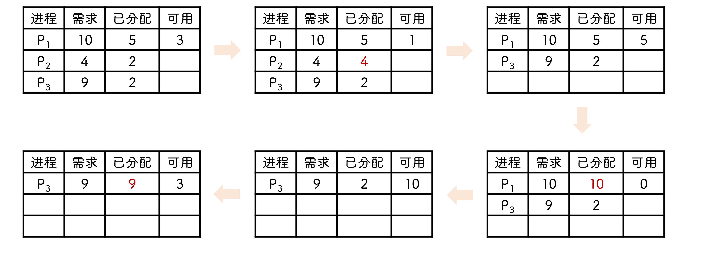

- `银行家算法` 规定最大 `贷款` 数(资源数), 此次请求和已占有的是否大于最大贷款数, 是的话拒绝请求, 不是的话再看银行的 `库存` 是否还能够被贷款, 能的话接收请求, 不能就拒绝

  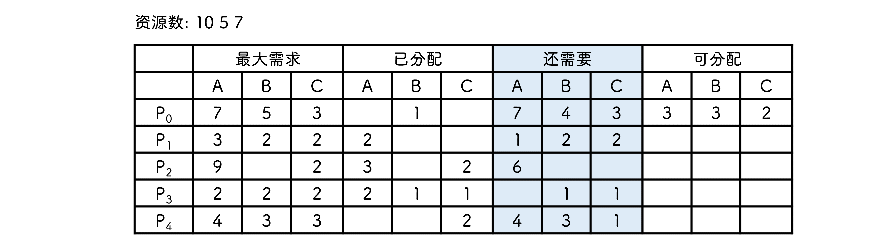

  - `p1` 的 `need(1,2,2)` 小于 `available(3,3,2)` , `p3` 的 `need(0,1,1)` 也小于 `available(3,3,2)` , 可任选一个作为安全序列起始

  - `p1` 执行完后释放其占用资源 `A:2`

    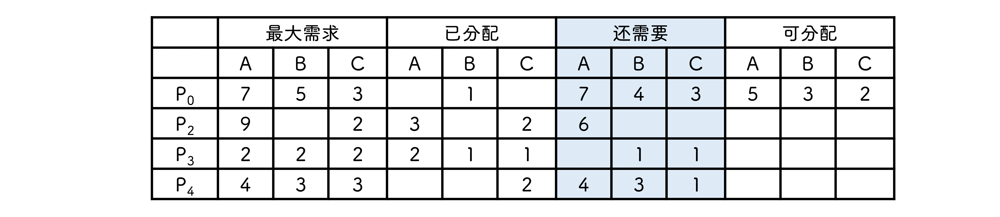

  - `p3` 的 `need(0,1,1)` 小于 `available(5,3,2)` , 因此作为第二个执行进程, 执行完后释放其占用资源

    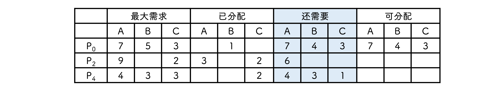

  - 最后可以按照 `p4` `p2` `p0` 的顺序进行

### 检测-资源分配图

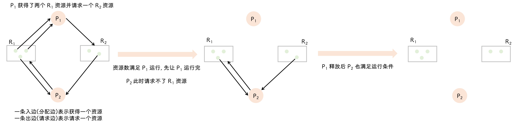
